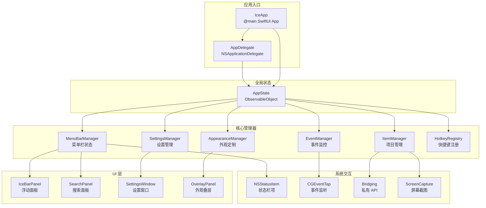
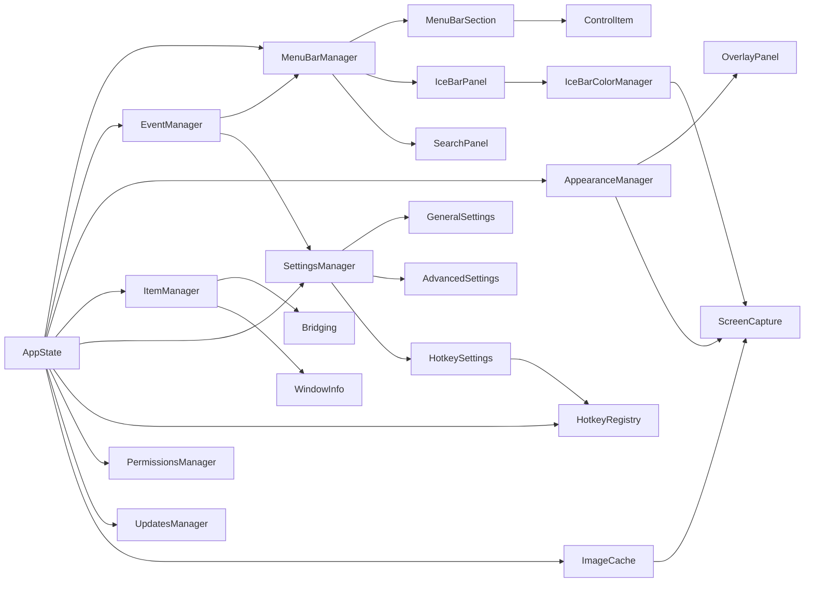
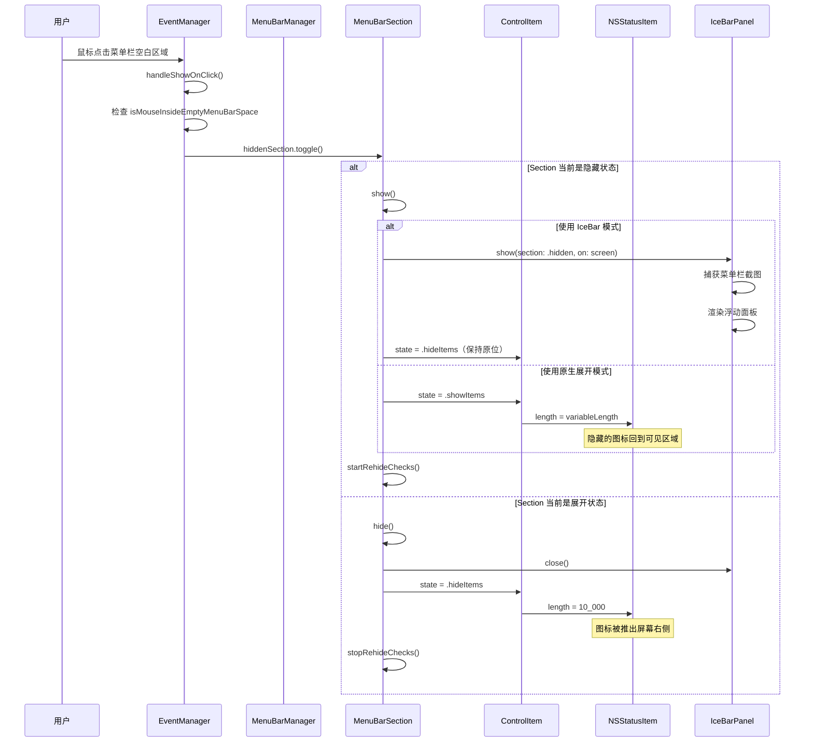
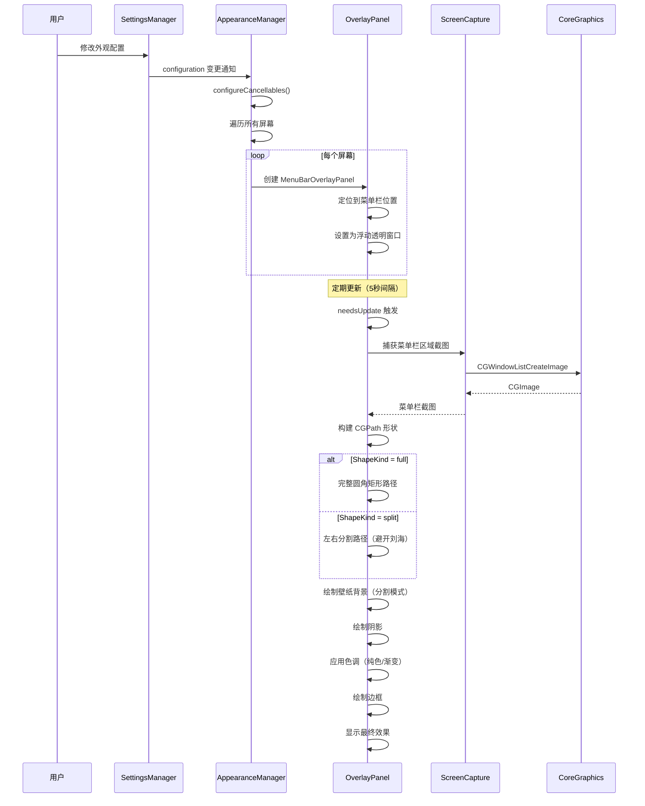

# Ice 源码学习笔记

> 仓库地址：[Ice](https://github.com/jordanbaird/Ice)
> 学习日期：2026-04-05

---

> **以下为 AI 源码分析**
>
> ### 一句话概括
>
> Ice 是一款 macOS 菜单栏管理工具，通过 NSStatusItem 控制项和全局事件监控实现菜单栏图标的隐藏/显示/分组管理，并支持外观定制、快捷键、搜索等高级功能。
>
> ### 要点速览
>
> | 核心模块 | 职责 | 关键文件 |
> |---------|------|---------|
> | AppState | 全局状态中心，持有所有 Manager 实例 | `Main/AppState.swift` |
> | MenuBarManager | 菜单栏状态管理，协调三个 Section | `MenuBar/MenuBarManager.swift` |
> | ControlItem | 状态栏控制项，实现图标隐藏/展开 | `MenuBar/ControlItem/ControlItem.swift` |
> | EventManager | 全局事件监控，处理鼠标悬停/点击/滚动 | `Events/EventManager.swift` |
> | AppearanceManager | 菜单栏外观定制（色调/阴影/边框/形状） | `MenuBar/Appearance/` |
> | IceBarPanel | 浮动面板，在菜单栏下方展示隐藏图标 | `UI/IceBar/IceBarPanel.swift` |
> | HotkeyRegistry | Carbon API 全局快捷键注册与分发 | `Hotkeys/HotkeyRegistry.swift` |
> | Bridging | 私有 CGS API 桥接层 | `Bridging/Bridging.swift` |

---

## 项目简介

Ice 是一款强大的 macOS 菜单栏管理工具。macOS 菜单栏空间有限，尤其在 MacBook（带刘海）上更为紧张。Ice 的核心价值在于：通过将菜单栏图标分为「可见」「隐藏」「始终隐藏」三个区域，用户可以灵活控制哪些图标常驻显示、哪些按需出现。除此之外，Ice 还提供了菜单栏外观定制（色调、阴影、圆角等）、全局快捷键、悬停自动展开、滚动切换、拖拽排列、IceBar 浮动面板、菜单栏项目搜索等丰富功能，目标是成为最全面的菜单栏管理工具。

## 技术栈

| 类别 | 技术 |
|------|------|
| 语言 | Swift 5.9+ |
| 框架 | SwiftUI + AppKit (Cocoa) |
| 构建工具 | Xcode / Swift Package Manager |
| 依赖管理 | Swift Package Manager |
| 测试框架 | 无（项目未包含测试目录） |

## 目录结构

```
Ice/
├── Main/                          # 应用入口与全局状态
│   ├── IceApp.swift               # @main 入口，SwiftUI App 生命周期
│   ├── AppState.swift             # 全局状态中心，持有所有 Manager
│   ├── AppDelegate.swift          # NSApplicationDelegate，启动和权限检查
│   └── Navigation/                # 导航状态模型
├── MenuBar/                       # 菜单栏核心逻辑
│   ├── MenuBarManager.swift       # 菜单栏管理器，协调 Section 和面板
│   ├── MenuBarSection.swift       # 菜单栏分区（visible/hidden/alwaysHidden）
│   ├── ControlItem/               # 状态栏控制项，实现隐藏/展开机制
│   ├── MenuBarItems/              # 菜单栏项目数据模型与缓存
│   ├── Appearance/                # 外观定制（Overlay 面板、色调、阴影、形状）
│   ├── Search/                    # 菜单栏项目搜索面板
│   └── Spacing/                   # 菜单栏项目间距调整
├── Events/                        # 事件监控系统
│   ├── EventManager.swift         # 统一事件调度（鼠标/键盘事件处理）
│   ├── EventTap.swift             # CGEventTap 封装
│   └── EventMonitors/             # 本地和全局事件监听器
├── Hotkeys/                       # 全局快捷键系统
│   ├── HotkeyRegistry.swift       # Carbon Event Manager 快捷键注册
│   ├── Hotkey.swift               # 快捷键模型
│   ├── HotkeyAction.swift         # 快捷键动作枚举
│   ├── KeyCombination.swift       # 键组合模型
│   └── KeyCode.swift / Modifiers.swift
├── UI/                            # 用户界面组件
│   ├── IceBar/                    # IceBar 浮动面板及颜色管理
│   ├── LayoutBar/                 # 拖拽排列布局栏
│   ├── HotkeyRecorder/           # 快捷键录制控件
│   ├── Shapes/                    # 自定义形状
│   ├── Pickers/                   # 颜色选择器等
│   ├── Views/                     # 通用视图组件
│   └── ViewModifiers/             # SwiftUI 视图修饰器
├── Settings/                      # 设置系统
│   ├── SettingsWindow.swift       # 设置窗口
│   ├── SettingsView.swift         # 设置主视图
│   ├── SettingsPanes/             # 各设置面板（通用/外观/快捷键/高级/关于）
│   └── SettingsManagers/          # 设置管理器（通用/高级/快捷键）
├── Bridging/                      # 私有 API 桥接
│   ├── Bridging.swift             # CGS 私有 API 封装
│   └── Shims/                     # C Shim 头文件
├── Permissions/                   # 权限管理（辅助功能/屏幕录制）
├── Updates/                       # 自动更新（Sparkle 框架）
├── UserNotifications/             # 用户通知管理
├── Utilities/                     # 工具类
│   ├── Extensions.swift           # 大量扩展（CGImage、NSScreen 等）
│   ├── ScreenCapture.swift        # 屏幕截图封装
│   ├── WindowInfo.swift           # 窗口信息查询
│   ├── MouseCursor.swift          # 鼠标位置工具
│   ├── MigrationManager.swift     # 配置迁移
│   └── ...
└── Swizzling/                     # Method Swizzling（NSSplitViewItem）
```

## 架构设计

### 整体架构

Ice 采用**中心化状态 + Manager 协作**的架构模式。`AppState` 作为全局状态中心，以 lazy 属性持有各个功能 Manager。各 Manager 独立负责自己的领域逻辑，通过 Combine 的 `@Published` 属性和 `objectWillChange` 实现响应式数据流。UI 层基于 SwiftUI，底层通过 AppKit (NSStatusItem、NSPanel、NSWindow) 与 macOS 系统深度交互。



### 核心模块

#### 1. AppState — 全局状态中心

- **职责**：作为 ObservableObject 持有所有功能 Manager 的 lazy 实例，是整个应用状态的单一来源
- **核心文件**：`Main/AppState.swift`
- **关键接口**：
  - `performSetup()` — 初始化所有 Manager
  - `activate(withPolicy:)` / `deactivate(withPolicy:)` — 激活/停用应用
  - `preventShowOnHover()` / `allowShowOnHover()` — 控制悬停显示行为
- **设计特点**：通过 Combine 的 `Publishers.Merge` 聚合子 Manager 的 `objectWillChange`，实现统一的状态变更通知

#### 2. MenuBarManager — 菜单栏管理器

- **职责**：管理三个 MenuBarSection（visible / hidden / alwaysHidden），协调 IceBarPanel 和 SearchPanel
- **核心文件**：`MenuBar/MenuBarManager.swift`
- **关键接口**：
  - `initializeSections()` — 初始化三个分区
  - `hideApplicationMenus()` / `showApplicationMenus()` — 隐藏/显示应用菜单（腾出空间）
  - `updateAverageColorInfo()` — 获取菜单栏平均颜色（用于外观适配）
  - `section(withName:)` — 按名称获取分区
- **与其他模块**：持有 IceBarPanel 和 SearchPanel；被 EventManager 调用以响应用户交互

#### 3. MenuBarSection — 菜单栏分区

- **职责**：表示菜单栏的一个逻辑分区，管理显示/隐藏状态及自动重新隐藏逻辑
- **核心文件**：`MenuBar/MenuBarSection.swift`
- **关键接口**：
  - `show()` / `hide()` / `toggle()` — 控制分区可见性
  - `startRehideChecks()` — 启动定时重新隐藏检测（基于鼠标位置）
- **三种分区**：
  - `.visible`：始终可见的图标区域
  - `.hidden`：默认隐藏，可通过点击/悬停/滚动展开
  - `.alwaysHidden`：始终隐藏，需 Option+点击 才能展开

#### 4. ControlItem — 控制项

- **职责**：封装 NSStatusItem，作为菜单栏分区的分隔符和控制开关
- **核心文件**：`MenuBar/ControlItem/ControlItem.swift`
- **关键机制**：
  - 通过 `HidingState`（`.hideItems` / `.showItems`）切换状态
  - 隐藏状态下设置 `length = 10_000`（极大值），将后面的图标推出屏幕
  - 展开状态下恢复 `length = variableLength`，让图标回到可见区域
- **与其他模块**：每个 MenuBarSection 持有一个 ControlItem；EventManager 监听其状态变化

#### 5. EventManager — 事件管理器

- **职责**：统一管理全局事件监控，处理鼠标悬停展开、点击切换、滚动切换、拖拽排列、智能重新隐藏等交互逻辑
- **核心文件**：`Events/EventManager.swift`
- **五个事件监听器**：
  - `mouseDownMonitor` — 左键点击展开/隐藏，右键菜单
  - `mouseUpMonitor` — 拖拽结束检测
  - `mouseDraggedMonitor` — Cmd+拖拽排列菜单栏图标
  - `mouseMovedMonitor` — 鼠标悬停自动展开/隐藏
  - `scrollWheelMonitor` — 滚轮切换隐藏区域
- **辅助计算**：精确判断鼠标位置（菜单栏内/空白区域/应用菜单区/刘海区/IceBar 区）

#### 6. AppearanceManager — 外观管理器

- **职责**：管理菜单栏的视觉定制，通过 OverlayPanel 叠加在原生菜单栏上方绘制自定义外观
- **核心文件**：`MenuBar/Appearance/MenuBarAppearanceManager.swift`, `MenuBarOverlayPanel.swift`
- **定制能力**：
  - **色调**：纯色 / 渐变色
  - **阴影**：自定义颜色和半径
  - **边框**：自定义颜色和宽度
  - **形状**：完整圆角 / 分割式（左右两块）
- **渲染机制**：使用 CGPath 在 NSPanel 上绘制自定义形状，叠加在系统菜单栏上方

#### 7. HotkeyRegistry — 快捷键注册

- **职责**：通过 Carbon Event Manager API 注册和分发全局快捷键
- **核心文件**：`Hotkeys/HotkeyRegistry.swift`
- **关键实现**：
  - 使用 `InstallEventHandler` 和 `RegisterEventHotKey` Carbon API
  - 支持 keyDown 和 keyUp 事件
  - 菜单打开时自动注销，关闭时重新注册（避免冲突）
- **支持的动作**：切换隐藏区/始终隐藏区、搜索、启用 IceBar、显示分隔符、切换应用菜单

#### 8. Bridging — 私有 API 桥接

- **职责**：封装 macOS 私有 CGS (Core Graphics Server) API，提供窗口管理和空间查询能力
- **核心文件**：`Bridging/Bridging.swift`, `Bridging/Shims/`
- **关键能力**：
  - 窗口列表查询（菜单栏项目窗口、屏幕窗口）
  - Space（桌面空间）状态查询
  - 连接属性设置（如 `SetsCursorInBackground`）
  - 窗口框架获取

### 模块依赖关系



## 核心流程

### 流程一：菜单栏图标隐藏/显示切换

这是 Ice 最核心的功能——用户通过各种交互方式触发隐藏区域的展开与收起。



**关键逻辑说明**：
1. **触发方式多样**：点击空白区域、鼠标悬停、滚轮滑动、全局快捷键均可触发
2. **IceBar 模式**：不在菜单栏原位展开，而是在浮动面板中显示截图——解决了 MacBook 刘海遮挡问题
3. **隐藏机制巧妙**：将 ControlItem 的 NSStatusItem 长度设为 10,000 像素，利用系统排布机制将后面的图标推出屏幕
4. **自动重新隐藏**：展开后启动 rehide 检测，支持定时和智能两种策略

### 流程二：菜单栏外观定制渲染

Ice 允许用户自定义菜单栏的视觉外观，通过在系统菜单栏上方叠加透明面板实现。



**关键逻辑说明**：
1. **叠加渲染**：OverlayPanel 是透明的 NSPanel，精确覆盖在系统菜单栏上方
2. **形状支持**：full 模式为完整圆角菜单栏，split 模式分为左右两块（适配刘海 MacBook）
3. **壁纸采样**：split 模式需要在分割缝隙处显示桌面壁纸，通过 ScreenCapture 获取壁纸窗口截图
4. **多屏幕支持**：每个屏幕独立创建 OverlayPanel，根据屏幕特征（是否有刘海）调整渲染
5. **性能优化**：5秒间隔更新，窗口可见性变化时立即更新，拖拽菜单项时暂停更新

## 关键设计亮点

### 1. 巧妙的图标隐藏机制 — NSStatusItem 长度撑开法

- **解决的问题**：macOS 不提供直接隐藏第三方菜单栏图标的 API
- **实现方式**：ControlItem 在隐藏状态下将 NSStatusItem 的 `length` 设为 `10_000`（极大值），利用系统从右向左排列 status item 的机制，将分隔符右侧的所有图标推出屏幕可视区域
- **关键代码**：`MenuBar/ControlItem/ControlItem.swift` 中的 `Lengths.expanded = 10_000` 和状态切换逻辑
- **为什么这样设计**：这是在不使用私有 API 修改其他应用 status item 的前提下，最可靠的隐藏方案。其他方案（如修改窗口层级）不够稳定

### 2. IceBar 浮动面板 — 解决刘海 MacBook 难题

- **解决的问题**：MacBook 刘海占据菜单栏中央空间，原地展开隐藏图标可能被遮挡或空间不足
- **实现方式**：将隐藏区域的图标以截图形式显示在菜单栏下方的浮动 NSPanel 中。IceBarColorManager 动态采样菜单栏背景色，使面板视觉上与菜单栏融为一体
- **关键代码**：`UI/IceBar/IceBarPanel.swift`、`UI/IceBar/IceBarColorManager.swift`
- **为什么这样设计**：既保留了隐藏图标的可交互性（点击截图中的图标会触发对应操作），又不受刘海空间限制

### 3. Combine 响应式状态管理 — 统一的事件驱动架构

- **解决的问题**：菜单栏管理涉及大量异步事件（鼠标移动、窗口变化、空间切换、设置修改），需要可靠的事件协调机制
- **实现方式**：全面使用 Combine 的 `@Published` 属性和 `Publishers.Merge`/`CombineLatest` 操作符，AppState 聚合所有子 Manager 的 `objectWillChange`，实现一处变更全局响应。结合 `debounce`、`delay`、`removeDuplicates` 等操作符避免不必要的更新
- **关键代码**：`Main/AppState.swift` 的 `configureCancellables()` 方法
- **为什么这样设计**：声明式的事件流比传统的 delegate/notification 模式更易于组合和维护，且能自动处理生命周期（通过 `store(in: &cancellables)`）

### 4. CGEventTap + UniversalEventMonitor 双层事件系统

- **解决的问题**：需要在全局范围监听鼠标事件，但不同场景对事件粒度要求不同
- **实现方式**：
  - `EventTap`：封装 CGEventTap，用于底层事件拦截（如按键修改、事件注入）
  - `UniversalEventMonitor`：封装 NSEvent 的 `addGlobalMonitorForEvents` 和 `addLocalMonitorForEvents`，用于高层事件响应
  - EventManager 主要使用 UniversalEventMonitor，而 HotkeyRegistry 使用 Carbon Event Handler
- **关键代码**：`Events/EventTap.swift`、`Events/EventMonitors/UniversalEventMonitor.swift`
- **为什么这样设计**：不同层级的 API 各有优势——CGEventTap 可以拦截和修改事件但需要辅助功能权限，NSEvent monitor 更轻量但只能观察。分层设计让每个场景都能使用最合适的 API

### 5. Bridging 层隔离私有 API — 安全使用系统底层能力

- **解决的问题**：获取菜单栏项目窗口列表、判断 Space 状态等功能需要使用 macOS 私有 CGS API，但直接调用私有 API 有维护风险
- **实现方式**：通过 `Bridging` 命名空间统一封装所有私有 API 调用，C Shim 文件声明函数签名，Swift 层提供类型安全的包装。`WindowListOption` 用 OptionSet 封装位掩码参数
- **关键代码**：`Bridging/Bridging.swift`、`Bridging/Shims/` 目录下的 C 头文件
- **为什么这样设计**：将私有 API 隔离在单一模块中，便于 macOS 版本升级时集中排查和适配，避免私有 API 调用散落在业务代码中
