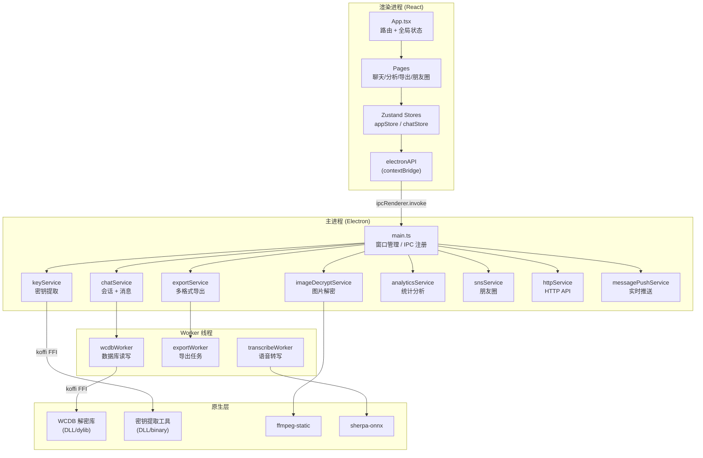
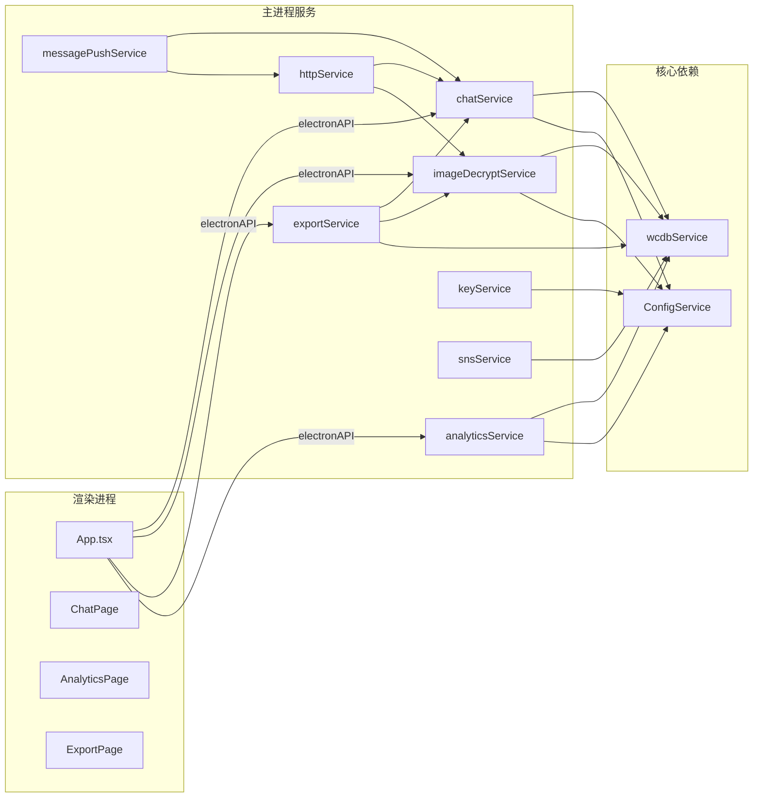
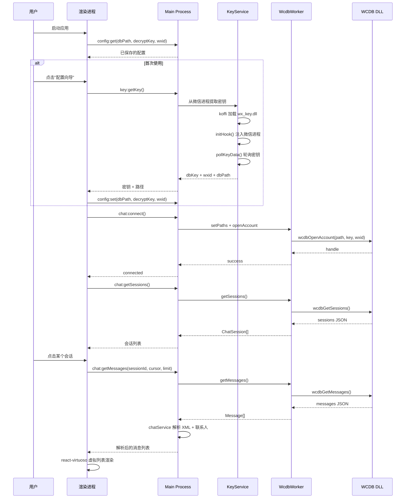
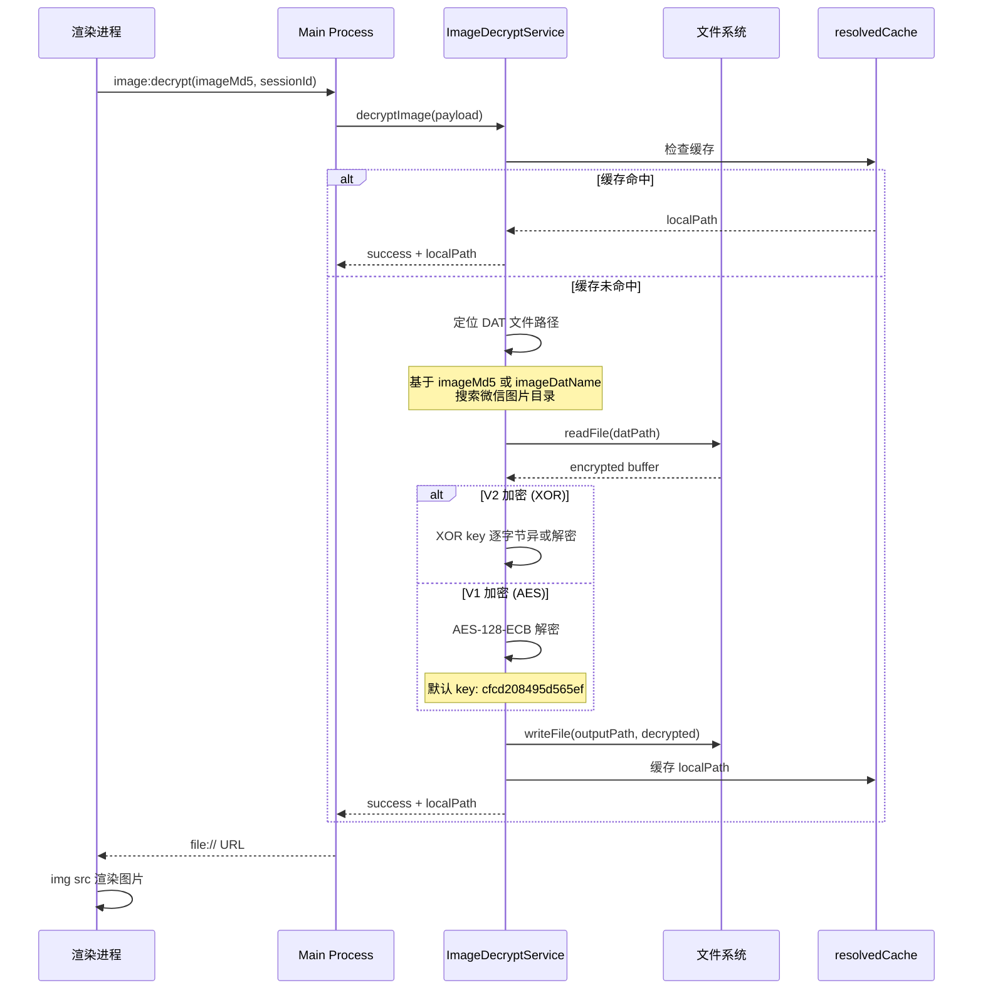

# WeFlow 源码学习笔记

> 仓库地址：[WeFlow](https://github.com/hicccc77/WeFlow)
> 学习日期：2026/04/15

---

> **以下为 AI 源码分析**
>
> ### 一句话概括
>
> WeFlow 是一个基于 Electron 的完全本地微信聊天记录实时查看、分析、导出工具，通过解密微信 4.0+ 的 WCDB 加密数据库实现数据访问。
>
> ### 要点速览
>
> | 核心模块 | 职责 | 关键文件 |
> |---------|------|---------|
> | Main Process | Electron 主进程，窗口管理、IPC 调度、自动更新 | `electron/main.ts` |
> | WCDB 数据服务 | 微信加密数据库解密与读取（Worker 线程） | `electron/services/wcdbService.ts`, `wcdbCore.ts` |
> | Key 提取服务 | 从微信进程内存中提取数据库解密密钥 | `electron/services/keyService.ts` |
> | Chat 服务 | 会话/消息查询、联系人解析、消息解密 | `electron/services/chatService.ts` |
> | 图片解密服务 | 微信图片 DAT 文件解密还原 | `electron/services/imageDecryptService.ts` |
> | 导出服务 | 多格式聊天记录导出（HTML/JSON/Excel/CSV 等） | `electron/services/exportService.ts` |
> | 统计分析服务 | 私聊/群聊统计、年度报告、双人报告 | `electron/services/analyticsService.ts` |
> | 朋友圈服务 | 朋友圈数据解密、预览与导出 | `electron/services/snsService.ts` |
> | HTTP API | 本地 HTTP 接口，供外部工具集成 | `electron/services/httpService.ts` |
> | React 前端 | 用户界面，聊天浏览、分析可视化 | `src/` 目录 |

---

## 项目简介

WeFlow 是一个完全在本地运行的微信聊天记录查看、分析与导出工具。它解决的核心问题是：**如何在不上传数据的前提下，实时访问、分析和导出微信 4.0+ 版本的加密聊天记录**。项目通过从微信进程内存中提取数据库解密密钥，直接读取 WCDB 加密数据库，实现聊天记录的实时查看、图片/视频/语音解密、统计分析报告生成、多格式导出等功能。支持 Windows、macOS、Linux 三平台。

## 技术栈

| 类别 | 技术 |
|------|------|
| 语言 | TypeScript |
| 前端框架 | React 19 + react-router-dom 7 |
| 状态管理 | zustand 5 |
| 桌面框架 | Electron 41 |
| 构建工具 | Vite 7 + vite-plugin-electron |
| 样式 | SCSS |
| 图表 | ECharts 6 + echarts-for-react |
| 虚拟列表 | react-virtuoso |
| 原生调用 | koffi（FFI 调用 DLL/dylib） |
| 音频解码 | silk-wasm（微信 SILK 语音格式） |
| 语音转写 | sherpa-onnx-node |
| 视频处理 | ffmpeg-static |
| 数据压缩 | fzstd（Zstandard 解压） |
| 打包发布 | electron-builder + electron-updater |
| 依赖管理 | npm |
| 测试框架 | 无（项目未配置测试） |

## 目录结构

```
WeFlow/
├── electron/                          # Electron 主进程代码
│   ├── main.ts                        # 主进程入口：窗口创建、IPC 注册、自动更新
│   ├── preload.ts                     # preload 脚本：contextBridge 暴露 electronAPI
│   ├── services/                      # 后端服务层（全部运行在主进程/Worker）
│   │   ├── wcdbService.ts             # WCDB Worker 代理（主进程端）
│   │   ├── wcdbCore.ts                # WCDB 核心：通过 koffi FFI 调用原生 DLL/dylib
│   │   ├── keyService.ts              # 密钥提取服务（Windows：DLL hook + 内存读取）
│   │   ├── keyServiceMac.ts           # 密钥提取服务（macOS：命令行工具）
│   │   ├── keyServiceLinux.ts         # 密钥提取服务（Linux）
│   │   ├── chatService.ts             # 聊天核心：会话/消息查询、XML 解析、联系人
│   │   ├── imageDecryptService.ts     # 图片解密：DAT → 原始图片
│   │   ├── exportService.ts           # 导出：HTML/JSON/Excel/CSV/TXT/ChatLab
│   │   ├── analyticsService.ts        # 私聊统计分析
│   │   ├── groupAnalyticsService.ts   # 群聊统计分析
│   │   ├── annualReportService.ts     # 年度报告生成
│   │   ├── snsService.ts              # 朋友圈服务
│   │   ├── httpService.ts             # HTTP API 服务（端口 5031）
│   │   ├── messagePushService.ts      # 实时消息推送与通知
│   │   ├── voiceTranscribeService.ts  # 语音转文字（sherpa-onnx）
│   │   ├── videoService.ts            # 视频解密与处理
│   │   └── config.ts                  # 配置服务（electron-store）
│   ├── wcdbWorker.ts                  # WCDB Worker 线程（数据库操作在此执行）
│   ├── exportWorker.ts                # 导出 Worker 线程
│   ├── windows/
│   │   └── notificationWindow.ts      # 通知弹窗窗口管理
│   └── utils/
│       └── LRUCache.ts                # LRU 缓存工具
├── src/                               # React 渲染进程代码
│   ├── main.tsx                       # React 入口
│   ├── App.tsx                        # 根组件：路由、主题、协议、更新、锁屏
│   ├── pages/                         # 页面组件
│   │   ├── HomePage.tsx               # 首页
│   │   ├── ChatPage.tsx               # 聊天记录浏览
│   │   ├── AnalyticsPage.tsx          # 私聊分析
│   │   ├── GroupAnalyticsPage.tsx     # 群聊分析
│   │   ├── AnnualReportPage.tsx       # 年度报告
│   │   ├── DualReportPage.tsx         # 双人报告
│   │   ├── ExportPage.tsx             # 导出页面
│   │   ├── SnsPage.tsx                # 朋友圈
│   │   ├── ContactsPage.tsx           # 联系人管理
│   │   └── SettingsPage.tsx           # 设置
│   ├── components/                    # 通用组件
│   ├── stores/                        # zustand 状态管理
│   │   ├── appStore.ts                # 全局应用状态（DB 连接、更新、锁屏）
│   │   ├── chatStore.ts               # 聊天状态（会话列表、消息、加载）
│   │   └── analyticsStore.ts          # 分析状态
│   ├── services/                      # 渲染进程服务
│   │   ├── ipc.ts                     # IPC 通信封装
│   │   └── config.ts                  # 配置读写（调用 electronAPI.config）
│   └── types/                         # 类型定义
│       └── models.ts                  # 核心数据模型
├── resources/                         # 原生资源
│   ├── key/                           # 各平台密钥提取工具（DLL/dylib/binary）
│   └── wcdb/                          # 各平台 WCDB 解密库
├── public/                            # 静态资源（图标、表情包）
└── package.json
```

## 架构设计

### 整体架构

WeFlow 采用经典的 **Electron 三进程架构**：Main Process（主进程）负责系统交互和业务逻辑，Renderer Process（渲染进程）负责 UI 呈现，Worker Threads（工作线程）负责 CPU 密集型的数据库操作和导出任务。三者通过 IPC（Inter-Process Communication）和 contextBridge 通信。

核心设计思路：所有敏感操作（数据库解密、密钥提取、文件系统访问）都在主进程和 Worker 线程中完成，渲染进程只能通过 `window.electronAPI` 暴露的受限 API 访问后端能力。数据库操作通过 Worker 线程异步执行，避免阻塞主进程的 UI 事件循环。



### 核心模块

#### 1. WCDB 数据服务（`wcdbService.ts` + `wcdbCore.ts` + `wcdbWorker.ts`）

**职责**：微信 WCDB 加密数据库的解密读取，是整个应用的数据基础。

**架构**：三层代理模式
- `WcdbService`（主进程）— 客户端代理，发送消息到 Worker
- `wcdbWorker.ts`（Worker 线程）— 接收消息，调用 WcdbCore
- `WcdbCore`（Worker 线程内）— 通过 koffi FFI 调用原生 WCDB 解密库（DLL/dylib）

**关键能力**：
- `wcdbOpenAccount(path, key, wxid)` — 用密钥打开加密数据库
- `wcdbGetSessions()` — 获取会话列表
- `wcdbGetMessages(sessionId, cursor, limit)` — 分页读取消息
- `wcdbGetGroupMembers(sessionId)` — 获取群成员
- 数据库变更监控（monitor），支持实时检测新消息

**通信方式**：Worker 消息基于 `{id, type, payload}` 格式，通过 `pending` Map 实现 Promise 化的请求-响应模型。

#### 2. 密钥提取服务（`keyService.ts` / `keyServiceMac.ts` / `keyServiceLinux.ts`）

**职责**：从运行中的微信进程内存中提取 WCDB 数据库解密密钥。

**Windows 实现**（`keyService.ts`）：
- 通过 koffi 加载 `wx_key.dll`
- 调用 Win32 API（kernel32、user32、advapi32）枚举窗口、定位微信进程
- `initHook()` 注入 hook 到微信进程
- `pollKeyData()` 轮询读取密钥数据
- 同时支持图片解密密钥（XOR key + AES key）的提取

**macOS 实现**（`keyServiceMac.ts`）：通过命令行工具提取密钥

#### 3. 聊天服务（`chatService.ts`）

**职责**：核心业务逻辑中枢，处理会话列表、消息查询、XML 解析、联系人信息、消息缓存等。

**关键类型**：
- `ChatSession` — 会话数据（username、unreadCount、sortTimestamp、displayName 等）
- `Message` — 消息数据（50+ 字段，覆盖文本、图片、视频、语音、名片、转账、表情包等所有微信消息类型）

**核心能力**：
- 会话列表加载与排序
- 消息分页查询与缓存（`MessageCacheService`）
- 联系人信息缓存（`ContactCacheService`）
- 微信消息 XML 解析（type 49 的 appmsg 细分类型识别）
- 消息防撤回（拦截撤回操作）
- Zstandard 压缩内容解压（`fzstd`）

#### 4. 图片解密服务（`imageDecryptService.ts`）

**职责**：将微信加密的 `.dat` 图片文件还原为原始图片。

**解密流程**：
1. 通过 `imageMd5` 或 `imageDatName` 定位 DAT 文件
2. 使用 XOR key / AES key 解密
3. 缓存解密结果，避免重复解密
4. 支持 V1（AES）和 V2（XOR）两种加密版本
5. 高清图不可用时降级返回缩略图

#### 5. 导出服务（`exportService.ts`）

**职责**：将聊天记录导出为多种格式。

**支持格式**：HTML、JSON、TXT、Excel（ExcelJS）、CSV、PGSQL、ChatLab 专属格式

**ChatLab 格式**：标准化的聊天数据交换格式，包含 `header`、`meta`、`members`、`messages` 四部分，支持嵌套聊天记录。

#### 6. HTTP API 服务（`httpService.ts`）

**职责**：将本地消息能力映射为 HTTP REST API，默认端口 5031。

**能力**：查询会话列表、分页获取消息、获取联系人、获取群成员、图片/视频/语音资源访问。支持原始 JSON 和 ChatLab 标准格式输出。

### 模块依赖关系



## 核心流程

### 流程一：数据库连接与聊天记录加载

这是应用启动后最核心的流程——从密钥提取到实时查看聊天记录。



**关键细节**：

1. **密钥提取**：Windows 平台通过 `koffi` FFI 调用 `wx_key.dll`，该 DLL 会 hook 微信进程内存，从中读取 WCDB 的 SQLCipher 解密密钥。macOS 使用独立的命令行工具。

2. **Worker 线程隔离**：所有数据库操作在 `wcdbWorker.ts` 中执行，通过 `postMessage` / `on('message')` 与主进程通信。`WcdbService` 使用 `pending` Map + 递增 `messageId` 实现 Promise 化调用。

3. **实时刷新**：`wcdbService.setMonitor()` 注册数据库变更监控，当微信写入新消息时，Worker 线程发出 `monitor` 类型事件，`messagePushService` 接收后触发桌面通知和 UI 刷新。

### 流程二：图片解密与显示

微信图片以加密的 `.dat` 格式存储，需要解密后才能显示。



## 关键设计亮点

### 1. Worker 线程数据库隔离

**问题**：WCDB 解密库的数据库操作是同步阻塞的，如果在 Electron 主进程中执行，会导致 UI 冻结。

**实现**：采用三层代理架构 —— `WcdbService`（主进程代理）→ `wcdbWorker.ts`（Worker 线程）→ `WcdbCore`（FFI 调用原生库）。主进程中的 `callWorker()` 方法通过 `pending` Map + 自增 ID 将 Worker 的异步消息模型包装为 Promise，上层代码可以 `await` 调用。Worker 异常退出时，所有 pending Promise 被 reject 并附带诊断信息（如 VC++ 依赖缺失提示）。

**设计原因**：FFI 调用原生 DLL 的数据库操作可能耗时数百毫秒到数秒，放在主进程会直接卡死 UI。Worker 线程让数据库操作完全不影响用户交互体验。

### 2. 跨平台密钥提取策略

**问题**：微信 4.0+ 使用 SQLCipher 加密 WCDB 数据库，密钥存储在微信进程内存中，不同操作系统的内存布局和安全机制完全不同。

**实现**：
- **Windows**（`keyService.ts`）：通过 `koffi` 加载 `wx_key.dll`，使用 Win32 API（`OpenProcess`、`EnumWindows` 等）定位微信进程窗口，然后通过 `initHook()` / `pollKeyData()` 从进程内存中提取密钥。同时支持从注册表读取微信安装路径。
- **macOS**（`keyServiceMac.ts`）：调用预编译的命令行工具提取密钥。
- **Linux**（`keyServiceLinux.ts`）：适配 Linux 环境的密钥获取。

**设计原因**：抽象为统一的 `KeyService` 接口，`main.ts` 根据 `process.platform` 实例化对应平台实现，上层业务代码无需关心平台差异。

### 3. IPC 分层与 contextBridge 安全隔离

**问题**：Electron 渲染进程不应直接访问 Node.js API 和文件系统，需要严格的安全边界。

**实现**（`electron/preload.ts`）：通过 `contextBridge.exposeInMainWorld('electronAPI', {...})` 暴露一个精心设计的 API 表面，按功能分组（`config`、`chat`、`auth`、`dialog`、`shell`、`app`、`notification`、`image`、`export` 等），每个方法对应一个 `ipcRenderer.invoke()` 调用。渲染进程完全无法访问 `require`、`fs`、`child_process` 等危险 API。

**设计原因**：遵循 Electron 安全最佳实践——`contextIsolation: true` + `nodeIntegration: false`，所有后端能力通过白名单式的 preload API 暴露，防止恶意内容注入攻击。

### 4. 数据库实时变更监控与消息推送

**问题**：用户希望在 WeFlow 中实时看到新消息，而不是手动刷新。

**实现**：`wcdbService.setMonitor()` 注册监控回调。WCDB 原生库检测到数据库文件变化时，通过 Worker 的 `{type: 'monitor', payload}` 消息通知主进程。`messagePushService` 接收变更事件，对比 `sessionBaseline`（上次已知的会话时间戳和未读数），识别出新消息，触发桌面通知（`notificationWindow`）和前端 UI 刷新。支持黑白名单过滤和 debounce（350ms）防抖。

**设计原因**：避免轮询数据库，利用原生库的文件监控机制实现低延迟的实时通知，同时 debounce 防止消息风暴时的性能问题。

### 5. 多通道自动更新策略

**问题**：项目同时维护 stable、preview（预览版）、dev（开发版）三个发布通道，版本号命名约定不同，需要支持跨通道升降级。

**实现**（`electron/main.ts`）：`inferUpdateTrackFromVersion()` 从版本号格式推断所属通道（`4.3.0` → stable，`0.26.2` → preview，`26.4.5` → dev）。用户可在设置中切换通道，`applyAutoUpdateChannel()` 动态修改 `electron-updater` 的 feed URL 和 channel，并通过 `resetUpdaterProviderCache()` 清除内部缓存。`shouldOfferUpdateForTrack()` 支持跨通道更新提示（包括降级）。

**设计原因**：三通道策略让普通用户使用稳定版，尝鲜用户使用预览版，开发者使用日构建版，同时保证版本切换的无缝体验。
