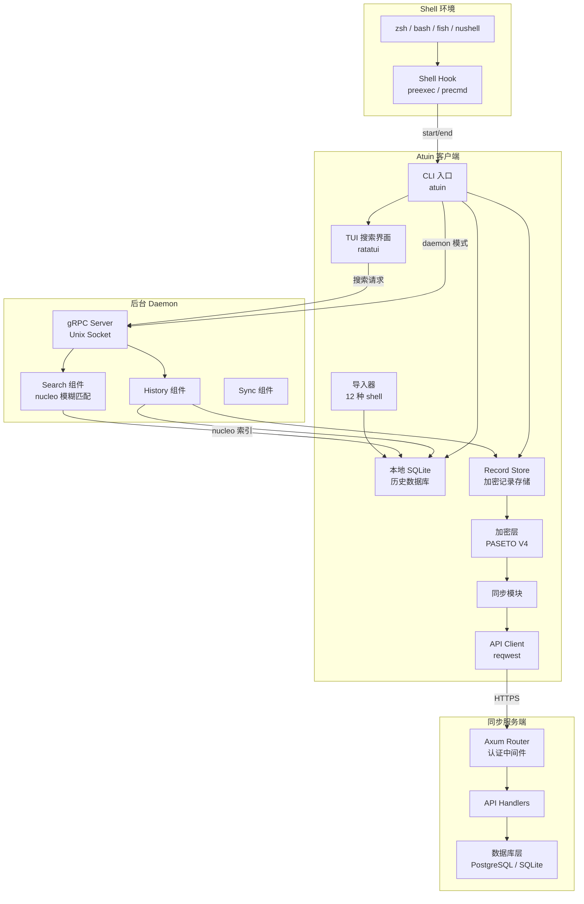
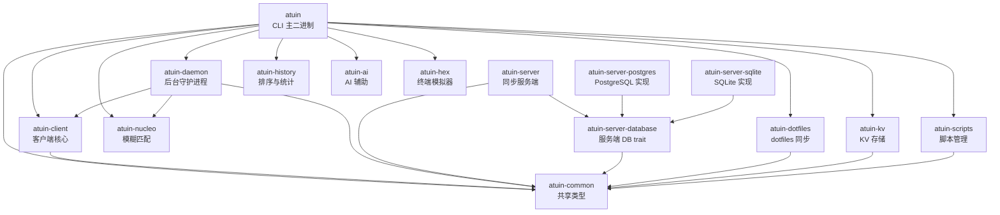
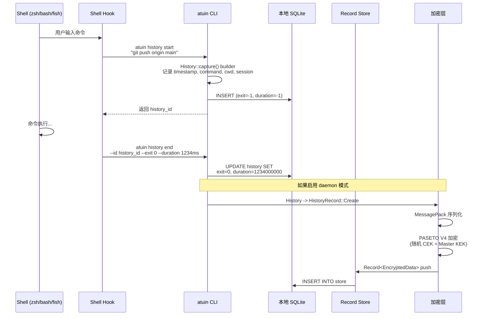
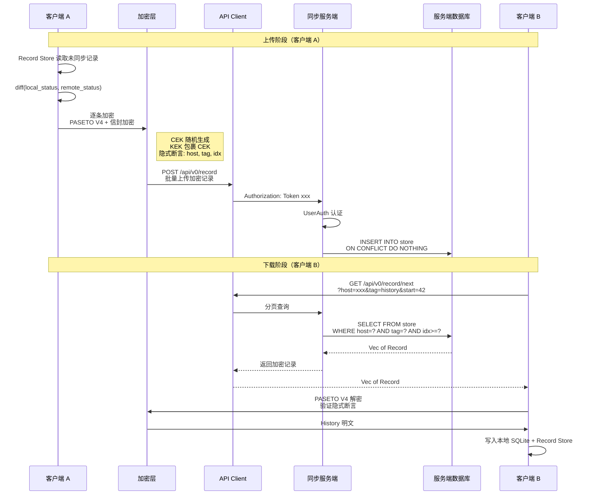

# atuin 源码学习笔记

> 仓库地址：[atuin](https://github.com/atuinsh/atuin)
> 学习日期：2026-04-05

---

> **以下为 AI 源码分析**
>
> ### 一句话概括
>
> Atuin 是一个用 Rust 编写的 shell 历史记录管理工具，用 SQLite 替代传统历史文件，提供全文搜索、端到端加密同步和跨机器共享能力。
>
> ### 要点速览
>
> | 核心模块 | 职责 | 关键文件 |
> |---------|------|---------|
> | `atuin` | CLI 入口与 TUI 搜索界面 | `crates/atuin/src/main.rs`, `command/client/search/` |
> | `atuin-client` | 客户端核心：数据库、加密、同步、导入 | `crates/atuin-client/src/` |
> | `atuin-server` | 同步服务端：API 路由与请求处理 | `crates/atuin-server/src/` |
> | `atuin-daemon` | 后台守护进程：组件化事件驱动架构 | `crates/atuin-daemon/src/` |
> | `atuin-common` | 共享类型：API 定义、Record 模型 | `crates/atuin-common/src/` |
> | `atuin-nucleo` | 高性能模糊匹配引擎 | `crates/atuin-nucleo/src/` |
> | `atuin-server-database` | 服务端数据库 trait 抽象 | `crates/atuin-server-database/src/` |
> | `atuin-server-postgres` | PostgreSQL 后端实现 | `crates/atuin-server-postgres/src/` |
> | `atuin-server-sqlite` | SQLite 后端实现 | `crates/atuin-server-sqlite/src/` |
> | `atuin-dotfiles` | dotfiles 同步管理 | `crates/atuin-dotfiles/src/` |
> | `atuin-kv` | 端到端加密的 key-value 存储 | `crates/atuin-kv/src/` |
> | `atuin-scripts` | 脚本管理与执行 | `crates/atuin-scripts/src/` |

---

## 项目简介

Atuin 替代了传统 shell 的纯文本历史文件（如 `.bash_history`、`.zsh_history`），使用 SQLite 数据库存储命令历史，并记录丰富的上下文信息（退出码、执行时长、工作目录、主机名等）。它提供了一个基于 ratatui 的全屏交互式搜索 TUI，支持模糊匹配、前缀搜索、全文搜索等多种模式。最核心的差异化能力是**端到端加密的跨机器历史同步**——用户可以通过官方云服务或自建服务器在多台机器间安全地共享命令历史，服务端永远无法看到明文数据。

## 技术栈

| 类别 | 技术 |
|------|------|
| 语言 | Rust (edition 2024, MSRV 1.94.0) |
| 框架 | Tokio (异步运行时), Axum (HTTP 服务端), ratatui (TUI), tonic/gRPC (daemon 通信) |
| 构建工具 | Cargo, cargo-chef (Docker 构建优化), cargo-dist (发布) |
| 依赖管理 | Cargo workspace (18 个 crate) |
| 测试框架 | cargo test (内置), pretty_assertions |

## 目录结构

```
atuin/
├── crates/                          # Cargo workspace 成员
│   ├── atuin/                       # CLI 主二进制：入口、命令路由、TUI 搜索
│   │   └── src/
│   │       ├── main.rs              # 程序入口
│   │       ├── command/             # 子命令实现（history, search, sync, import...）
│   │       └── shell/               # Shell 集成脚本（zsh, bash, fish）
│   ├── atuin-client/                # 客户端核心逻辑
│   │   └── src/
│   │       ├── database.rs          # SQLite 数据库层（Database trait + 实现）
│   │       ├── encryption.rs        # 端到端加密（libsodium 旧版 + PASETO V4 新版）
│   │       ├── sync.rs              # 同步编排
│   │       ├── api_client.rs        # HTTP API 客户端
│   │       ├── history/             # History 数据模型与 Record 存储
│   │       ├── record/              # Record Store 抽象层（加密、同步、SQLite 存储）
│   │       ├── import/              # 12 种 shell 历史导入器
│   │       └── settings/            # 配置管理
│   ├── atuin-daemon/                # 后台守护进程
│   │   └── src/
│   │       ├── daemon.rs            # Daemon 主循环与组件编排
│   │       ├── components/          # 组件：history, search, sync
│   │       ├── search/              # 搜索索引与 frecency 排序
│   │       └── server.rs            # gRPC 服务端（Unix socket / TCP）
│   ├── atuin-server/                # 同步服务端
│   │   └── src/
│   │       ├── router.rs            # Axum 路由与认证中间件
│   │       ├── handlers/            # API 请求处理器
│   │       └── bin/main.rs          # 服务端二进制入口
│   ├── atuin-server-database/       # 服务端数据库 trait 抽象
│   ├── atuin-server-postgres/       # PostgreSQL 实现
│   ├── atuin-server-sqlite/         # SQLite 实现
│   ├── atuin-common/                # 共享类型（API、Record、Shell）
│   ├── atuin-nucleo/                # 模糊匹配引擎（lock-free, 并行排序）
│   ├── atuin-dotfiles/              # dotfiles（alias）同步
│   ├── atuin-kv/                    # 加密 key-value 存储
│   ├── atuin-scripts/               # 脚本管理
│   ├── atuin-history/               # 历史排序与统计
│   ├── atuin-ai/                    # AI 辅助功能
│   └── atuin-hex/                   # 终端模拟器（实验性）
├── docs/                            # MkDocs 文档站
├── systemd/                         # systemd 服务配置
├── k8s/                             # Kubernetes 部署清单
└── Dockerfile                       # 服务端容器镜像
```

## 架构设计

### 整体架构

Atuin 采用经典的**客户端-服务器**架构，客户端通过 shell hook 捕获命令并存入本地 SQLite，可选地通过端到端加密与远程服务器同步。客户端还包含一个可选的后台 daemon 进程，提供基于 gRPC 的高性能搜索索引。



### 核心模块

#### 1. CLI 入口与命令路由 (`crates/atuin/`)

**职责**：解析命令行参数，路由到对应子命令，初始化日志和 Tokio 运行时。

**核心文件**：
- `src/main.rs` — 程序入口，使用 clap 解析命令
- `src/command/mod.rs` — 顶层命令枚举 `AtuinCmd`
- `src/command/client.rs` — 客户端子命令集合 `Cmd`，包含 20+ 个子命令

**关键设计**：
- `AtuinCmd::run()` 在匹配命令前先设置 umask(077)，确保文件权限安全
- `Cmd::run()` 区分"热路径"和"普通路径"：`History` 和 `Init` 命令跳过数据库初始化（因为它们在每条 shell 命令前后运行），其他命令才初始化 SQLite 连接池
- Daemon 模式的 daemonize 在创建 Tokio runtime 之前执行，避免 fork 破坏异步运行时状态

#### 2. 客户端核心 (`crates/atuin-client/`)

**职责**：历史数据模型、本地存储、端到端加密、同步协议、配置管理。

**核心文件**：
- `src/history.rs` + `src/history/` — History 数据结构与 type-state builder
- `src/database.rs` — `Database` trait 与 SQLite 实现
- `src/encryption.rs` + `src/record/encryption.rs` — 双加密方案（旧 libsodium / 新 PASETO V4）
- `src/record/` — Record Store 抽象（`Store` trait、`SqliteStore`、同步 diff 算法）
- `src/sync.rs` — 高层同步编排（upload/download）
- `src/api_client.rs` — HTTP 客户端
- `src/import/` — 12 种 shell 历史导入器

**关键接口**：

```rust
// History 数据模型 — 记录一条命令的完整上下文
pub struct History {
    pub id: HistoryId,
    pub timestamp: OffsetDateTime,
    pub duration: i64,         // 纳秒，-1 表示未知
    pub exit: i64,             // 退出码，-1 表示预执行捕获
    pub command: String,
    pub cwd: String,
    pub session: String,       // UUIDv7 会话 ID
    pub hostname: String,      // "hostname:username"
    pub deleted_at: Option<OffsetDateTime>,  // 软删除
}

// Database trait — 抽象本地存储
pub trait Database: Send + Sync + 'static {
    async fn save(&self, h: &History) -> Result<()>;
    async fn search(&self, mode: SearchMode, filter: FilterMode,
                    context: &Context, query: &str, ...) -> Result<Vec<History>>;
    async fn list(&self, filters: &[FilterMode], context: &Context,
                  max: Option<usize>, unique: bool, ...) -> Result<Vec<History>>;
}

// Store trait — 抽象加密记录存储
pub trait Store: Send + Sync {
    async fn push(&self, record: &Record<EncryptedData>) -> Result<()>;
    async fn next(&self, host: HostId, tag: &str, idx: RecordIdx, limit: u64)
        -> Result<Vec<Record<EncryptedData>>>;
    async fn status(&self) -> Result<RecordStatus>;
}

// Importer trait — 统一的 shell 历史导入接口
pub trait Importer: Sized {
    const NAME: &'static str;
    async fn new() -> Result<Self>;
    async fn entries(&mut self) -> Result<usize>;
    async fn load(self, loader: &mut impl Loader) -> Result<()>;
}
```

#### 3. 后台 Daemon (`crates/atuin-daemon/`)

**职责**：长驻后台进程，维护内存搜索索引，通过 gRPC 提供低延迟搜索。

**核心文件**：
- `src/daemon.rs` — `Daemon` 主循环，`DaemonState` 共享状态，`Component` trait
- `src/components/history.rs` — 历史组件，追踪运行中的命令
- `src/components/search.rs` — 搜索组件，维护去重索引与 frecency 排序
- `src/search/index.rs` — 搜索索引，frecency 评分算法
- `src/server.rs` — gRPC 服务端（Unix socket / TCP）
- `src/client.rs` — gRPC 客户端

**关键设计**：

```rust
// 组件化事件驱动架构
pub trait Component: Send + 'static {
    fn start(&mut self, handle: DaemonHandle);
    fn handle_event(&mut self, event: DaemonEvent);
    fn stop(&mut self);
}

// 事件枚举 — 组件间通信
pub enum DaemonEvent {
    HistoryStarted(History),
    HistoryEnded(History),
    RecordsAdded(Vec<RecordId>),
    SyncCompleted { uploaded: usize, downloaded: usize },
    ForceSync,
    ShutdownRequested,
    // ...
}
```

#### 4. 同步服务端 (`crates/atuin-server/`)

**职责**：接收、存储、分发加密后的历史记录。

**核心文件**：
- `src/router.rs` — Axum 路由定义、`UserAuth` 认证提取器
- `src/handlers/user.rs` — 用户注册/登录（Argon2 密码哈希）
- `src/handlers/history.rs` — v1 历史同步 API
- `src/handlers/v0/record.rs` — v0 加密记录 API
- `src/settings.rs` — 服务端配置

**关键设计**：
- 泛型数据库：`<DB: Database>` 贯穿整个服务端代码，同一套逻辑支持 PostgreSQL 和 SQLite
- 双 API 版本：v1（传统历史同步，可禁用）+ v0（新的加密记录格式）
- 服务端只存储加密后的 blob，永远不接触明文
- PostgreSQL 支持读写分离（可配置只读副本）

#### 5. 模糊匹配引擎 (`crates/atuin-nucleo/`)

**职责**：高性能、lock-free 的模糊匹配，支持并行排序。

**核心接口**：
```rust
pub struct Nucleo<T> { /* ... */ }

impl<T: Send + Sync + 'static> Nucleo<T> {
    pub fn new(config: Config, columns: u32) -> (Self, Arc<Injector<T>>);
    pub fn tick(&self, timeout: u64) -> Status;
    pub fn snapshot(&self) -> &Snapshot<T>;
    pub fn pattern(&mut self) -> &mut MultiPattern;
}
```
- `Injector<T>` — lock-free 的项目注入（用自定义 boxcar 实现）
- 后台 worker 线程执行匹配
- rayon 并行排序结果

### 模块依赖关系



## 核心流程

### 流程一：命令捕获与存储

Shell hook 在每条命令执行前后触发 `atuin history start` 和 `atuin history end`，将命令完整上下文写入本地 SQLite 和 Record Store。



**关键实现细节**：
- 热路径优化：`history start/end` 跳过 Record Store 和数据库连接池初始化，直接操作 SQLite
- 隐私过滤：`should_save()` 检查命令是否匹配 secrets 模式（API key、密码等）、是否以空格开头、是否在排除目录中
- UUIDv7 会话 ID：可从 UUID 中提取时间戳，用于会话过滤

### 流程二：端到端加密同步

客户端与服务端之间的历史同步全程加密，服务端只存储不可解密的 blob。



**关键实现细节**：
- **信封加密（Envelope Encryption）**：每条记录生成随机 CEK（Content-Encryption-Key），用主密钥 KEK 包裹 CEK。这样密钥轮换时只需重新包裹 CEK，无需重新加密数据
- **PASETO V4 隐式断言**：host、tag、idx 作为 additional data 参与认证但不加密，防止记录被篡改或重放
- **同步 diff 算法**：对每个 (host, tag) 对比较本地与远程的 idx，产生 Upload/Download/Noop 操作
- **软删除同步**：删除操作生成 `HistoryRecord::Delete(id)` 记录，同步到其他设备后标记 `deleted_at`

## 关键设计亮点

### 1. Type-State Builder 模式 — 编译时安全的 History 构造

**解决的问题**：History 有多个构造场景（shell hook 捕获、导入、daemon、数据库加载），每个场景必填字段不同，运行时校验容易遗漏。

**实现方式**（`crates/atuin-client/src/history/builder.rs`）：

使用 `typed_builder` 宏生成不同的 builder，通过 Rust 类型系统在编译期保证必填字段：

```rust
History::capture()   // CWD 必填，session/hostname 自动推断
    .timestamp(now)
    .command("git push")
    .cwd("/home/user/repo")
    .build()

History::daemon()    // CWD + session + hostname 全部必填（daemon 不做推断）
    .timestamp(now)
    .command("git push")
    .cwd("/home/user/repo")
    .session("uuid...")
    .hostname("host:user")
    .build()

History::import()    // 只需 timestamp + command，其余有默认值
    .timestamp(now)
    .command("git push")
    .build()
```

**设计理由**：不同入口对 History 的上下文掌握程度不同。Shell hook 能通过环境变量推断 session 和 hostname，但 daemon 不能假设这些；导入器只有命令文本和时间戳。Type-state 模式将这些差异编码到类型中，消除了运行时 unwrap。

### 2. 组件化事件驱动 Daemon — 松耦合的后台服务

**解决的问题**：Daemon 需要同时处理历史记录、搜索索引维护和云同步，这些职责如果耦合会导致代码难以维护和测试。

**实现方式**（`crates/atuin-daemon/src/daemon.rs`）：

定义 `Component` trait 和 `DaemonEvent` 枚举，Daemon 主循环通过 broadcast channel 广播事件给所有组件：

```rust
trait Component: Send + 'static {
    fn start(&mut self, handle: DaemonHandle);
    fn handle_event(&mut self, event: DaemonEvent);
    fn stop(&mut self);
}
```

三个组件独立运行：
- **HistoryComponent**：追踪运行中命令（DashMap），命令结束时写入 DB 并发射 `HistoryEnded` 事件
- **SearchComponent**：监听 `HistoryEnded` 更新内存索引，每 60 秒重建 frecency 排序
- **SyncComponent**：监听 `ForceSync` 触发同步，完成后发射 `SyncCompleted`

**设计理由**：事件驱动使组件间没有直接依赖，新增功能（如 AI 分析）只需实现 `Component` trait 并注册即可。DaemonHandle 通过 `Arc<DaemonState>` 提供共享状态访问，避免了复杂的所有权传递。

### 3. 信封加密（Envelope Encryption）— 高效的密钥轮换

**解决的问题**：端到端加密场景下，密钥轮换通常需要重新加密所有数据，对于大量历史记录（可能数十万条）代价极高。

**实现方式**（`crates/atuin-client/src/record/encryption.rs`）：

```
每条记录的加密流程：
1. 生成随机 CEK (Content-Encryption-Key)
2. 用 CEK + PASETO V4 加密 payload
3. 用主密钥 KEK (Key-Encryption-Key) 包裹 CEK
4. 存储: (加密payload, 包裹后的CEK)

密钥轮换：
- 只需 unwrap(旧KEK) -> wrap(新KEK) 对 CEK
- 无需解密和重新加密 payload
```

**设计理由**：信封加密是 AWS KMS 等云服务的标准实践。Atuin 在客户端实现了同样的模式，使密钥轮换从 O(n * 数据大小) 降低到 O(n * 密钥大小)。PASETO V4 的隐式断言进一步确保记录无法被跨 host/tag 重放。

### 4. 泛型数据库抽象 — 一套代码支持多后端

**解决的问题**：同步服务端需要同时支持 PostgreSQL（生产）和 SQLite（开发/自建），但不希望维护两套请求处理逻辑。

**实现方式**（`crates/atuin-server-database/src/lib.rs` + `crates/atuin-server/src/router.rs`）：

整个服务端以 `<DB: Database>` 泛型参数贯穿：

```rust
// Database trait 定义在 atuin-server-database
pub trait Database: Sized + Clone + Send + Sync + 'static {
    async fn new(settings: &DbSettings) -> DbResult<Self>;
    async fn add_history(&self, history: &[NewHistory]) -> DbResult<()>;
    async fn list_history(...) -> DbResult<Vec<History>>;
    // 40+ 方法
}

// 路由和处理器全部泛型化
pub fn router<DB: Database>(state: AppState<DB>) -> Router { ... }

// 二进制入口根据 URI scheme 选择实现
match settings.db_settings.db_type() {
    DbType::Postgres => launch::<Postgres>(settings).await,
    DbType::Sqlite => launch::<Sqlite>(settings).await,
}
```

**设计理由**：Rust 的 trait 泛型在编译时单态化，零运行时开销。PostgreSQL 实现支持读写分离和计数缓存（`total_history_count_user` 视图），SQLite 实现则简洁轻量。两个实现共享所有 handler 代码，差异仅在 SQL 方言和连接管理。

### 5. Frecency 搜索排序 — 平衡频率与新近度

**解决的问题**：命令历史搜索不应简单按时间排序——用户昨天用了 100 次的命令比 1 分钟前只用了 1 次的命令更可能是想要的结果。

**实现方式**（`crates/atuin-daemon/src/search/index.rs`）：

```rust
pub fn compute(&self, now: i64, recency_mul: f64, frequency_mul: f64) -> u32 {
    let age = now - self.last_used;
    // 新近度评分：按时间衰减
    let recency_score = match age {
        ..3600       => 100.0,   // 1 小时内
        ..86400      => 75.0,    // 1 天内
        ..604800     => 50.0,    // 1 周内
        ..2592000    => 25.0,    // 1 月内
        _            => 5.0,     // 更早
    };
    // 频率评分：对数增长，避免高频命令过度主导
    let frequency_score = (self.count as f64).ln() * 20.0;
    // 加权组合
    (recency_score * recency_mul + frequency_score.min(100.0) * frequency_mul) as u32
}
```

搜索组件维护一个 `CommandData` 结构，预计算每条命令的 frecency 分数，并在每次搜索请求时快速排序返回。搜索索引按命令去重，每条命令记录其出现的所有目录、主机和会话，支持按 `FilterMode` 快速过滤。

**设计理由**：frecency（frequency + recency）是浏览器地址栏和 Firefox 等工具验证过的排序策略。对数频率避免了 `cd` 和 `ls` 等高频命令过度主导结果，阶梯式时间衰减比线性衰减更符合人的记忆曲线。
