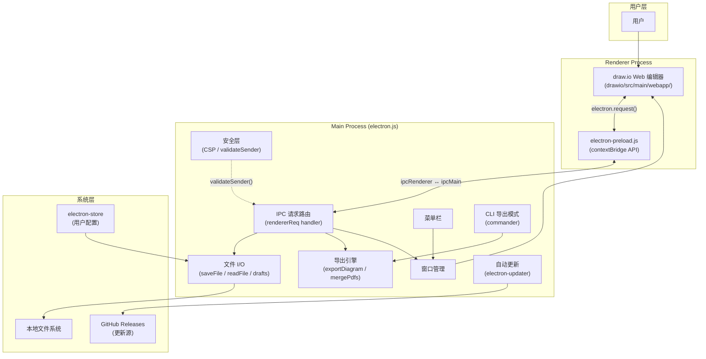
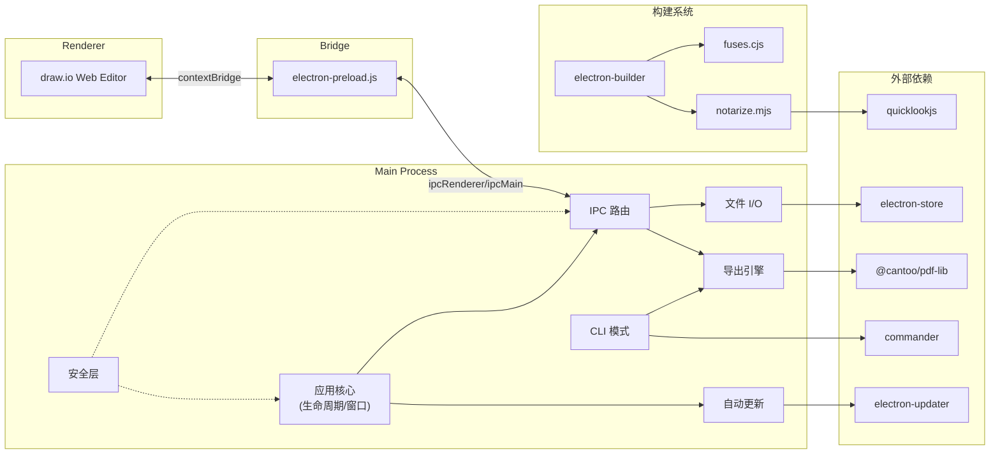
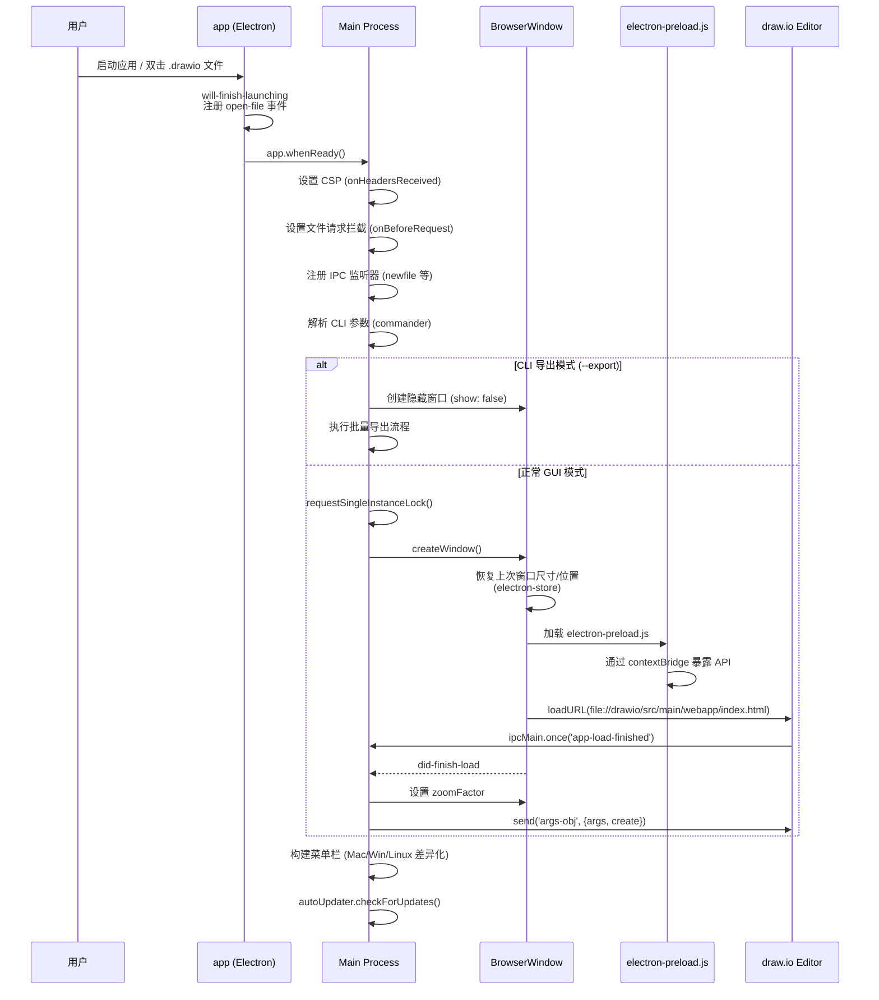
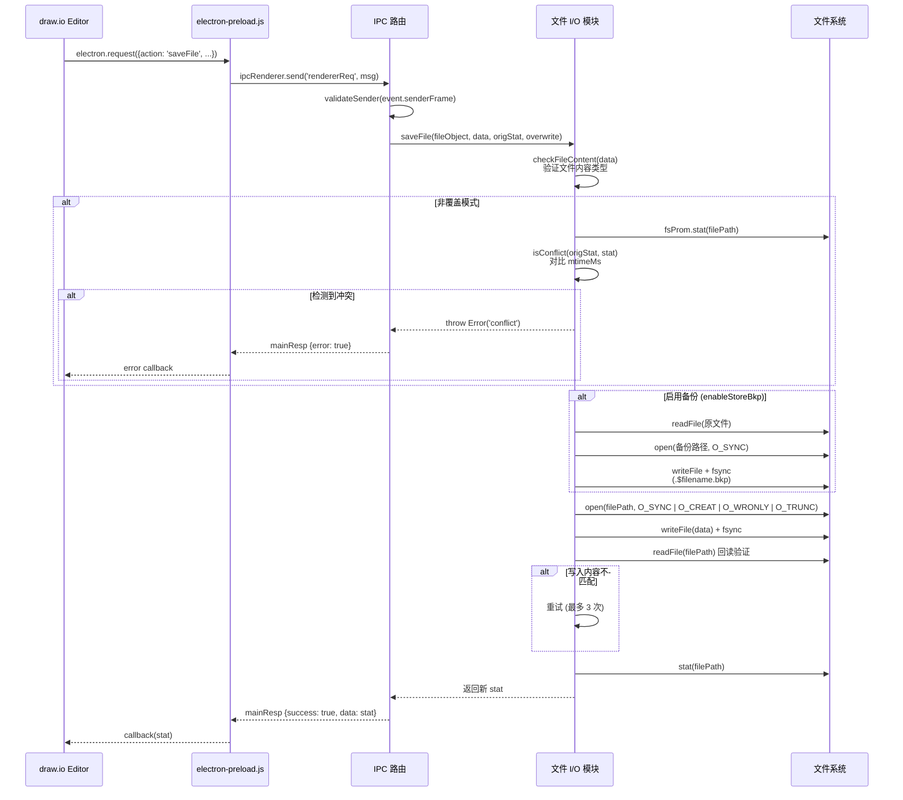

# drawio-desktop 源码学习笔记

> 仓库地址：[drawio-desktop](https://github.com/jgraph/drawio-desktop)
> 学习日期：2026-04-05

---

> **以下为 AI 源码分析**
>
> ### 一句话概括
>
> drawio-desktop 是一个基于 Electron 的桌面绘图应用，将 draw.io 核心 Web 编辑器封装为安全隔离的本地应用程序，支持多格式导出和跨平台分发。
>
> ### 要点速览
>
> | 核心模块 | 职责 | 关键文件 |
> |---------|------|---------|
> | 主进程 (Main Process) | 窗口管理、IPC 调度、菜单、自动更新、文件 I/O | `src/main/electron.js` |
> | 预加载桥接 (Preload Bridge) | 安全暴露 IPC 接口给渲染进程 | `src/main/electron-preload.js` |
> | draw.io 核心编辑器 | 图表编辑 UI 与业务逻辑（Web 应用） | `drawio/` (git submodule) |
> | 导出引擎 | PDF/PNG/SVG/HTML 多格式导出 | `src/main/electron.js` (exportDiagram) |
> | 构建与分发 | 多平台打包、签名、公证 | `build/`, `electron-builder-*.json` |
> | 版本同步 | 从 submodule 同步版本号 | `sync.cjs` |

---

## 项目简介

drawio-desktop 是 [draw.io](https://www.drawio.com) 的桌面客户端，使用 Electron 将核心 draw.io Web 编辑器打包为跨平台桌面应用。它的首要设计目标是 **安全与隔离** — 应用完全与互联网隔离（仅保留自动更新功能），所有图表数据只存储在本地，通过 Content Security Policy 和 contextBridge 确保不会有任何数据外泄。支持创建流程图、UML 图、架构图等多种图表，并支持导出为 PDF、PNG、SVG、JPEG、HTML 等格式。项目采用 Apache 2.0 协议开源，但不接受外部贡献。

## 技术栈

| 类别 | 技术 |
|------|------|
| 语言 | JavaScript (ES6 Modules) |
| 框架 | Electron 40.x |
| 构建工具 | electron-builder |
| 依赖管理 | npm |
| 测试框架 | 无自动化测试，采用手动测试流程 |

## 目录结构

```
drawio-desktop/
├── src/main/                          # Electron 主进程代码
│   ├── electron.js                    # 核心入口：窗口管理、IPC、导出、菜单 (3200+ 行)
│   ├── electron-preload.js            # contextBridge 预加载脚本，暴露安全 IPC API
│   └── disableUpdate.js               # 由 sync.cjs 生成，控制是否禁用自动更新
├── drawio/                            # git submodule → draw.io 核心 Web 编辑器
│   └── src/main/webapp/               # Web 应用目录，通过 file:// 加载到 BrowserWindow
├── build/                             # 构建资源
│   ├── notarize.mjs                   # macOS 签名、公证、Quick Look 扩展组装
│   ├── fuses.cjs                      # Electron Security Fuses 配置
│   ├── quicklook-preview.html         # macOS Quick Look 预览 HTML
│   ├── quicklook-entitlements.plist   # Quick Look 沙箱权限
│   ├── entitlements.mac.plist         # macOS 应用权限
│   └── *.png / *.icns / *.ico        # 各尺寸应用图标
├── doc/
│   └── RELEASE_PROCESS.md             # 发布流程文档
├── .github/workflows/                 # CI/CD 工作流
│   ├── electron-builder.yml           # macOS/Linux 构建
│   ├── electron-builder-win.yml       # Windows 构建
│   ├── prepare-release.yml            # 自动化发布准备
│   └── hash-gen.yml                   # 校验和生成
├── electron-builder-linux-mac.json    # Linux/macOS 构建配置
├── electron-builder-win.json          # Windows x64 构建配置
├── electron-builder-win-arm64.json    # Windows ARM64 构建配置
├── electron-builder-win32.json        # Windows 32-bit 构建配置
├── electron-builder-appx.json         # Windows Store 构建配置
├── electron-builder-snap.json         # Snap 构建配置
├── sync.cjs                           # 版本同步脚本：从 drawio/VERSION 更新 package.json
├── package.json                       # 项目配置与依赖
└── preload.js                         # 旧版预加载脚本（调试用）
```

## 架构设计

### 整体架构

drawio-desktop 采用经典的 **Electron 双进程架构**：Main Process 负责系统级操作（窗口、文件 I/O、对话框、菜单、自动更新），Renderer Process 运行 draw.io Web 编辑器。两个进程之间通过 `contextBridge` + `ipcRenderer`/`ipcMain` 实现安全通信。draw.io 核心编辑器作为 git submodule 引入，以 `file://` 协议加载到 BrowserWindow 中，实现完全离线运行。



### 核心模块

#### 1. 主进程核心 (Main Process Core)

**职责**：应用生命周期管理、窗口创建与注册、IPC 消息路由

**核心文件**：`src/main/electron.js`

**关键函数与逻辑**：
- `createWindow(opt)` — 创建 BrowserWindow 实例，恢复上次窗口位置/大小，加载 draw.io 的 `index.html`，注册窗口事件（maximize/unmaximize/resize/close）
- `app.whenReady()` 回调 — 应用初始化入口，设置 CSP 头、文件请求拦截、IPC 监听、菜单栏、自动更新
- `ipcMain.on('rendererReq')` — 统一 IPC 路由，根据 `args.action` 分发到 `saveFile`/`readFile`/`showOpenDialog` 等 20+ 个操作
- `windowsRegistry[]` — 全局窗口数组，管理所有打开的窗口实例

#### 2. 安全 IPC 桥接层 (Preload Bridge)

**职责**：通过 `contextBridge` 安全暴露有限 API 给渲染进程，实现进程间通信

**核心文件**：`src/main/electron-preload.js`

**关键接口**：
- `electron.request(msg, callback, error)` — 请求/响应模式，使用 `reqId` 追踪回调
- `electron.registerMsgListener(action, callback)` — 注册持久消息监听
- `electron.sendMessage(action, args)` — 单向消息发送
- `electron.listenOnce(action, callback)` — 一次性消息监听
- `process.type` / `process.versions` — 安全暴露部分进程信息

#### 3. 文件 I/O 系统

**职责**：文件读写、草稿管理、备份机制、冲突检测

**核心文件**：`src/main/electron.js`（2350-2830 行）

**关键函数**：
- `saveFile(fileObject, data, origStat, overwrite, defEnc)` — 带冲突检测和写入验证（自动重试 3 次）的安全文件保存
- `saveDraft(fileObject, data)` — 草稿自动保存，Windows 下设置隐藏属性
- `getFileDrafts(fileObject)` — 获取文件所有草稿列表，兼容旧版前缀
- `checkFileContent(body, enc)` — 文件内容类型校验，通过魔术字节识别 XML/PDF/PNG/JPEG/SVG/VSDX 等格式
- `deleteFile(file)` — 安全删除，先验证文件内容再删除

**设计特点**：
- 使用 `O_SYNC` 标志确保同步 I/O 减少文件损坏风险
- 写入后回读验证，不一致时自动重试
- 草稿文件使用 `.$` 前缀 + `.dtmp` 后缀命名
- 备份文件使用 `.$` 前缀 + `.bkp` 后缀命名

#### 4. 导出引擎

**职责**：将图表导出为 PDF、PNG、JPEG、SVG、XML、HTML 格式

**核心文件**：`src/main/electron.js`（2074-2348 行，1518-1800 行）

**关键函数**：
- `exportDiagram(event, args, directFinalize)` — 创建离屏 BrowserWindow 渲染图表，根据格式分发导出逻辑
- `mergePdfs(pdfFiles, xml)` — 使用 `@cantoo/pdf-lib` 合并多页 PDF，可嵌入 XML 元数据
- `writePngWithText(origBuff, key, text, compressed, base64encoded)` — 在 PNG 文件中嵌入 `tEXt`/`zTXt` 文本块（用于存储图表 XML 数据）
- `readPngXml(buffer)` / `readPdfXml(buffer)` / `readSvgXml(svgString)` — 从各种文件格式中提取嵌入的 draw.io XML 数据
- `buildHtmlExport(xml, title, options)` — 生成自包含 HTML 查看器

#### 5. CLI 导出模式

**职责**：命令行批量导出 `.drawio` 文件

**核心文件**：`src/main/electron.js`（440-970 行）

**使用 `commander` 解析命令行参数**，支持：
- `--export` 触发导出模式（不显示窗口）
- `--format` 指定输出格式（pdf/png/svg/jpg/xml/html）
- `--all-pages` / `--page-index` / `--page-range` 页面选择
- `--scale` / `--width` / `--height` 尺寸控制
- `--embed-diagram` 嵌入图表数据到导出文件
- 支持递归处理目录中的所有文件

#### 6. 构建与分发系统

**职责**：多平台打包、代码签名、macOS 公证、Quick Look 扩展

**核心文件**：
- `build/fuses.cjs` — 配置 Electron Security Fuses（禁用 `ELECTRON_RUN_AS_NODE`、启用 Cookie 加密、强制从 asar 加载）
- `build/notarize.mjs` — macOS 签名流程：组装 Quick Look `.appex` → 沙箱签名 → 重签外层 `.app` → Apple 公证
- `electron-builder-*.json` — 六套平台构建配置

### 模块依赖关系



## 核心流程

### 流程一：应用启动与窗口创建



### 流程二：文件保存与冲突检测



## 关键设计亮点

### 1. 安全优先的多层防护体系

**解决的问题**：作为本地桌面应用，需要防止图表数据外泄和恶意脚本执行。

**具体实现**：
- **Content Security Policy**（`electron.js:374-391`）— 在 `onHeadersReceived` 中为所有响应注入严格 CSP，仅允许 `self` 来源的脚本和连接
- **文件请求拦截**（`electron.js:396-409`）— `onBeforeRequest` 拦截所有 `file://` 请求，只允许加载应用代码目录下的文件
- **validateSender()**（`electron.js:137-140`）— 每个 IPC 消息都验证发送者的 URL 是否来自应用代码目录
- **contextBridge 隔离**（`electron-preload.js:36-79`）— 渲染进程只能访问 4 个精心设计的 API 方法
- **Electron Fuses**（`build/fuses.cjs`）— 禁用 `ELECTRON_RUN_AS_NODE`、禁用 `NODE_OPTIONS`、强制从 asar 加载
- **导航禁用**（`electron.js:1365-1367`）— `will-navigate` 事件被完全拦截
- **路径保护**（`electron.js:2702,2832,2972`）— 所有文件操作都检查路径不在应用基础目录内（防止覆盖应用文件）

**设计原因**：draw.io Desktop 的核心卖点就是安全与隔离，这种纵深防御确保即使某一层被突破也不会造成数据泄露。

### 2. 可靠的文件写入与草稿机制

**解决的问题**：防止因应用崩溃、系统断电等导致用户数据丢失或文件损坏。

**具体实现**（`electron.js:2660-2828`）：
- 使用 `O_SYNC` 标志打开文件，确保每次写入都同步到磁盘
- 写入后调用 `fh.sync()` 显式刷盘
- 写入后立即回读文件内容并与原始数据比较，不一致则自动重试（最多 3 次）
- 保存前先创建 `.bkp` 备份文件
- 自动草稿保存机制（`saveDraft`），使用 `.$filename.dtmp` 命名，Windows 下设为隐藏文件
- 文件冲突检测通过对比 `mtimeMs` 实现

**设计原因**：图表文件可能包含大量工作成果，数据丢失的代价极高。多层保护（同步写入 + 回读验证 + 备份 + 草稿）最大限度降低了数据丢失风险。

### 3. PNG/PDF 中嵌入图表 XML 的实现

**解决的问题**：导出的 PNG/PDF 文件既是可查看的图片/文档，又能被 draw.io 重新打开编辑。

**具体实现**：
- **PNG 嵌入**（`electron.js:1525-1656`）— `writePngWithText()` 在 PNG 文件的 IDAT 块之前插入 `zTXt` 文本块，key 为 `mxGraphModel`，存储压缩后的 XML 数据。手动操作 PNG 二进制格式（解析魔术字节、计算 CRC 校验）
- **PDF 嵌入**（`electron.js:1658-1715`）— `mergePdfs()` 使用 `pdf-lib` 将 XML 数据设为 PDF 的 Subject 元数据或作为附件嵌入
- **SVG 嵌入** — 图表 XML 编码后存储在 SVG 根元素的 `content` 属性中
- **提取** — `readPngXml()`/`readPdfXml()`/`readSvgXml()` 实现了对应的反向提取

**设计原因**：实现"一个文件，两种用途"，用户可以把 PNG 发给同事查看，同事也可以用 draw.io 打开继续编辑。

### 4. macOS Quick Look 预览扩展的构建链设计

**解决的问题**：在 Finder 中按空格键即可预览 `.drawio` 文件，无需打开应用。

**具体实现**（`build/notarize.mjs`）：
- 利用 `quicklookjs` 提供的 `PreviewExtension.appex` 模板
- 在 `afterSign` 钩子中（而非 `afterPack`）组装 `.appex`，确保它不会在未签名状态下存在于构建产物中
- 替换 `preview.html` 为自定义的 draw.io 查看器，内嵌 `viewer-static.min.js`
- 写入自定义 `Info.plist` 声明 `com.jgraph.drawio` UTI
- `.appex` 使用独立的沙箱 entitlements 签名（Quick Look 扩展要求 `app-sandbox`），然后重签外层 `.app`
- `viewer-static.min.js` 优先从 `build/` 目录读取（CI 环境），回退到 submodule（本地开发）

**设计原因**：Quick Look 是 macOS 用户体验的重要组成部分。将签名时序精心设计在 `afterSign`（而非 `afterPack`），避免了 electron-builder 签名验证时发现未签名的 `.appex` 而报错。

### 5. 请求/响应式 IPC 通信模式

**解决的问题**：Electron 原生 IPC 是单向的，需要手动关联请求与响应。

**具体实现**（`electron-preload.js:6-71` + `electron.js:3135-3234`）：
- Preload 脚本维护 `reqId` 自增计数器和 `reqInfo` 回调映射表
- 每次 `electron.request()` 调用分配唯一 `reqId`，发送到主进程
- 主进程统一在 `rendererReq` 处理器中用 `switch(args.action)` 路由到对应处理函数
- 处理完成后通过 `event.reply('mainResp', {reqId, data/error})` 返回结果
- Preload 脚本在 `mainResp` 监听器中通过 `reqId` 找到对应回调执行
- 文件监听 (`watchFile`) 作为特殊情况单独处理（回调可多次触发）

**设计原因**：将异步 IPC 封装为类 RPC 的请求/响应模式，简化了渲染进程的调用方式，同时保持了 `contextIsolation: true` 的安全隔离。
