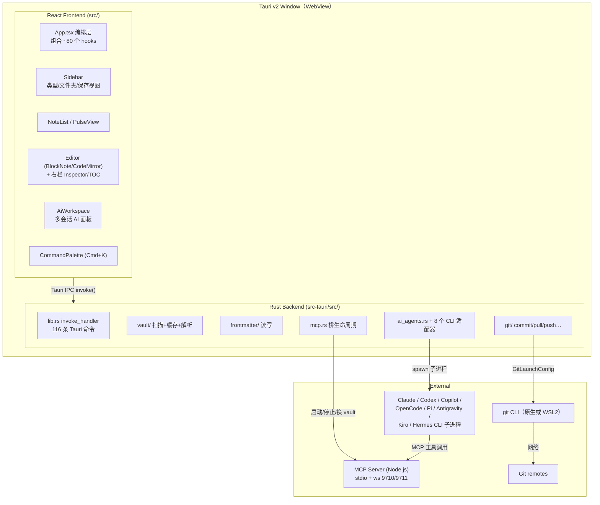
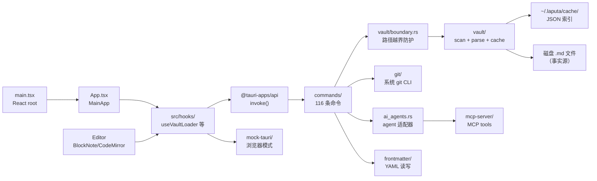
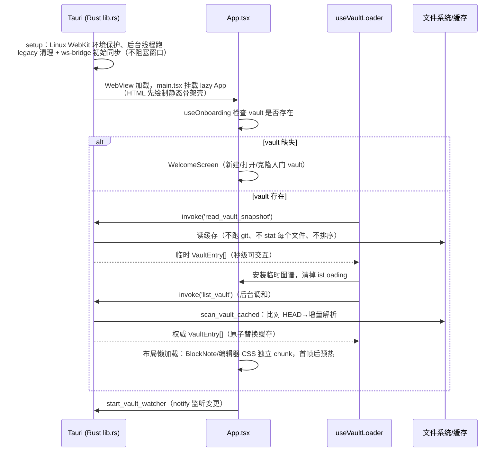
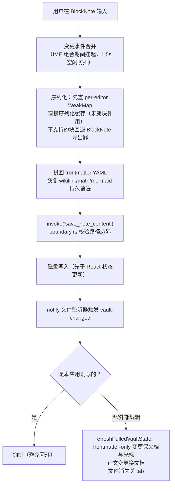

# Tolaria 源码学习笔记

> 仓库地址：[tolaria](https://github.com/refactoringhq/tolaria)
> 学习日期：2026-10-01

---

> **以下为 AI 源码分析**
>
> ### 一句话概括
>
> Tolaria 是一个基于 Tauri v2 + React 19 + Rust 的跨平台 Markdown 知识库桌面应用，以"文件系统是唯一事实源"为核心原则，把 YAML frontmatter 约定、git 版本管理和 MCP/AI Agent 集成编织成一个"AI 可导航的个人第二大脑"。
>
> ### 要点速览
>
> | 模块 | 职责 | 关键文件 |
> |------|------|---------|
> | `src/` 前端 | 四面板 UI（Sidebar / NoteList / Editor / 右栏），约 788 个 TS/TSX 文件 14.5 万行 | `src/App.tsx`（1948 行编排层）、`src/main.tsx`、`src/hooks/`（279 个 hook） |
> | `src-tauri/` 后端 | Rust 命令层：vault 扫描、frontmatter 读写、git、搜索、AI agent 适配，163 个文件 5.1 万行 | `src-tauri/src/lib.rs`（注册 116 条 IPC 命令）、`src-tauri/src/vault/`、`src-tauri/src/git/` |
> | `mcp-server/` | Node.js MCP server，把 vault 操作暴露给 AI 助手，stdio + WebSocket 双传输 | `mcp-server/index.js`（12 个 tools）、`tool-service.js`、`vault.js`、`ws-bridge.js` |
> | `src/mock-tauri/` | 浏览器开发模式的 Tauri mock 层 | `src/mock-tauri/index.ts` |
> | `site/` | VitePress 用户文档（发布到 GitHub Pages） | `site/` |
> | `docs/` | 项目自维护技术文档：ARCHITECTURE.md、ABSTRACTIONS.md、180 个 ADR | `docs/ARCHITECTURE.md`（1232 行） |
> | `e2e/` + `tests/` | Playwright 冒烟/回归/集成测试 | `playwright.*.config.ts` |

---

## 项目简介

Tolaria 解决的问题是"用纯 Markdown 文件管理大型知识库（作者本人 10000+ 笔记）时缺少顺手的桌面工具"。它是一个 macOS / Windows / Linux 桌面应用，读取一个"vault"（Markdown + YAML frontmatter 的文件夹），呈现 Bear 风格的四面板界面，并原生集成 git 同步与 AI Agent（Claude Code、Codex、Copilot、OpenCode 等 8 种 CLI agent + 直连模型 API）。核心价值主张是：数据永远属于用户——文件优先、git 优先、离线优先、无锁定、AGPL-3.0 开源。它同时是"AI-first"的：vault 的约定设计让 AI agent 无需定制配置即可正确导航知识图谱。

## 技术栈

| 类别 | 技术 |
|------|------|
| 语言 | TypeScript 5.9（前端）、Rust 2021 / 1.77.2（后端）、JavaScript（MCP server） |
| 框架 | React 19、Tauri v2.11、BlockNote 0.46（富文本编辑器）、CodeMirror 6（raw 模式） |
| 构建/样式 | Vite 7 + Tailwind CSS v4 + Radix UI/shadcn、tauri-build |
| 依赖管理 | pnpm（带 overrides + patchedDependencies）、Cargo |
| 测试框架 | Vitest（单测）、Playwright（smoke/regression/integration）、cargo test |
| 可观测性 | Sentry（崩溃上报）+ PostHog（分析），双双 opt-in |

其他显著依赖：tldraw（白板）、Mermaid 11（图表）、KaTeX（数学公式）、IronCalc（表格）、pdfjs-dist（PDF 预览）、`@modelcontextprotocol/sdk`（MCP）、notify（文件监听）、gray_matter（frontmatter 解析）。

## 目录结构

```text
tolaria/
├── src/                    # React 前端
│   ├── App.tsx             # 主编排组件（1948 行，组合 ~80 个自定义 hook）
│   ├── main.tsx            # React root 入口（lazy App + 错误边界 + 主题预绘）
│   ├── types.ts            # VaultEntry 等核心类型（:12-69）
│   ├── components/         # 473 个组件：Editor、Sidebar、NoteList、AiPanel…
│   ├── hooks/              # 279 个 hook：useVaultLoader、useAutoSync、useCliAiAgent…
│   ├── collections/        # Collection 抽象（sidebar 选择 → 可呈现数据集）
│   ├── utils/              # richEditorMarkdown.ts、wikilinks.ts、frontmatter.ts…
│   ├── mock-tauri/         # 浏览器模式的 invoke mock（isTauri() 分流）
│   └── shared/             # 跨 Rust/TS 的契约 JSON（appCommandManifest、wordCountContract…）
├── src-tauri/              # Rust 桌面后端
│   └── src/
│       ├── lib.rs          # run()：插件注册、setup、116 条 invoke_handler 命令
│       ├── vault/          # mod.rs（scan/parse）、entry.rs（VaultEntry）、cache.rs（增量缓存）、rename.rs…
│       ├── git/            # commit/pull/push/status/history/conflict/pulse/clone…
│       ├── frontmatter/    # YAML frontmatter 读写（ops.rs）
│       ├── commands/       # 命令处理器（vault/boundary.rs 路径越界防护）
│       ├── ai_agents.rs    # CLI agent 请求规范化与适配器分发
│       └── cli_agent_runtime.rs / *_cli.rs   # 8 种 agent 适配器
├── mcp-server/             # Node.js MCP server
│   ├── index.js            # stdio 传输入口 + 12 个 tools 定义
│   ├── tool-service.js     # 共享工具语义（双传输复用）
│   ├── vault.js            # 文件操作（含 mtime 乐观锁、原子写）
│   └── ws-bridge.js        # WS 双桥：9710 工具桥 / 9711 UI 桥
├── docs/                   # ARCHITECTURE.md、ABSTRACTIONS.md、adr/（180 个 ADR）
├── site/                   # VitePress 用户文档源
├── e2e/ + tests/           # Playwright 测试
└── scripts/                # release-version.mjs、build-agent-docs.mjs 等构建脚本
```

## 架构设计

### 整体架构

整体是"单进程双运行时"的 Tauri 架构：WebView 里跑 React 前端，原生侧跑 Rust 命令层，两者只通过 Tauri IPC（`invoke`）通信。数据不归应用所有——应用只是 Markdown 文件夹的读写器。vault 数据同时存在三种表示：**文件系统（事实源）、缓存索引（`~/.laputa/cache/<hash>.json`，可随时删除重建）、React 状态（`VaultEntry[]`）**，三者冲突时文件系统获胜。



前端的"浏览器开发模式"值得一提：`src/mock-tauri/index.ts:26-32` 的 `isTauri()` 检测 `window.__TAURI_INTERNALS__`，非 Tauri 环境下 `mockInvoke` 走 mock handler（甚至支持 dev HTTP 后端 `/api/vault/*`），因此 `pnpm dev` 无需 Rust 工具链即可在浏览器跑通整个 UI——这大大降低了贡献门槛。

### 核心模块

**1. 前端编排层（App.tsx + hooks）**
- 职责：所有 UI 状态的宿主，单向数据流，无 Redux/全局 context。
- 核心文件：`src/App.tsx:164`（`App()` 按窗口模式分流：note 窗口 / AI workspace 窗口 / 主窗口 `MainApp`）、`src/main.tsx:65-70`（lazy App）、`src/main.tsx:265-268`（三级 React 错误回调接 Sentry）。
- 关键结构：`MainApp` 组合约 80 个 hook，`Sidebar` 单行传 40+ props、`NoteList` 传 50+ props（App.tsx:1753、:1764）——典型的"hook 组合 + props drilling"风格，子组件之间不互相通信，一切经过 App。
- 重要 hook：`useVaultLoader`（加载 entries）、`useVaultSwitcher`（多 vault 切换）、`useVaultWatcher`（文件监听）、`useEditorSave`（防抖自动保存）、`useAutoSync`/`useAutoGit`（git 自动同步/检查点）、`useCliAiAgent`（AI 会话）。

**2. Rust vault 模块（src-tauri/src/vault/）**
- 职责：vault 扫描、Markdown 解析、增量缓存、崩溃安全重命名、附件管理。
- 核心类型：`VaultEntry` 约 40 个字段（`vault/entry.rs:15-94`），TS 侧镜像在 `src/types.ts:12-69`。
- 关键函数：`parse_md_file`（`vault/mod.rs:158-212`）——读文件 → gray_matter 解析 YAML → 提取 title（frontmatter title → H1 → 文件名，mod.rs:83-88）→ 解析 `type:` 实体类型（mod.rs:174）→ 把 is-a 自动转为 `Type` 关系（mod.rs:104-117）→ 收集所有含 `[[wikilink]]` 的字段进 `relationships`；`scan_vault`（mod.rs:455-485）——校验路径、恢复挂起的 rename 事务、WalkDir 递归跳过隐藏目录、按修改时间排序。
- 缓存：`scan_vault_cached`（`vault/cache.rs:772-826`），`CACHE_VERSION = 14`，缓存写到 vault 外的 `~/.laputa/cache/<16位路径哈希>.json`。

**3. Git 模块（src-tauri/src/git/）**
- 职责：全部 git 操作 shell out 到系统 git CLI（刻意不用 libgit2，以复用用户的 credential helper/SSH 配置）。每个 vault 解析出 `GitWorkspace`（`vault_root` + `git_root` + `vault_pathspec`），vault 范围命令带 pathspec 执行，提交用 `git commit --only` 保留兄弟目录的暂存状态。

**4. AI agent 层（ai_agents.rs + 适配器）**
- 职责：把 8 种 CLI agent 的差异归一成统一的流式事件协议（TextDelta / ThinkingDelta / ToolStart / ToolDone / Done）。
- 核心文件：`ai_agents.rs`（请求规范化 + 适配器分发）、`cli_agent_runtime.rs`（共享子进程/流/版本探测/MCP 配置生成）、各 `*_cli.rs` 适配器。每 agent 有 Safe / Power User 两档权限模式（如 Codex Safe 用 `--sandbox read-only`，Power User 用 `--sandbox workspace-write --ask-for-approval never`）。
- 前端配套：`useCliAiAgent` + `aiAgentFileOperations.ts`（检测 agent 写了哪些文件 → 触发 vault reload）。

**5. MCP server（mcp-server/）**
- 职责：把 vault 操作暴露为 MCP tools，供外部 AI 客户端（Claude Code、Cursor 等）和 app 内 agent 使用。
- 核心文件：`index.js:382-401`（stdio 入口，12 个 tools：search_notes / get_note / create_note / update_note / append_to_note / open_note / refresh_vault / list_vaults / attach_vault / clone_vault 等）；`tool-service.js:12`（`createMcpToolService` 工厂，双传输共享语义）；`vault.js:539-547`（`updateNote` 用 `expectedMtime` 乐观锁防止覆盖并发编辑，写入走 temp 文件 + rename 原子替换）；`ws-bridge.js`（9710 工具桥 + 9711 UI 桥，`isLoopbackAddress` + Origin 白名单只允许本机访问，:151-195）。
- vault 解析：`vault-path.js:156-179` 优先 `VAULT_PATH` env，否则读 `~/.config/com.tolaria.app/vaults.json` 取 active + mounted 集合。

### 模块依赖关系



分层清晰：UI 永远不直接碰文件系统，一切写操作走 `invoke()` → `commands/vault/boundary.rs:20-55`（校验路径在 active vault 根内、拒绝 `..` 越界）→ vault 模块 → 磁盘。

## 核心流程

### 流程一：启动与渐进式 vault 加载

Tolaria 对 10000+ 笔记的 vault 做了极致的启动优化——"snapshot 优先、渐进加载"（ADR-0166/0170）：



关键逻辑：`read_vault_snapshot` 是"信任缓存"的快速路径，`list_vault` 才是权威扫描；两者不阻塞串联，用户先看到笔记再等后台调和。缓存写入用 temp 文件 + fsync + rename 原子替换，且带 writer lock 和指纹检查防止多窗口竞争——崩溃时旧的可用快照仍然可读，不会让下次启动退化为全量扫描。

### 流程二：笔记编辑与自动保存（含外部变更回路）



两条硬性不变量贯穿此流程：**（1）disk-first writes**——所有变更必须先写盘（via Tauri IPC）再更新 React 状态，写盘失败时 React 状态保持与磁盘一致；**（2）乐观 UI 必须带回滚**——`useNoteCreation` 的 `persistOptimistic` 允许状态先行，但失败回调必须还原。对外部变更（git pull、AI agent 写入、其他编辑器），`useVaultWatcher` 批量防抖后走 `refreshPulledVaultState()` 统一调和，并精区分"仅 frontmatter 变化"（保留编辑器文档、光标、滚动位置）与"正文变化"（替换文档）。

### 流程三：AI Agent 会话（MCP 闭环）

用户在 AiPanel 发消息 → `useCliAiAgent` 构建 JSON 上下文快照（活跃笔记 + 链接笔记 + 打开的 tab，大笔记截断成 head/tail 并提示 agent 用 `get_note` 取全文）→ `invoke('stream_ai_agent')` → Rust 按请求生成作用域事件名 `ai-agent-stream-*`，选适配器 spawn CLI 子进程（带 Tolaria MCP 配置）→ 子进程通过 MCP tools（`search_notes`、`get_note`、`update_note` 等）操作 vault → 事件流归一化为 TextDelta/ThinkingDelta/ToolStart/ToolDone/Done 发回前端 → `aiAgentFileOperations.ts` 检测到文件写入后触发 vault reload。用户点停止时，`abort_ai_agent_stream` 校验同一事件名后 kill 注册的子进程——真正的进程级取消而非仅忽略事件。

## 关键设计亮点

**1. "文件系统是唯一事实源" + 三表示一权威**
- 解决的问题：知识库应用最常见的死法是数据被应用"绑架"（专有格式/数据库/云依赖）。
- 实现：ARCHITECTURE.md 定义的三大表示（磁盘 / 缓存 / React state）与六条不变量（disk-first writes、乐观 UI 带回滚、无孤儿状态更新、reload 恢复、缓存可弃、可见性过滤在命令边界）。缓存放在 vault 外（`~/.laputa/cache/`，`cache.rs:119-132`）避免污染用户 git 仓库，且任何时刻可删除重建。
- 为什么值得学：这是把"数据主权"从口号变成可执行工程约束的罕见范本——不变量有明确的代码归属者，违反会在 review 中可见。

**2. 基于 git 的增量 vault 缓存（三分支策略）**
- 解决的问题：10000+ 笔记每次启动全量扫描太慢。
- 实现：`scan_vault_cached`（`cache.rs:772-826`）三分支：缓存有效且 HEAD 相同 → 只重解析未提交变更（`git status --porcelain`）；HEAD 变了 → `git diff old..new --name-only` 选择性重解析变更文件；无缓存/损坏 → walkdir 全量扫描。缓存版本号（当前 v14）随 `VaultEntry` 字段变更提升以强制重扫。
- 妙处：把"用户数据本身就是 git 仓库"这个产品事实直接变成了增量索引引擎，零额外索引基础设施。

**3. Convention over configuration 的数据模型**
- 解决的问题：让 schema 既服务人类又服务 AI，且不引入专有格式。
- 实现：标准 frontmatter 字段（`type:`、`status:`、`belongs_to:`…）自带 UI 语义；关系字段不硬编码——任何值含 `[[wikilink]]` 的字段自动成为关系（ADR-0010）；`_` 前缀字段是系统属性（隐藏于 UI 但 raw 可编辑）；类型即文件（`type: Type` 的普通笔记定义 icon/color/template）。类型从 `type:` 字段读取，绝不从目录推断——改类型只改一个字段，文件不动。
- 为什么重要：README 明说这个原则"直接服务于 AI 可读性"——共享约定越多，agent 需要的定制指令越少。

**4. 双传输 MCP server + mtime 乐观锁**
- 解决的问题：同一套 vault 工具语义要同时服务外部 AI 客户端（stdio）和 app 内部（WebSocket），且并发编辑不能互相覆盖。
- 实现：`tool-service.js:12` 的服务工厂被 `index.js`（stdio）和 `ws-bridge.js`（9710/9711 双桥）复用；`vault.js:539-547` 的 `updateNote` 用 `get_note` 返回的 `mtimeMs` 做 `expectedMtime` 比对，写入走 temp+rename 原子替换；WS 桥只绑 loopback 且校验 Origin（`ws-bridge.js:151-195`），工具桥拒绝浏览器 Origin、UI 桥只信任 Tauri Origin。
- 学习点：安全边界（路径校验、loopback、Origin 白名单）和正确性边界（乐观锁、原子写）都在数据层做实，而不是依赖调用方自律。

**5. 不用 manualChunks 的代码分割 + 浏览器 mock 全等开发**
- 解决的问题：桌面应用首帧速度与贡献者门槛。
- 实现：`vite.config.ts`（1046 行）没有任何 rollup manualChunks——分包全靠代码级 lazy（`main.tsx` lazy App、`LazyEditor` 把 BlockNote/KaTeX 挡在首 chunk 外，首帧后预热）；HTML 里预置静态骨架壳让 WebView 在 React 加载前就画出 Tolaria 框架。`src/mock-tauri/` 让 `pnpm dev` 在纯浏览器跑通全部 UI（含 mock git 历史和 AI 响应），macOS/Linux 之外也能开发。
- 附带一提：dev server 中间件甚至内置整套 `/api/vault/*` 后端模拟（`vite.config.ts:584-596`），Playwright 冒烟测试因此不依赖 Rust 构建。
