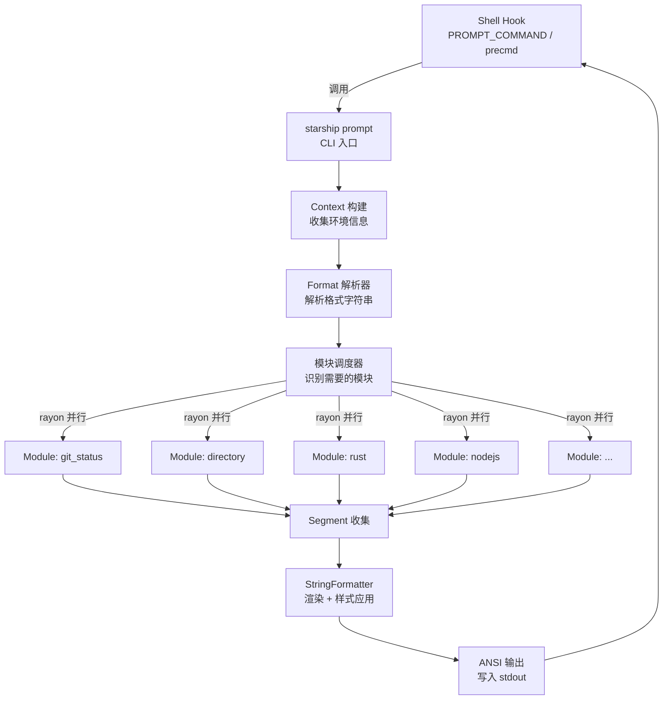
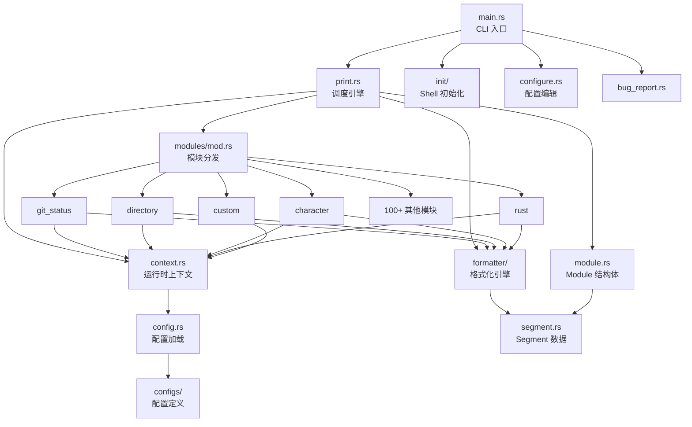
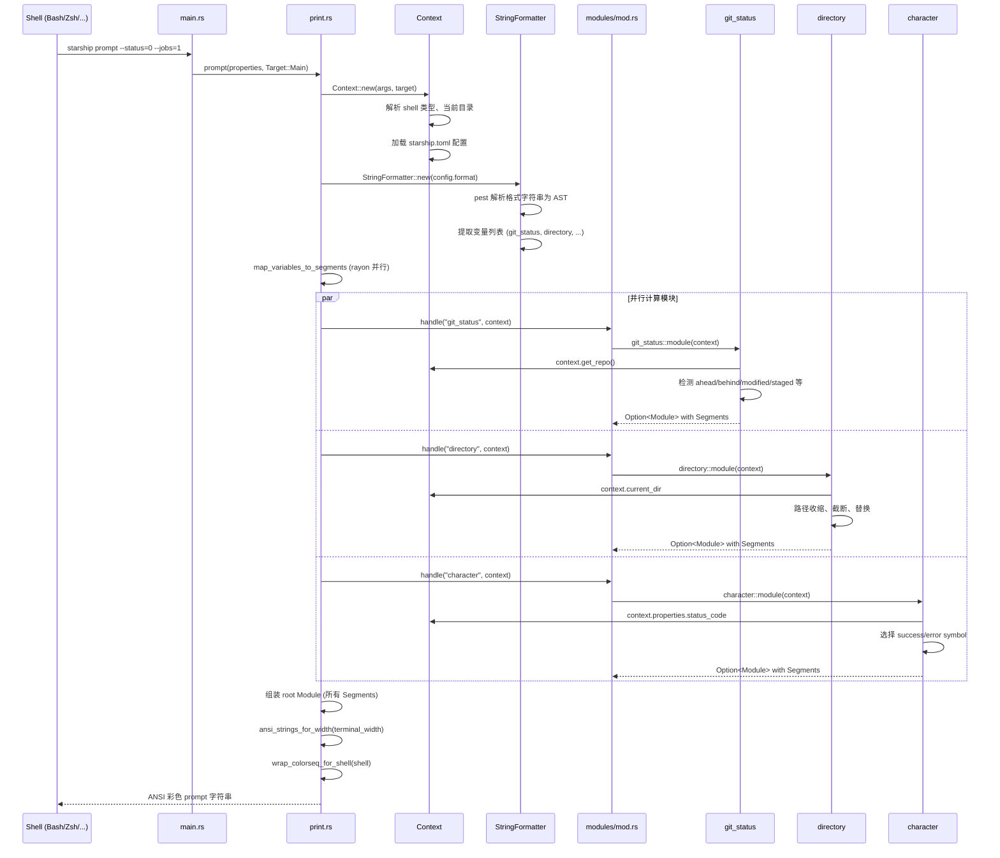
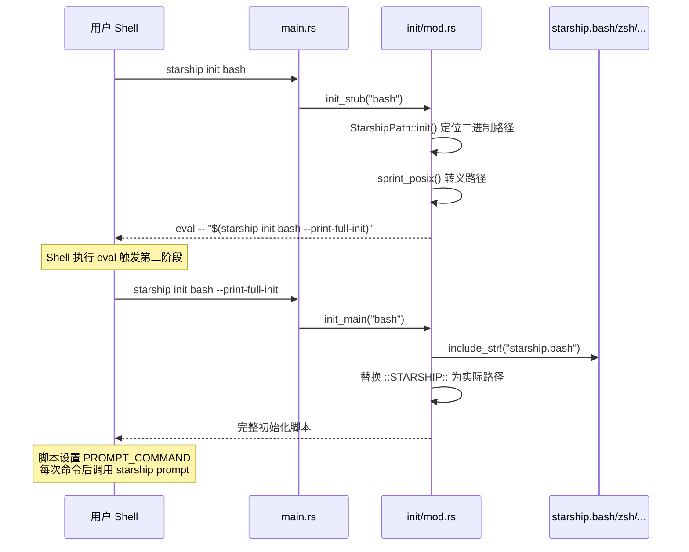

# starship 源码学习笔记

> 仓库地址：[starship](https://github.com/starship/starship)
> 学习日期：2026-04-05

---

> **以下为 AI 源码分析**
>
> ### 一句话概括
>
> Starship 是一个用 Rust 编写的极速跨 shell prompt 生成器，通过模块化插件架构和并行计算，为任意 shell 提供高度可定制的命令行提示符。
>
> ### 要点速览
>
> | 核心模块 | 职责 | 关键文件 |
> |---------|------|---------|
> | CLI 入口 | 解析命令行参数，分发子命令 | `src/main.rs` |
> | Context | 收集运行时上下文（目录、Git、环境变量等） | `src/context.rs` |
> | Print | 调度模块并行计算，组装最终 prompt 输出 | `src/print.rs` |
> | Formatter | 解析自定义格式字符串，渲染变量为 Segment | `src/formatter/` |
> | Module | 定义模块结构体和 Segment 集合 | `src/module.rs` |
> | Modules (100+) | 各信息采集模块（git、语言版本、云平台等） | `src/modules/*.rs` |
> | Configs | 每个模块的配置定义和默认值 | `src/configs/*.rs` |
> | Init | 各 shell 的初始化脚本模板 | `src/init/` |

---

## 项目简介

Starship 是一个**跨 shell、极速、无限可定制**的命令行 prompt 工具。它通过检测当前目录的上下文信息（如 Git 状态、编程语言版本、云平台配置等），在终端 prompt 中展示与当前工作最相关的信息。用 Rust 实现以保证极致的速度和跨平台兼容性，支持 Bash、Zsh、Fish、PowerShell、Nushell 等 10 种 shell。用户只需在 `starship.toml` 中配置即可定制 prompt 的每一个细节。

## 技术栈

| 类别 | 技术 |
|------|------|
| 语言 | Rust (Edition 2024, MSRV 1.90) |
| 框架 | 无特定应用框架，CLI 基于 clap |
| 构建工具 | Cargo + build.rs (shadow-rs 注入构建信息) |
| 依赖管理 | Cargo (Cargo.toml / Cargo.lock) |
| 测试框架 | Rust 内置 `#[test]` + mockall + tempfile |

## 目录结构

```
starship/
├── src/
│   ├── main.rs              # CLI 入口，clap 命令定义与分发
│   ├── lib.rs               # 库入口，公开模块声明
│   ├── context.rs           # 运行时上下文（目录、Git、shell、环境）
│   ├── print.rs             # 调度引擎：模块并行计算 + prompt 组装
│   ├── module.rs            # Module 结构体定义 + ALL_MODULES 常量
│   ├── segment.rs           # Segment（Text/Fill/LineTerm）数据结构
│   ├── config.rs            # 配置加载、ModuleConfig trait、Style 解析
│   ├── configure.rs         # `starship config` 交互式编辑逻辑
│   ├── bug_report.rs        # 生成 GitHub issue 模板
│   ├── logger.rs            # 自定义日志实现
│   ├── formatter/           # 格式字符串引擎
│   │   ├── spec.pest        # PEG 语法定义
│   │   ├── parser.rs        # pest 解析器
│   │   ├── model.rs         # AST 节点（FormatElement, TextGroup 等）
│   │   ├── string_formatter.rs # 核心渲染引擎
│   │   └── version.rs       # 版本号格式化工具
│   ├── modules/             # 100+ 信息采集模块
│   │   ├── mod.rs           # handle() 分发函数 + description()
│   │   ├── git_status.rs    # Git 状态检测
│   │   ├── rust.rs          # Rust 版本检测
│   │   ├── character.rs     # prompt 字符（箭头）
│   │   ├── directory.rs     # 当前目录显示
│   │   ├── custom.rs        # 用户自定义模块
│   │   └── ...              # nodejs, python, golang, aws 等
│   ├── configs/             # 每个模块的配置结构体
│   │   ├── mod.rs           # FullConfig 汇总 + 模块声明
│   │   ├── starship_root.rs # 根配置 + PROMPT_ORDER 默认顺序
│   │   └── *.rs             # 各模块配置（format, symbol, style 等）
│   ├── init/                # Shell 初始化脚本
│   │   ├── mod.rs           # init_stub / init_main 逻辑
│   │   ├── starship.bash    # Bash 初始化脚本
│   │   ├── starship.zsh     # Zsh 初始化脚本
│   │   └── ...              # fish, powershell, nu, elvish 等
│   ├── test/                # 测试工具（ModuleRenderer 等）
│   └── utils/               # 工具函数（命令执行、环境变量、序列化）
├── docs/                    # VitePress 文档站（多语言）
├── install/                 # 安装脚本和包资源
├── Cargo.toml               # 项目依赖和元数据
├── build.rs                 # 构建脚本（preset 生成、Windows 资源）
└── .github/workflows/       # CI/CD（测试、发布、安全审计）
```

## 架构设计

### 整体架构

Starship 采用**模块化插件架构 + 并行调度引擎**的设计。每次 shell 需要渲染 prompt 时，shell 初始化脚本调用 `starship prompt` 命令，Starship 创建 Context 上下文对象，然后根据用户配置的 format 字符串解析出需要的模块列表，使用 rayon 线程池并行计算所有模块，最终将各模块输出的 Segment 组装为带 ANSI 颜色的 prompt 字符串返回给 shell。



### 核心模块

#### 1. CLI 入口 (`src/main.rs`)

- **职责**：定义 clap 子命令（`prompt`、`init`、`module`、`config`、`explain`、`timings` 等），解析参数并分发到对应处理函数
- **关键结构**：`Cli` struct + `Commands` enum
- **核心逻辑**：`main()` 初始化 logger 和 rayon 线程池后，`match args.command` 分发到各处理函数

#### 2. Context (`src/context.rs`)

- **职责**：封装一次 prompt 渲染所需的所有运行时信息
- **关键字段**：
  - `config: StarshipConfig` — 用户 TOML 配置
  - `current_dir / logical_dir` — 当前工作目录
  - `repo: OnceLock<Repo>` — Git 仓库信息（惰性加载）
  - `dir_contents: OnceLock<DirContents>` — 目录内容（惰性加载）
  - `shell: Shell` — 当前 shell 类型
  - `env: Env` — 环境变量访问（支持 mock）
- **设计特点**：大量使用 `OnceLock` 实现惰性初始化，多个模块共享同一份 Git 仓库信息避免重复计算

#### 3. Print 引擎 (`src/print.rs`)

- **职责**：prompt 组装的核心调度器
- **核心函数**：
  - `prompt()` — 创建 Context，调用 `get_prompt()` 输出
  - `get_prompt()` — 加载 formatter，**并行计算**所有模块，组装输出
  - `handle_module()` — 判断模块是否启用，调用 `modules::handle()` 获取输出
  - `load_formatter_and_modules()` — 根据 target（Main/Right/Profile/Continuation）选择对应格式字符串
- **并行机制**：使用 `rayon` 的 `par_iter()` 对 `$all` 展开的模块列表和 `map_variables_to_segments` 中的变量替换进行并行计算

#### 4. Formatter 引擎 (`src/formatter/`)

- **职责**：解析用户自定义的格式字符串（如 `"[$symbol($version)]($style)"`），替换变量为实际值
- **核心组件**：
  - `spec.pest` — PEG 语法定义，支持 `$variable`、`[text](style)`、`(conditional)` 三种核心语法
  - `parser.rs` — 基于 pest 的解析器，将格式字符串解析为 AST
  - `model.rs` — AST 节点定义（`FormatElement::Text | Variable | TextGroup | Conditional`）
  - `string_formatter.rs` — 核心渲染引擎，提供 `map()` / `map_meta()` / `map_style()` / `map_variables_to_segments()` 链式 API

#### 5. Module 与 Segment (`src/module.rs`, `src/segment.rs`)

- **Module**：一个模块的输出容器，包含 name、description、segments 列表、duration 计时
- **Segment**：三种变体 — `Text`（带样式文本）、`Fill`（填充字符）、`LineTerm`（换行符）
- **渲染链**：Module → `ansi_strings()` → `AnsiStrings` → 最终 ANSI 输出

#### 6. Modules 集合 (`src/modules/`)

- **职责**：100+ 个信息采集模块，每个模块实现 `fn module(context: &Context) -> Option<Module>` 接口
- **分发机制**：`modules::handle()` 函数通过 `match module_name` 将模块名映射到对应实现
- **模块分类**：
  - **VCS**：git_status, git_branch, git_commit, git_metrics, git_state, hg_branch 等
  - **语言版本**：rust, nodejs, python, golang, java 等 40+ 个
  - **云平台**：aws, azure, gcloud, openstack, kubernetes
  - **Shell 相关**：character, cmd_duration, directory, jobs, status, time
  - **扩展**：custom（用户自定义）、env_var（环境变量）

#### 7. Configs (`src/configs/`)

- **职责**：为每个模块定义可序列化的配置结构体，提供默认值
- **模式**：每个模块配置实现 `Deserialize + Default`，通过 `ModuleConfig` trait 从 TOML 加载
- **典型字段**：`format`（格式字符串）、`symbol`（图标）、`style`（颜色样式）、`disabled`、`detect_extensions`/`detect_files`/`detect_folders`（触发条件）

### 模块依赖关系



## 核心流程

### 流程一：Prompt 渲染（主流程）

这是 Starship 最核心的流程——每次按下回车键后 shell 渲染新 prompt 时触发。



**关键逻辑说明**：

1. **Shell Hook 触发**：Shell 初始化脚本设置了 `PROMPT_COMMAND`（Bash）或 `precmd`（Zsh）等钩子，在每次命令执行后调用 `starship prompt`
2. **Context 构建**：收集当前目录、shell 类型、上一条命令的退出码、终端宽度等信息；Git 仓库和目录内容通过 `OnceLock` 惰性加载
3. **格式字符串解析**：默认 `format = "$all"` 会展开为 `PROMPT_ORDER` 中定义的所有模块
4. **并行计算**：通过 rayon 的 `par_iter()` 并行执行所有模块，最大线程数默认为 `min(CPU 核心数, 8)`
5. **Segment 组装**：每个模块返回 `Vec<Segment>`，由 StringFormatter 按格式字符串顺序组装
6. **ANSI 输出**：根据 shell 类型对 ANSI 颜色序列进行适配包装（如 Zsh 需要 `%{...%}` 包裹）

### 流程二：Shell 初始化

这是用户执行 `eval "$(starship init bash)"` 时的流程。



**关键逻辑说明**：

1. **两阶段初始化**：第一阶段输出一个短小的 stub 命令，第二阶段通过 `--print-full-init` 输出完整初始化脚本。这种设计解决了不同 shell 版本对 `eval` / `source` / 进程替换的兼容性问题
2. **Shell 脚本模板**：每个 shell 有独立的初始化脚本（如 `starship.bash`、`starship.zsh`），通过 `include_str!` 编译时嵌入二进制文件中
3. **路径转义**：针对不同 shell 类型有专门的路径转义逻辑（POSIX、PowerShell、Cmd）

## 关键设计亮点

### 1. rayon 并行模块计算

- **解决的问题**：prompt 渲染需要在毫秒级完成，但 100+ 个模块中部分涉及 Git 操作、外部命令调用等耗时操作
- **实现方式**：在 `print.rs` 中使用 rayon 的 `par_iter()` 和 `map_variables_to_segments()` 并行计算所有模块。线程池大小通过 `STARSHIP_NUM_THREADS` 环境变量可配置，默认为 `min(CPU 核心数, 8)`（`src/lib.rs:36`）
- **设计考量**：限制最大 8 线程避免在高核心数机器上产生过多线程开销；使用全局线程池而非每次创建，减少初始化开销

### 2. PEG 语法驱动的格式化引擎

- **解决的问题**：用户需要高度灵活的 prompt 自定义能力，包括变量替换、条件渲染、嵌套样式
- **实现方式**：使用 pest PEG 解析器（`src/formatter/spec.pest`）定义格式语法，支持三种核心结构：
  - `$variable` — 变量引用
  - `[text](style)` — 带样式的文本组
  - `(conditional)` — 条件渲染（变量全空时隐藏）
- **设计考量**：pest 在编译时生成解析器代码，零运行时开销；AST 模型（`FormatElement`）支持递归嵌套，用户可以写出如 `"[($version)]($style)"` 这样的复杂格式

### 3. OnceLock 惰性共享上下文

- **解决的问题**：多个模块可能需要相同的 Git 仓库信息或目录内容，重复计算浪费时间
- **实现方式**：`Context` 中的 `repo` 和 `dir_contents` 字段使用 `OnceLock` 包装（`src/context.rs:58-52`），第一次访问时计算并缓存，后续模块直接复用
- **设计考量**：`OnceLock` 是线程安全的，配合 rayon 并行计算时多个模块可以安全地竞争初始化同一份数据

### 4. 统一的模块接口与配置模式

- **解决的问题**：100+ 个模块需要一致的接口和配置体验，同时降低新增模块的门槛
- **实现方式**：
  - 所有模块实现同一接口：`fn module(context: &Context) -> Option<Module>`
  - 配置结构体通过 `#[derive(Deserialize, Default)]` + `ModuleConfig` trait 自动从 TOML 加载
  - 每个模块标准化地使用 `detect_extensions` / `detect_files` / `detect_folders` 触发条件
  - `modules/mod.rs` 中 `handle()` 函数是单一分发入口
- **设计考量**：统一的模式使新增模块只需三个文件（`modules/xxx.rs`、`configs/xxx.rs`、注册入口），CONTRIBUTING.md 有完整的 checklist

### 5. 可测试性设计

- **解决的问题**：prompt 工具高度依赖环境（Git 状态、目录内容、外部命令输出），难以编写可靠的单元测试
- **实现方式**：
  - `Context` 的 `env` 字段支持 mock 环境变量（`#[cfg(test)] cmd: HashMap` 支持命令输出 mock）
  - `ModuleRenderer` 测试工具（`src/test/`）提供链式 API：`.path()` / `.config()` / `.env()` / `.cmd()` / `.collect()`
  - `context.exec_cmd()` 和 `context.get_env()` 都走 mock 路径
- **设计考量**：确保测试完全隔离、可在任何机器上运行；不依赖预装工具或特定环境状态
