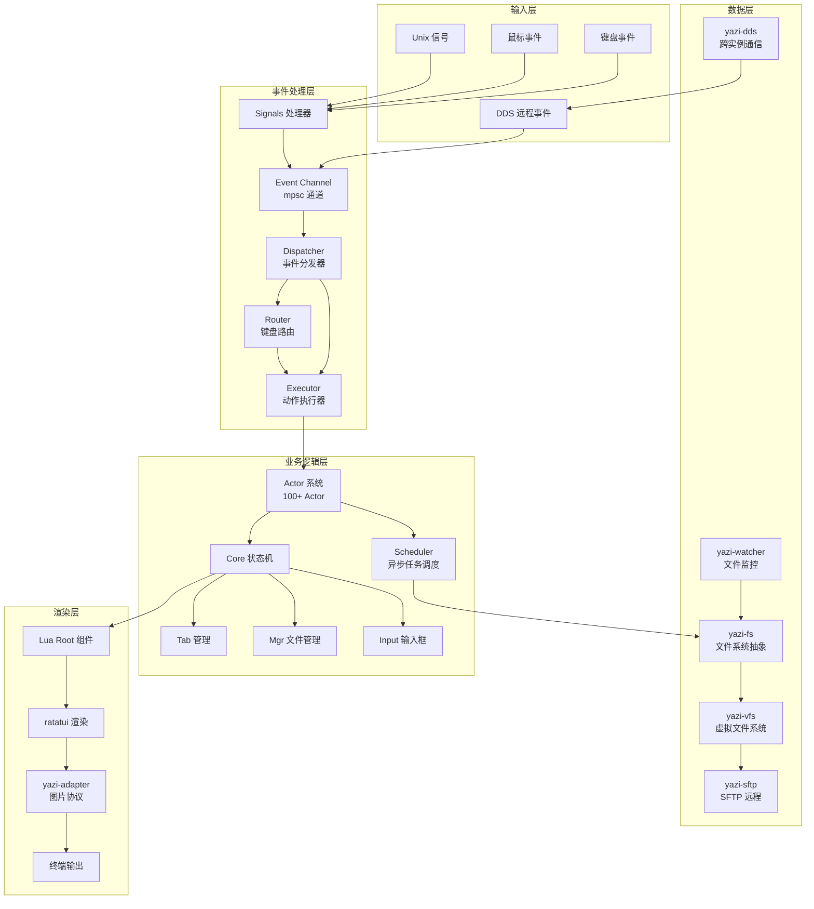
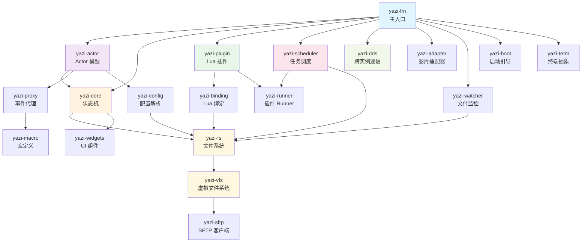
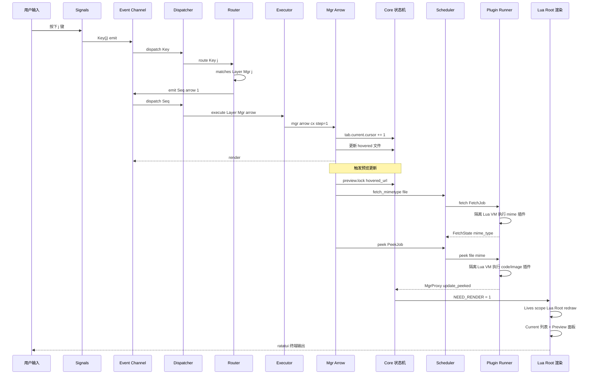
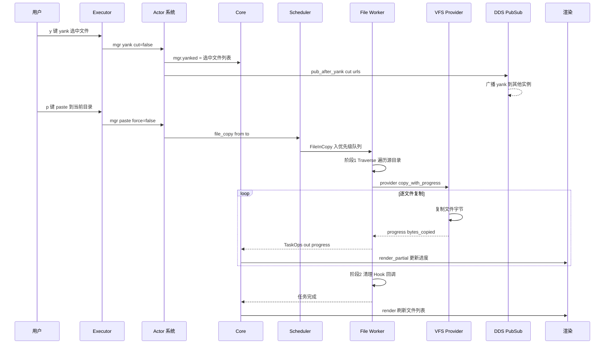

# yazi 源码学习笔记

> 仓库地址：[yazi](https://github.com/sxyazi/yazi)
> 学习日期：2026-04-05

---

> **以下为 AI 源码分析**
>
> ### 一句话概括
>
> Yazi 是一个用 Rust 编写的高性能异步终端文件管理器，基于 tokio 异步运行时和 Lua 插件系统，通过事件驱动架构和多协议图片渲染实现了极致的文件浏览体验。
>
> ### 要点速览
>
> | 核心模块 | 职责 | 关键文件 |
> |---------|------|---------|
> | yazi-fm | 主入口 binary，事件循环与 UI 渲染 | `main.rs`, `app.rs`, `dispatcher.rs` |
> | yazi-core | 核心状态机：Tab/Mgr/Input 等业务逻辑 | `core.rs`, `tab/`, `mgr/` |
> | yazi-actor | Actor 并发模型，所有操作的执行层 | `actor.rs`, `context.rs` |
> | yazi-plugin | Lua 插件系统（mlua），预览/预加载/获取器 | `standard.rs`, `preset/` |
> | yazi-runner | 隔离 Lua VM 的 Runner，执行插件任务 | `runner.rs`, `fetcher/`, `previewer/` |
> | yazi-scheduler | 异步任务调度：文件操作、插件、进程 | `scheduler.rs`, `worker.rs` |
> | yazi-dds | 跨实例 Data Distribution Service | `client.rs`, `server.rs`, `pubsub.rs` |
> | yazi-fs | 文件系统抽象层，Provider trait | `file.rs`, `files.rs`, `provider/` |
> | yazi-vfs | 虚拟文件系统，统一本地/SFTP 操作 | `provider.rs`, `cha.rs`, `files.rs` |
> | yazi-adapter | 多协议终端图片渲染（Kitty/Sixel/iTerm2） | `adapter.rs`, `drivers/` |
> | yazi-config | TOML 配置解析（keymap/theme/layout） | `lib.rs`, `popup/`, `vfs/` |
> | yazi-proxy | 事件代理层，连接各模块的 emit 通道 | `mgr.rs`, `app.rs`, `input.rs` |
> | yazi-binding | Rust 类型到 Lua 的 UserData 绑定 | `cha.rs`, `url.rs`, `file.rs` |
> | yazi-macro | 全局宏定义（act!/emit!/render!） | `actor.rs`, `event.rs`, `render.rs` |
> | yazi-watcher | 文件系统变更监控（主/备双层） | `watcher.rs`, `local/` |
> | yazi-widgets | TUI 输入组件（vim-like 操作） | `input/input.rs`, `scrollable.rs` |

---

## 项目简介

Yazi（意为"鸭子"）是一个用 Rust 编写的终端文件管理器，目标是提供高效、用户友好、高度可定制的文件管理体验。项目基于 tokio 异步运行时实现全异步 I/O，所有文件操作、图片解码、代码高亮等任务均在后台线程执行，不阻塞 UI。通过 Lua 5.5 插件系统（mlua），用户可以重写几乎所有 UI 组件和功能逻辑。项目还内置了跨实例通信的 DDS（Data Distribution Service），支持多个 yazi 实例间状态同步。

## 技术栈

| 类别 | 技术 |
|------|------|
| 语言 | Rust (Edition 2024, MSRV 1.92.0) |
| 框架 | tokio (异步运行时), ratatui (TUI 框架), crossterm (终端事件) |
| 构建工具 | Cargo (workspace, 30+ crates), Nix Flake |
| 依赖管理 | Cargo (workspace dependencies) |
| 测试框架 | cargo test (workspace) |
| 脚本引擎 | mlua (Lua 5.5, 支持 async/serde/macros) |
| 图片处理 | image crate, Sixel/Kitty/iTerm2 协议 |
| 远程文件 | russh (SSH), 自实现 SFTP 协议 |

## 目录结构

```
yazi/
├── yazi-fm/            # 主入口 binary：App 事件循环、UI 渲染、事件分发
├── yazi-cli/           # CLI 工具（ya）：emit/pub/sub/pkg 子命令
├── yazi-core/          # 核心状态机：Tab、Mgr、Input、Confirm 等业务状态
├── yazi-actor/         # Actor 并发模型：所有用户操作的执行层（100+ Actor）
├── yazi-plugin/        # Lua 插件系统：运行时初始化、API 暴露、预置组件
│   └── preset/         # 预置 Lua 脚本：25 个插件 + 15 个 UI 组件
├── yazi-runner/        # 插件 Runner：隔离 Lua VM 执行 fetcher/previewer/preloader
├── yazi-scheduler/     # 异步任务调度器：文件操作、插件、进程的多线程工作池
├── yazi-dds/           # 分布式数据服务：Unix socket C/S 架构，PubSub 跨实例通信
├── yazi-fs/            # 文件系统抽象：File/Cha 数据模型、排序/过滤、Provider trait
├── yazi-vfs/           # 虚拟文件系统：统一本地/SFTP 操作的 Provider 工厂
├── yazi-sftp/          # SFTP 客户端：完整的 SSH File Transfer Protocol 实现
├── yazi-adapter/       # 图片适配器：7 种终端图片协议的驱动实现
├── yazi-config/        # 配置系统：TOML 解析（yazi.toml/keymap.toml/theme.toml）
├── yazi-proxy/         # 事件代理：AppProxy/MgrProxy/InputProxy 等 emit 桥接
├── yazi-binding/       # Lua 绑定：Cha/Url/File/Rect/Style 等 UserData 类型
├── yazi-macro/         # 宏定义：act!/emit!/render!/relay! 等核心宏
├── yazi-watcher/       # 文件监控：系统通知 + 轮询双层监控机制
├── yazi-widgets/       # UI 组件：vim-like Input（快照栈/模式切换/自动完成）
├── yazi-shared/        # 共享库：原子类型、线程局部存储
├── yazi-term/          # 终端抽象：Term 结构、信号量控制
├── yazi-tty/           # TTY 层：底层终端 I/O
├── yazi-boot/          # 启动引导：命令行参数解析、Boot 配置初始化
├── yazi-build/         # 构建脚本
├── yazi-codegen/       # 代码生成
├── yazi-emulator/      # 终端模拟器检测
├── yazi-ffi/           # 外部 C 函数接口（macOS DiskArbitration 等）
├── yazi-packing/       # 打包工具
├── yazi-parser/        # 动作解析器
├── yazi-shim/          # 第三方库垫片（ratatui/crossterm/strum 扩展）
├── assets/             # 图标、安装脚本
├── nix/                # Nix 构建配置
├── scripts/            # CI/CD 脚本
└── snap/               # Snapcraft 配置
```

## 架构设计

### 整体架构

Yazi 采用 **事件驱动 + Actor 模型 + 插件化** 的分层架构。用户输入（键盘/鼠标/信号）通过 crossterm 捕获后进入统一的事件通道，经由 Dispatcher 分发到 Router（键盘路由）和 Executor（动作执行），最终由各 Layer 的 Actor 修改 Core 状态，触发 ratatui + Lua 混合渲染管线输出到终端。



### 核心模块

#### 1. yazi-fm — 主入口与事件循环

程序入口位于 `yazi-fm/src/main.rs`，通过 `#[tokio::main]` 启动异步运行时。启动时按顺序初始化 29 个子系统模块，最后调用 `App::serve()` 进入主事件循环。

**App 结构体**（`app.rs`）：
- `core: Core` — 核心状态机（包含所有 UI 状态）
- `term: Option<Term>` — 终端抽象（ratatui Terminal）
- `signals: Signals` — Unix 信号处理器

**事件循环机制**：
- 使用 `tokio::select!` 同时监听事件通道和渲染超时
- 每次最多批量处理 50 个事件（`rx.recv_many(&mut events, 50)`）
- 渲染限流：10ms 时间窗口（最高 100Hz）
- 支持全量渲染（`NEED_RENDER=1`）和部分渲染（`NEED_RENDER=2`，仅更新进度和通知）

**事件分发链**：
- `Dispatcher::dispatch()` — 按事件类型分发（Call/Seq/Key/Mouse/Resize/Focus/Paste）
- `Router::route()` — 根据当前 Layer 和 Keymap 配置匹配键盘输入
- `Executor::execute()` — 按 Layer 分发到对应的 Actor（App/Mgr/Tasks/Input 等 11 个层级）

**核心文件**：
- `yazi-fm/src/main.rs` — 启动流程
- `yazi-fm/src/app/app.rs` — App 结构体和 `serve()` 事件循环
- `yazi-fm/src/dispatcher.rs` — 事件分发器
- `yazi-fm/src/router.rs` — 键盘路由（Layer + Keymap 匹配）
- `yazi-fm/src/executor.rs` — 动作执行器（11 个 Layer 分发）
- `yazi-fm/src/signals.rs` — 信号处理（SIGINT/SIGTSTP/SIGCONT 等）

#### 2. yazi-core — 核心状态机

管理应用的全部 UI 状态，是所有 Actor 操作的目标对象。

**Core 结构体**：
- `mgr: Mgr` — 文件管理器（包含 `tabs: Tabs`，每个 Tab 持有 `Folder`、`Selected`、`Backstack`、`Preview`）
- `tasks: Tasks` — 后台任务面板（500ms 轮询刷新）
- `input: Input` — 输入框组件（vim-like 模式：Normal/Insert/Replace）
- `confirm: Confirm` — 确认对话框
- `pick: Pick` — 选择列表
- `which: Which` — 快捷键提示
- `help: Help` — 帮助面板
- `cmp: Cmp` — 自动完成列表
- `spot: Spot` — 文件聚焦预览
- `notify: Notify` — 通知消息系统

**Tab 数据结构**：
- `current: Folder` — 当前目录（`Files` 集合 + `Sorter` + `Filter`）
- `parent: Option<Folder>` — 父目录
- `selected: Selected` — 多选集合（带父子冲突检测）
- `backstack: Backstack<UrlBuf>` — 前进/后退历史（最多 60 条）
- `history: HashMap<UrlBuf, Folder>` — 目录缓存
- `preview: Preview` — 预览状态（锁定机制防止闪烁）
- `finder: Option<Finder>` — 快速查找
- `preference: Preference` — Tab 级偏好设置

**核心文件**：
- `yazi-core/src/core.rs` — Core 结构体定义
- `yazi-core/src/tab/` — Tab 模块（11 个子文件）
- `yazi-core/src/mgr/` — Mgr 模块（Tabs/Yanked/Batcher/Mimetype）
- `yazi-core/src/input/` — Input 组件
- `yazi-core/src/highlighter.rs` — 代码高亮（273 行，基于 syntect）

#### 3. yazi-actor — Actor 并发执行模型

每个用户操作封装为一个 Actor，通过 `act!` 宏统一调度。

**Actor trait**：
```rust
pub trait Actor {
    type Form;                    // 操作参数类型
    const NAME: &str;             // Actor 名称
    fn act(cx: &mut Ctx, form: Form) -> Result<Data>;  // 执行逻辑
    fn hook(cx: &Ctx, form: &Form) -> Option<SparkKind>; // 前置钩子
}
```

**Ctx 上下文**：
- `core: &mut Core` — 核心状态可变引用
- `term: &mut Option<Term>` — 终端引用
- `tab: usize` — 当前 Tab 索引
- `level: usize` — 调用深度（防止无限递归）
- `source: Source` — 事件来源

**Actor 分类**（100+ 个）：
- **App 层**：bootstrap、quit、plugin、plugin_do、lua、resize、mouse、focus
- **Mgr 层**：cd、arrow、enter、leave、open、yank、paste、remove、create、rename、search、filter、tab_create/close/switch、sort、hidden、visual_mode
- **Tasks 层**：show、close、cancel、inspect、process_open
- **Input 层**：按 mode 分发（Normal/Insert/Replace），支持 complete
- **其他层**：Confirm、Help、Cmp、Which、Notify、Spot、Pick

**核心文件**：
- `yazi-actor/src/actor.rs` — Actor trait 定义
- `yazi-actor/src/context.rs` — Ctx 上下文
- `yazi-actor/src/app/` — 应用级 Actor（15+ 个）
- `yazi-actor/src/mgr/` — 文件管理 Actor（30+ 个）

#### 4. yazi-plugin — Lua 插件系统

基于 mlua (Lua 5.5) 提供强大的插件扩展能力。

**两阶段初始化**（`standard.rs`）：
- Stage 1：设置全局对象（`ui`/`ya`/`fs`/`ps`/`rt`/`th`），安装 Binding 类型，加载 `ya.lua` 和 15 个预置 UI 组件
- Stage 2：执行 `setup.lua`/`compat.lua`，异步加载用户 `init.lua`

**Lua API 分类**：
- `ya.*` — 工具函数（emit/exec/sleep/hash/clipboard/image_show/preview_code/sync/async/chan/join 等 40+ API）
- `ui.*` — UI 元素（area/redraw/render/hide/lines/truncate/width）
- `fs.*` — 文件操作（cha/copy/create/rename/remove/read_dir/write 等）
- `ps.*` — PubSub（pub/pub_to/sub/sub_remote/unsub）
- `rt.*` — 运行时配置（args/mgr/preview/tasks/plugin/term）
- `th.*` — 主题访问（app/mgr/tabs/mode/status/which/confirm 等 15 个分类）

**预置插件**（25 个）：
- 预览器：code、image、pdf、video、font、json、archive、file、folder、empty
- 工具：fzf、zoxide、dds、session、extract、vfs、magick
- MIME：mime、mime-dir、mime-local、mime-remote
- 辅助：multi、noop、null、init

**核心文件**：
- `yazi-plugin/src/standard.rs` — 标准 Lua 环境初始化
- `yazi-plugin/src/utils/` — ya.* API（17 个子文件）
- `yazi-plugin/preset/plugins/` — 25 个预置插件
- `yazi-plugin/preset/components/` — 15 个预置 UI 组件（root/current/preview/header/status 等）

#### 5. yazi-runner — 插件 Runner

在隔离的 Lua VM 中执行插件任务，防止插件间状态污染。

**Runner 类型**：
- `Fetcher` — 获取文件元数据（图标、Git 状态等），返回 `FetchState`
- `Previewer` — 文件预览（peek），支持 Lua 钩子超时取消（每 2000 指令检查）
- `Preloader` — 预加载缓存，返回完成状态
- `Entry` — 可执行脚本入口，支持长期后台任务
- `Spot` — 表格聚焦，返回 CancellationToken
- `Loader` — 插件加载器，LRU 缓存 + 字节码编译

**核心文件**：
- `yazi-runner/src/runner.rs` — Runner 主体
- `yazi-runner/src/loader/loader.rs` — 插件加载与字节码缓存
- `yazi-runner/src/fetcher/fetcher.rs` — Fetch 任务
- `yazi-runner/src/previewer/previewer.rs` — Peek 任务

#### 6. yazi-scheduler — 异步任务调度器

管理所有后台任务的生命周期，基于优先级通道分发。

**Scheduler** 包含 7 种 Worker 类型：
- `File` — 文件操作（copy/cut/delete/trash/link/download/upload）
- `Plugin` — 插件 entry 执行
- `Fetch` — 媒体信息获取（LRU 4096 缓存）
- `Preload` — 预加载（LRU 4096 + loading 256 去重）
- `Size` — 目录大小计算（300ms Throttle 批量聚合）
- `Process` — 进程执行（block/orphan/bg 三种模式）
- `Hook` — 清理回调

每种 Worker 使用 `async_priority_channel` 实现优先级队列，线程数可配置。

**核心文件**：
- `yazi-scheduler/src/scheduler.rs` — 主调度器
- `yazi-scheduler/src/worker.rs` — Worker 线程管理
- `yazi-scheduler/src/file/file.rs` — 文件操作（两阶段：遍历+执行）
- `yazi-scheduler/src/ongoing.rs` — 进行中任务管理

#### 7. yazi-dds — Data Distribution Service

实现多个 yazi 实例间的状态同步和通信。

**架构**：Client-Server 模式，通过 Unix socket 通信，无需额外服务进程（首个 yazi 实例自动成为 Server）。

**Server 职责**：
- 接受客户端连接，处理 `hi`（注册能力）/ `bye`（断开）握手
- 消息路由：广播（receiver=0）或单播（receiver=指定 ID）
- 状态持久化：以 `@` 开头的事件保存到 `.dds` 文件
- 心跳保活：每 5 秒发送 `\n`

**PubSub 机制**：
- 本地订阅（`ps.sub`）：同进程内事件回调
- 远程订阅（`ps.sub_remote`）：跨实例事件，自动更新能力列表
- 事件类型（Ember）：Tab/Cd/Load/Hover/Rename/Yank/Duplicate/Move/Trash/Delete/Download/Mount/Custom

**核心文件**：
- `yazi-dds/src/client.rs` — 客户端（自动重连 500ms）
- `yazi-dds/src/server.rs` — 服务器（消息路由与广播）
- `yazi-dds/src/pubsub.rs` — PubSub 管理
- `yazi-dds/src/state.rs` — 状态持久化

#### 8. yazi-adapter — 终端图片渲染

支持 7 种终端图片协议，自动检测终端类型选择最佳方案。

**协议支持**：
- `Kgp` — Kitty Graphics Protocol（新版 unicode placeholders）
- `KgpOld` — Kitty 旧版协议
- `Iip` — iTerm2 Inline Images Protocol
- `Sixel` — Sixel 图形格式（Wu 量化 256 色 + RLE 压缩）
- `X11` / `Wayland` — Überzug++ 后端
- `Chafa` — ASCII 艺术渲染

**图片处理流程**：解码 → EXIF 方向校正 → 下采样到终端尺寸 → 色彩量化 → 协议编码 → 终端输出

**核心文件**：
- `yazi-adapter/src/adapter.rs` — Adapter 枚举与自动检测
- `yazi-adapter/src/drivers/sixel.rs` — Sixel 编码（色彩量化+RLE）
- `yazi-adapter/src/image.rs` — 图片预处理（precache/downscale）

### 模块依赖关系



## 核心流程

### 流程一：文件浏览与预览

从用户按下方向键到文件预览显示的完整调用链。



### 流程二：文件复制操作

从用户 yank(复制) → paste(粘贴) 的完整异步文件操作流程。



## 关键设计亮点

### 1. 高性能渲染管线

**解决的问题**：终端 UI 刷新频率和响应速度的平衡。

**实现方式**：
- **渲染限流**（`yazi-fm/src/app/app.rs`）：10ms 时间窗口（最高 100Hz），使用 `Duration::from_millis(10).checked_sub(last_render.elapsed())` 计算是否需要延迟
- **三级渲染标志**：`NEED_RENDER` 原子变量，0=无需渲染、1=全量渲染、2=部分渲染（仅更新进度和通知）
- **同步更新**：使用 `BeginSynchronizedUpdate`/`EndSynchronizedUpdate` CSI 序列确保原子屏幕刷新，防止闪烁
- **事件批处理**：每次最多处理 50 个事件后再渲染，避免频繁重绘
- **碰撞检测与差异更新**（`render.rs`）：检测渲染碰撞后计算 buffer diff，只发送变化部分

**设计原因**：终端输出带宽有限，批处理+限流+差异更新的组合将渲染开销降到最低，同时保持流畅的用户体验。

### 2. 隔离式 Lua 插件架构

**解决的问题**：插件间状态隔离和主线程安全。

**实现方式**：
- **双环境设计**（`yazi-plugin/src/standard.rs` vs `slim.rs`）：Standard 环境用于主应用（含 PubSub/setup/用户 init.lua），Slim 环境用于 Runner 中的隔离执行
- **隔离 VM**（`yazi-runner/src/runner.rs`）：每个插件任务创建独立的 Lua VM（`Lua::new()` + `Runtime::new_isolate()`）
- **超时取消**：通过 Lua 钩子每 2000 条指令检查 CancellationToken
- **字节码缓存**（`yazi-runner/src/loader/loader.rs`）：首次加载解析 Lua 源码后编译为字节码缓存，避免重复解析
- **Composer 模式**（`yazi-binding/src/composer.rs`）：自定义 metatable 实现零开销的属性动态访问

**设计原因**：Lua 的 GIL 限制单线程执行，隔离 VM 允许多个插件在不同线程并行执行。字节码缓存消除了重复解析开销。

### 3. 异步优先级任务调度

**解决的问题**：大量文件操作时的响应性和资源分配。

**实现方式**：
- **优先级通道**（`yazi-scheduler/src/worker.rs`）：使用 `async_priority_channel::unbounded()` 为每种任务类型创建独立队列，支持 Low/Normal/High 三级优先级
- **可配置工作线程**：file_workers、plugin_workers、fetch_workers、process_workers 各自独立配置
- **两阶段文件操作**（`yazi-scheduler/src/file/file.rs`）：阶段 1 遍历（Traverse）收集所有文件并计算总大小，阶段 2 逐文件执行并报告进度
- **LRU 去重**（`fetch.rs`/`preload.rs`）：Fetch 和 Preload 各维护 4096 条 LRU 缓存，避免重复处理
- **Throttle 批量聚合**（`size.rs`）：目录大小计算结果 300ms 内批量聚合，减少 UI 更新频率

**设计原因**：文件操作天生有不同的紧迫程度——用户发起的复制比后台预加载更重要。优先级通道确保关键操作不被低优先级任务阻塞。

### 4. 零额外进程的跨实例通信

**解决的问题**：多个 yazi 实例间的状态同步（剪贴板、目录变更通知等）。

**实现方式**：
- **自举 Server**（`yazi-dds/src/client.rs`）：第一个 yazi 实例自动成为 Server，后续实例作为 Client 连接，无需预先启动守护进程
- **Unix socket 通信**：使用 `Stream::bind()` 创建本地 socket
- **能力协商**：Client 通过 `hi` 消息声明支持的事件类型（abilities），Server 只转发匹配的事件
- **静态消息持久化**（`yazi-dds/src/state.rs`）：以 `@` 开头的事件（如 `@yank`）保存到磁盘 `.dds` 文件，新 Client 连接时自动加载
- **自动重连**：断线后 500ms 重试，清除旧的对等体列表

**设计原因**：不需要用户配置或启动额外服务，首个实例自动承担 Server 角色。能力协商减少无效消息传输，静态消息持久化确保剪贴板等状态在实例重启后不丢失。

### 5. 多协议图片自适应渲染

**解决的问题**：不同终端模拟器支持不同的图片显示协议。

**实现方式**：
- **自动检测**（`yazi-adapter/src/adapter.rs`）：`Adapter::matches()` 根据终端类型、Tmux/Zellij 环境、X11/Wayland 会话自动选择最佳协议
- **7 种驱动实现**（`yazi-adapter/src/drivers/`）：每种协议独立实现 `image_show`/`image_hide`/`image_erase`
- **Sixel 优化**（`drivers/sixel.rs`）：Wu 量化算法生成 256 色调色板 + RLE 压缩，在有限色深下最大化图片质量
- **图片预缓存**（`image.rs`）：`precache()` 预处理（EXIF 校正 + 下采样）后保存为 PNG/JPEG，避免重复解码
- **显示区域计算**：根据终端单元格尺寸（pixel/cell）精确计算图片显示区域

**设计原因**：终端图片显示没有统一标准，支持 7 种协议覆盖了几乎所有主流终端。自动检测免去用户配置负担，预缓存减少重复处理开销。
