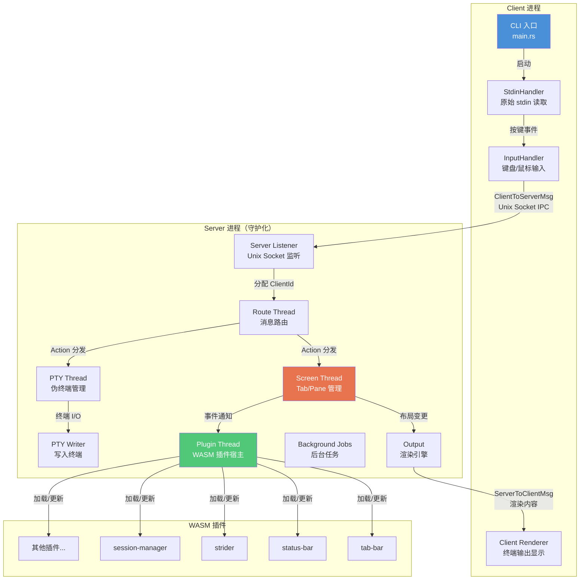
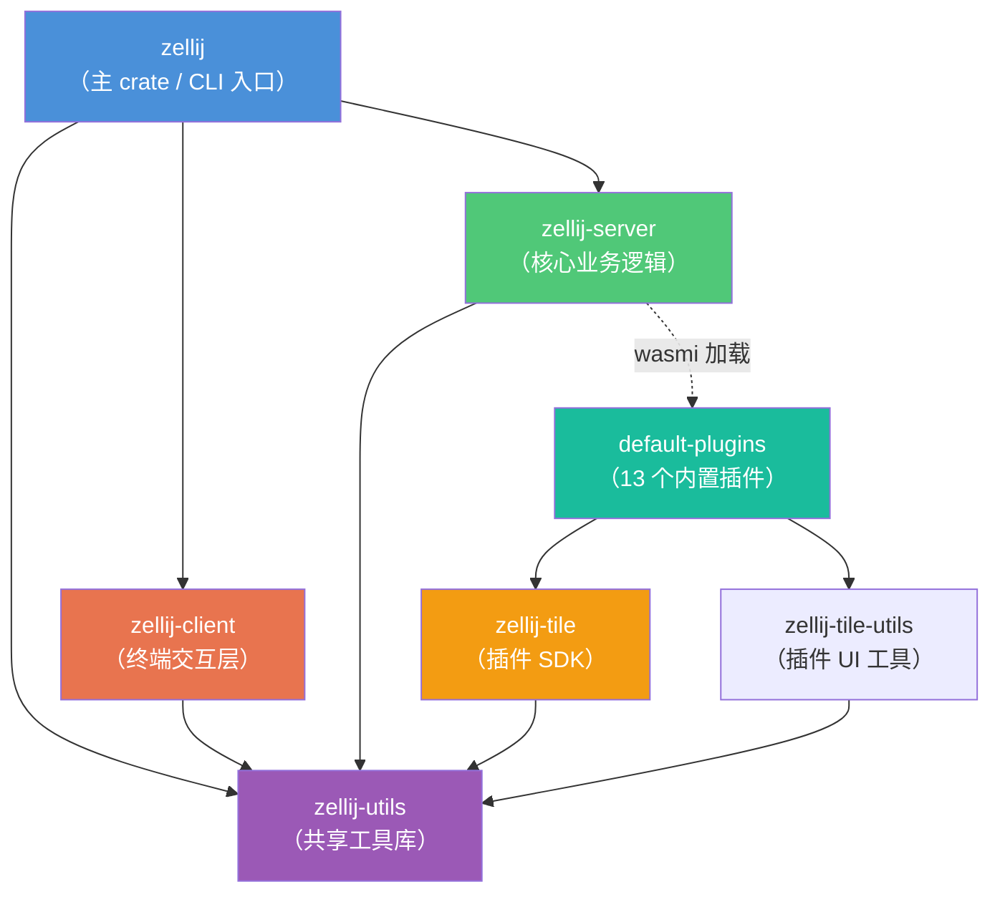
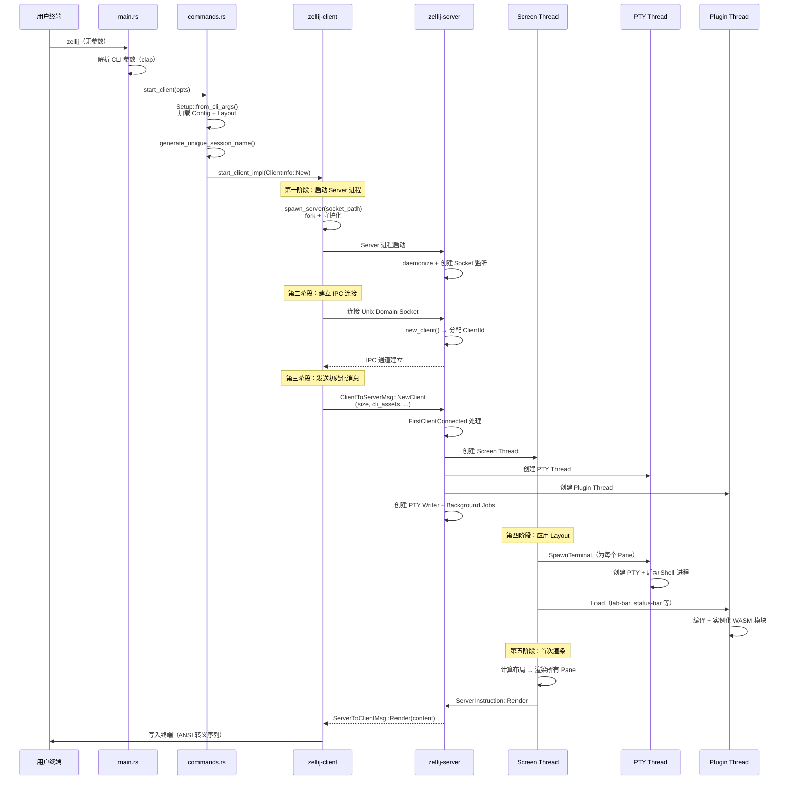
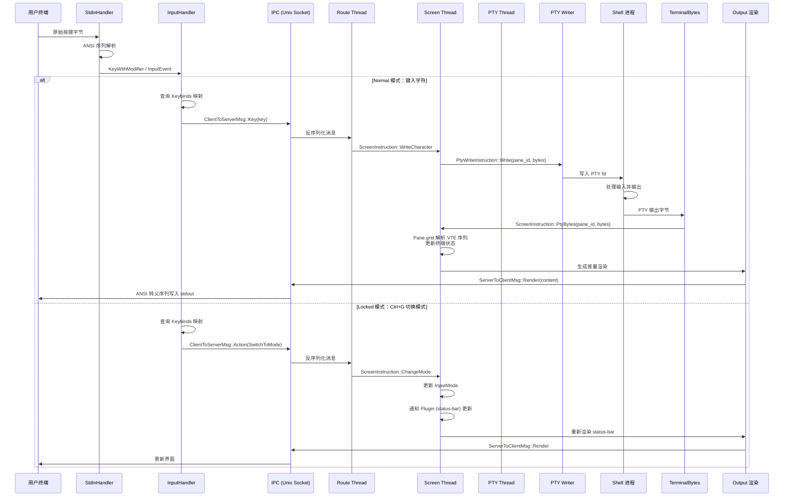

# Zellij 源码学习笔记

> 仓库地址：[zellij](https://github.com/zellij-org/zellij)
> 学习日期：2026-04-05

---

> **以下为 AI 源码分析**
>
> ### 一句话概括
>
> Zellij 是一个用 Rust 编写的终端多路复用器（Terminal Multiplexer），采用 Client-Server 架构，通过 WebAssembly 插件系统实现可扩展的 UI 和功能。
>
> ### 要点速览
>
> | 核心模块 | 职责 | 关键文件 |
> |---------|------|---------|
> | `zellij`（主 crate） | CLI 入口、命令分发、客户端/服务器进程启动 | `src/main.rs`, `src/commands.rs` |
> | `zellij-client` | 终端输入处理、键盘事件解析、与服务器 IPC 通信 | `zellij-client/src/lib.rs`, `input_handler.rs` |
> | `zellij-server` | 会话管理、Screen/Tab/Pane 布局引擎、PTY 管理、插件宿主 | `zellij-server/src/lib.rs`, `screen.rs`, `pty.rs` |
> | `zellij-utils` | 共享数据类型、IPC 协议（Protobuf）、配置解析（KDL）、错误处理 | `zellij-utils/src/ipc.rs`, `data.rs`, `kdl/` |
> | `zellij-tile` | 插件开发 SDK（Rust → WASM）、`ZellijPlugin` trait | `zellij-tile/src/lib.rs`, `shim.rs` |
> | `default-plugins` | 13 个内置插件：tab-bar、status-bar、strider 等 | `default-plugins/*/src/main.rs` |

---

## 项目简介

Zellij 是一个面向开发者和运维人员的终端工作空间工具，类似 tmux/screen，但设计理念更加现代化。它在不牺牲简单性的前提下提供强大功能：开箱即用的良好体验、浮动和堆叠窗格、真正的多人协作、KDL 格式的布局配置系统，以及基于 WebAssembly 的插件生态——允许用任何能编译到 WASM 的语言编写插件。v0.44 还引入了内置 Web 客户端，使终端不再是必需品。

## 技术栈

| 类别 | 技术 |
|------|------|
| 语言 | Rust（edition 2021, MSRV 1.92） |
| 框架 | tokio（异步运行时）、wasmi（WASM 运行时）、crossterm（终端控制） |
| 构建工具 | cargo xtask（自定义构建系统）、Protobuf（prost） |
| 依赖管理 | Cargo workspace（18 个成员 crate） |
| 测试框架 | Rust 内置 `#[test]` + insta（快照测试）+ Docker E2E 测试 |

## 目录结构

```
zellij/
├── src/                          # 主 crate：CLI 入口与命令分发
│   ├── main.rs                   #   程序入口，解析 CLI 参数并分发命令
│   ├── commands.rs               #   各命令的具体实现（start_client, start_server 等）
│   └── tests/                    #   E2E 端到端测试
├── zellij-client/                # 客户端 crate：终端交互层
│   └── src/
│       ├── lib.rs                #   ClientInstruction 定义、start_client 入口
│       ├── input_handler.rs      #   键盘/鼠标输入处理与 Action 分发
│       ├── stdin_handler.rs      #   原始 stdin 读取与 ANSI 解析
│       ├── os_input_output.rs    #   操作系统 I/O 抽象层
│       └── web_client/           #   Web 客户端支持（WebSocket）
├── zellij-server/                # 服务器 crate：核心业务逻辑
│   └── src/
│       ├── lib.rs                #   ServerInstruction、SessionMetaData、start_server 入口
│       ├── screen.rs             #   Screen 管理：Tab 创建/切换/关闭、渲染调度
│       ├── tab/                  #   Tab 实现：窗格布局、鼠标处理、剪贴板
│       ├── panes/                #   Pane 实现：终端仿真、浮动/平铺窗格、Sixel 图片
│       ├── pty.rs                #   PTY 伪终端管理：进程创建与 I/O
│       ├── plugins/              #   WASM 插件宿主：加载、运行、事件分发
│       │   ├── wasm_bridge.rs    #     WASM 运行时桥接层
│       │   ├── plugin_map.rs     #     插件实例管理
│       │   └── zellij_exports.rs #     导出给插件的 Host Functions
│       ├── route.rs              #   客户端消息路由（ClientToServerMsg → 各线程）
│       ├── thread_bus.rs         #   线程间消息总线 ThreadSenders
│       ├── output/               #   终端输出渲染（差量更新、VTE 指令生成）
│       └── ui/                   #   UI 组件（窗格边框、加载指示器）
├── zellij-utils/                 # 共享工具 crate
│   └── src/
│       ├── ipc.rs                #   IPC 协议：ClientToServerMsg / ServerToClientMsg
│       ├── data.rs               #   核心数据类型（InputMode、Event、Action 等）
│       ├── input/                #   输入层：Action 定义、Keybinds、Layout 解析、Config
│       ├── kdl/                  #   KDL 配置文件解析器
│       ├── plugin_api/           #   插件 API（Protobuf 定义）
│       └── sessions.rs           #   会话管理工具函数
├── zellij-tile/                  # 插件 SDK crate（编译为 WASM）
│   └── src/
│       ├── lib.rs                #   ZellijPlugin trait、register_plugin! 宏
│       └── shim.rs               #   插件可调用的 Host API 封装
├── zellij-tile-utils/            # 插件 UI 工具库
├── default-plugins/              # 13 个内置插件
│   ├── tab-bar/                  #   顶部 Tab 栏
│   ├── status-bar/               #   底部状态栏（快捷键提示）
│   ├── compact-bar/              #   紧凑模式栏
│   ├── strider/                  #   文件浏览器
│   ├── session-manager/          #   会话管理器
│   ├── configuration/            #   配置界面
│   └── ...                       #   about、share、link、layout-manager 等
└── xtask/                        # 构建任务（cargo xtask run/test/clippy）
```

## 架构设计

### 整体架构

Zellij 采用经典的 **Client-Server 分离架构**。当用户启动 `zellij` 时，主进程 fork 出一个守护化的 Server 进程，然后自身作为 Client 通过 Unix Domain Socket（IPC）与 Server 通信。Server 进程独立于终端存在，即使 Client 断开连接，会话仍然保持运行——这正是 Session 持久化的基础。

Server 内部采用**多线程消息传递**架构，各核心子系统运行在独立线程中，通过 `ThreadSenders` 消息总线进行异步通信。这种设计避免了共享状态的复杂锁竞争，同时保持了模块间的清晰边界。

插件系统基于 **WebAssembly (wasmi 运行时)**，插件编译为 `.wasm` 文件后被 Server 加载运行，通过 Protobuf 序列化的 Host Functions 与宿主交互，实现了安全隔离和语言无关的可扩展性。



### 核心模块

#### 1. Server 主循环 (`zellij-server/src/lib.rs`)

**职责**：服务器进程的入口和主事件循环，负责会话生命周期管理。

- `start_server()` 函数：守护化进程 → 创建 IPC Socket 监听 → 启动各工作线程 → 进入主消息循环
- `SessionMetaData`：持有所有工作线程的 `ThreadSenders`、配置、Keybinds、布局等会话级元数据
- `SessionState`：管理所有已连接 Client 的状态（ID、终端大小、是否为 Web 客户端等）
- 主循环处理 `ServerInstruction`：客户端连接/断开、渲染分发、会话切换、配置热更新等

**关键接口**：
- `ServerInstruction` enum：约 30 种服务器指令（`FirstClientConnected`、`Render`、`KillSession` 等）
- `SessionMetaData::propagate_configuration_changes()`：配置变更热传播到所有子系统

#### 2. Screen / Tab / Pane 布局引擎 (`zellij-server/src/screen.rs`, `tab/`, `panes/`)

**职责**：Zellij 的核心 UI 引擎，管理 Screen → Tab → Pane 的三级层次结构。

- **Screen**：持有所有 Tab 的 `BTreeMap<usize, Tab>`，处理 Tab 的创建/关闭/切换，协调渲染
- **Tab**：管理 `TiledPanes`（平铺窗格）和 `FloatingPanes`（浮动窗格），处理布局计算和交换布局（Swap Layouts）
- **Pane**：分为 `TerminalPane`（终端仿真）和 `PluginPane`（插件渲染），每个 Pane 内部维护完整的 VTE 终端状态（Grid）

**关键设计**：
- Tab 有两种标识：稳定的 `id`（BTreeMap key）和动态的 `position`（显示顺序）
- 支持 Swap Layouts：预定义多套平铺/浮动布局，窗格数量变化时自动切换最佳布局
- `Output` 模块实现差量渲染：仅发送变化的字符，减少终端 I/O

#### 3. PTY 管理 (`zellij-server/src/pty.rs`, `terminal_bytes.rs`)

**职责**：管理所有伪终端（PTY）的创建、I/O 和生命周期。

- `PtyInstruction` enum：`SpawnTerminal`、`NewTab`、`CloseTab`、`OpenInPlaceEditor` 等
- 每个 PTY 绑定一个异步任务（`TerminalBytes`）监听输出
- `PtyWriteInstruction`：单独的写入线程，避免写入阻塞主逻辑

#### 4. 插件系统 (`zellij-server/src/plugins/`)

**职责**：基于 wasmi 的 WASM 插件运行时，加载并执行插件，提供双向通信。

- **WasmBridge** (`wasm_bridge.rs`)：核心桥接层，管理所有插件实例的生命周期
- **PluginMap** (`plugin_map.rs`)：插件实例注册表，维护 `PluginId → RunningPlugin` 映射
- **PluginLoader** (`plugin_loader.rs`)：从 URL/文件加载 `.wasm`，编译为 wasmi `Module`
- **zellij_exports** (`zellij_exports.rs`)：导出给插件的 Host Functions（如 `subscribe`、`set_selectable`、`open_terminal` 等）
- **Plugin Workers**：支持插件开启后台工作线程，避免阻塞 UI 渲染

**关键接口**：
- `PluginInstruction` enum：`Load`、`Update`（事件分发）、`Unload`、`Resize`、`Pipe` 等
- 插件通过 Protobuf 序列化的 `Event` 接收通知，通过 Host Functions 调用宿主能力

#### 5. 消息总线 (`zellij-server/src/thread_bus.rs`)

**职责**：封装所有线程间通信的 Sender，提供类型安全的消息传递。

- `ThreadSenders` struct：持有 `to_screen`、`to_pty`、`to_plugin`、`to_server`、`to_pty_writer`、`to_background_jobs` 六个 `SenderWithContext`
- 每个 `send_to_*` 方法自动附加 `ErrorContext`，实现跨线程的错误追踪链
- `Bus<T>` struct：将接收端和所有发送端打包，传入各线程主函数

#### 6. IPC 通信 (`zellij-utils/src/ipc.rs`)

**职责**：定义 Client ↔ Server 之间的通信协议。

- `ClientToServerMsg`：客户端发往服务器的消息（`Key`、`TerminalResize`、`Action`、`DetachSession` 等）
- `ServerToClientMsg`：服务器发往客户端的消息（`Render`、`Exit`、`Connected`、`SwitchSession` 等）
- 底层传输：Unix Domain Socket + Protobuf 序列化（`prost`）
- Windows 平台：使用命名管道（Named Pipes），半双工，需要独立的 reply 管道

### 模块依赖关系



## 核心流程

### 流程一：客户端启动与会话创建

这是 Zellij 最核心的启动流程，展示了从用户输入 `zellij` 到终端界面出现的完整链路。



**关键细节**：
1. Server 通过 `daemonize` crate 实现进程守护化，脱离终端控制
2. Client 启动后先 `spawn_server()`，然后等待 Socket 文件出现再连接
3. `FirstClientConnected` 是服务器最重要的初始化入口，创建所有工作线程并应用 Layout
4. Layout 定义了初始的 Tab 和 Pane 结构，Screen 线程解析 Layout 后向 PTY 和 Plugin 线程发送创建指令
5. Client 进入事件循环：stdin → InputHandler → IPC → Server → 渲染 → stdout

### 流程二：用户按键到 Pane 输出

展示一次按键从用户输入到终端回显的完整数据流。



**关键细节**：
1. Zellij 采用**模态输入**设计（类似 Vim）：`Normal` 模式下按键直通 Shell，`Locked` 模式下捕获快捷键
2. `InputHandler` 根据当前 `InputMode` 和 `Keybinds` 配置决定按键的处理方式
3. PTY 写入和读取分别由 `PTY Writer` 和 `TerminalBytes` 异步处理，避免互相阻塞
4. `Output` 模块实现智能差量渲染：对比前后帧，仅发送变化的字符和样式，减少带宽
5. 每个 Pane 的 `Grid` 维护完整的终端仿真状态（光标位置、滚动区域、字符属性等）

## 关键设计亮点

### 1. 多线程消息传递架构

**解决的问题**：终端多路复用器需要同时处理多个 PTY 的 I/O、用户输入、插件渲染和 UI 更新，如何避免死锁和性能瓶颈？

**实现方式**：Server 端启动 6 个独立线程（Screen、PTY、Plugin、PTY Writer、Background Jobs、Route），通过 `ThreadSenders`（`zellij-server/src/thread_bus.rs`）封装的 bounded channel 进行异步消息传递。每个线程都有自己的 `*Instruction` enum 定义所有可接收的指令类型。

**为什么这样设计**：
- 无共享可变状态，天然避免死锁
- 每个线程专注单一职责，可独立优化
- 消息传递自带 `ErrorContext` 链，跨线程的错误可追溯到源头
- bounded channel 提供背压（backpressure），防止某个线程过载

### 2. WebAssembly 插件系统

**解决的问题**：如何让用户用任意语言扩展终端多路复用器的功能，同时保证安全性和稳定性？

**实现方式**：使用 `wasmi`（纯 Rust 的 WASM 解释器）加载插件（`zellij-server/src/plugins/wasm_bridge.rs`）。插件 SDK（`zellij-tile`）提供 `ZellijPlugin` trait，插件实现 `load()`、`update()`、`render()` 三个生命周期方法。宿主通过 `zellij_exports.rs` 导出 Host Functions，插件通过 `shim.rs` 封装调用。双向通信使用 Protobuf 序列化（`zellij-utils/src/plugin_api/`）。

**为什么这样设计**：
- WASM 沙箱隔离：插件崩溃不会影响主进程
- 语言无关：只要能编译到 `wasm32-wasip1` 的语言都可以写插件
- Protobuf 协议：版本兼容性好，序列化高效
- 内置 13 个默认插件（tab-bar、status-bar 等），证明了插件系统的完整性

### 3. Client-Server 分离与会话持久化

**解决的问题**：用户关闭终端窗口后如何保持会话运行？如何支持多客户端协作？

**实现方式**：`src/commands.rs` 中 `start_client()` 先 `spawn_server()` 创建守护进程，然后通过 Unix Domain Socket 连接。Server 维护 `SessionState`（`zellij-server/src/lib.rs`），跟踪所有 Client 的连接状态。Client 断开时 Server 继续运行，重新连接（`Attach`）时恢复会话。甚至支持 `Resurrect` 模式：从磁盘缓存的布局恢复已终止的会话。

**为什么这样设计**：
- Server 守护化后完全独立于终端，即使 SSH 断开也不丢失状态
- 多 Client 可同时连接同一 Session，实现真正的多人协作（Server 取所有 Client 终端尺寸的最小值作为渲染尺寸）
- Session 序列化到磁盘（`session_serialization.rs`），支持重启后恢复

### 4. KDL 配置与 Swap Layouts

**解决的问题**：如何让终端布局配置既人类可读又足够强大，同时支持动态布局切换？

**实现方式**：使用 KDL 格式（`zellij-utils/src/kdl/`）定义配置和布局文件。Layout 系统支持 **Swap Layouts**：预定义多套平铺/浮动布局方案，当 Pane 数量变化时自动选择最匹配的布局（`zellij-server/src/tab/swap_layouts.rs`）。配置支持运行时热更新（`watch_config_file_changes`），无需重启 Session。

**为什么这样设计**：
- KDL 语法简洁直观，比 YAML 更适合层级配置
- Swap Layouts 解决了固定布局无法适应动态窗格数量的痛点
- 热更新通过 `notify` crate 监听文件变更，经 `SessionConfiguration` 传播到所有线程

### 5. 跨平台 IPC 抽象

**解决的问题**：如何在 Unix 和 Windows 上提供统一的 Client-Server 通信机制？

**实现方式**：通过 `interprocess` crate 抽象本地 Socket（`zellij-utils/src/ipc.rs`）。定义 `IpcStream` trait 抽象双向字节流。Unix 使用 Unix Domain Socket（全双工），Windows 使用 Named Pipes（半双工，需要额外的 reply 管道）。消息使用 Protobuf 编码（`client_server_contract`），通过长度前缀帧进行分包。`os_input_output.rs` 在 Client 和 Server 两侧分别提供平台特定的 I/O 实现。

**为什么这样设计**：
- `interprocess` crate 提供跨平台的本地 Socket 抽象
- Protobuf 替代了早期的 bincode 序列化，提供更好的前向/后向兼容性
- 分离的 `os_input_output_unix.rs` / `os_input_output_windows.rs` 隔离了平台差异
