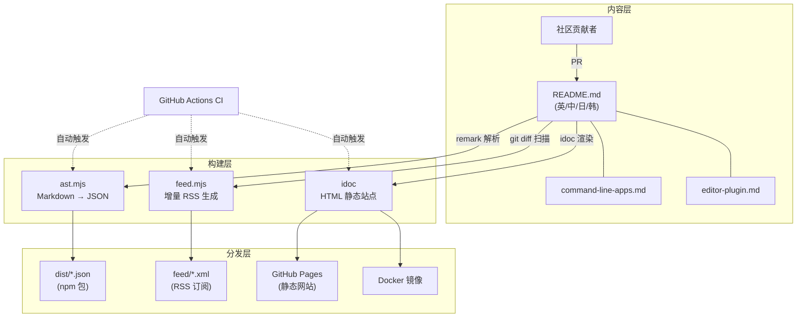
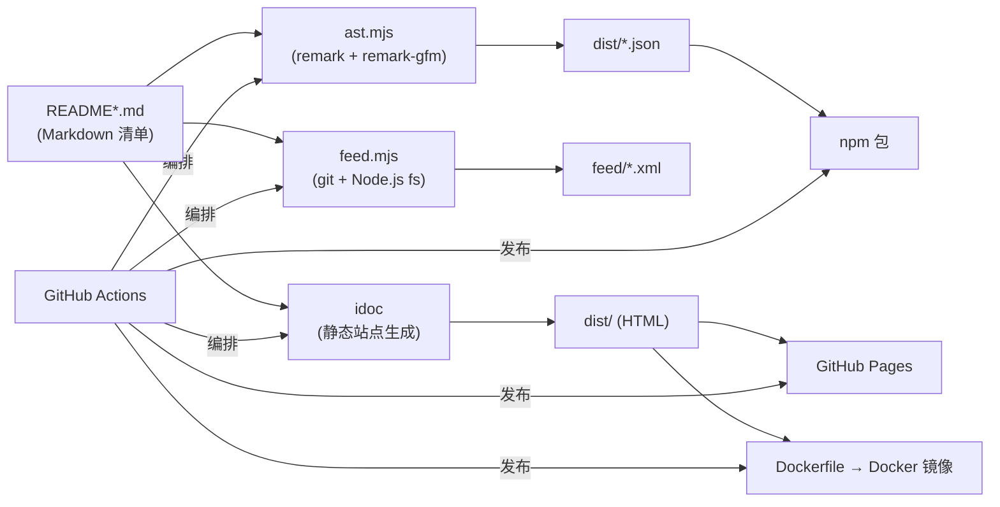
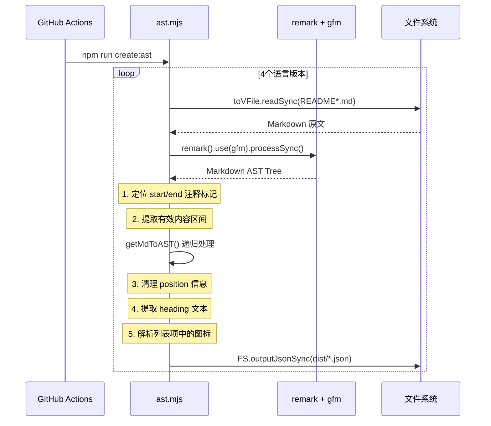
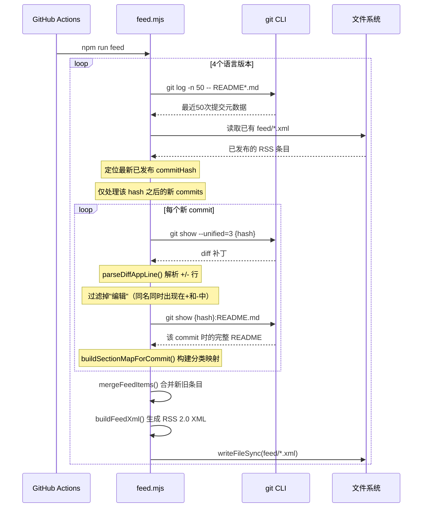

# awesome-mac 源码学习笔记

> 仓库地址：[awesome-mac](https://github.com/jaywcjlove/awesome-mac)
> 学习日期：2026-04-05

---

> **以下为 AI 源码分析**
>
> ### 一句话概括
>
> 一个社区驱动的 macOS 优质应用收录清单项目，以 Markdown 为核心数据源，通过自动化构建流水线将应用列表发布为静态网站、npm 包、RSS 订阅和 Docker 镜像。
>
> ### 要点速览
>
> | 核心模块 | 职责 | 关键文件 |
> |---------|------|---------|
> | 内容层 | 多语言 Markdown 应用列表（英/中/日/韩） | `README.md`, `README-zh.md`, `README-ja.md`, `README-ko.md` |
> | AST 构建 | 解析 Markdown 为结构化 JSON 数据 | `build/ast.mjs` |
> | RSS 生成 | 增量扫描 git diff 生成多语言 RSS Feed | `build/feed.mjs` |
> | 静态站点 | 使用 idoc 将 Markdown 渲染为 HTML 网站 | `idoc.yml` |
> | CI/CD | 自动构建、发布网站/npm/Docker/GitHub Release | `.github/workflows/ci.yml`, `Dockerfile` |
> | 附属清单 | 命令行工具和编辑器插件子列表 | `command-line-apps.md`, `editor-plugin.md` |

---

## 项目简介

awesome-mac 是一个收录高质量 macOS 应用程序的 Awesome List 项目，由 jaywcjlove（Kenny Wang）发起并持续维护。项目以 Markdown 文件作为唯一数据源（Single Source of Truth），通过社区 PR 持续收录优质软件，目前英文版收录约 **1146** 款应用，中文版收录约 **1014** 款。项目的核心价值在于：为 macOS 用户提供分类清晰、社区筛选的软件推荐清单，同时通过自动化构建将列表转化为可搜索的网站、可订阅的 RSS Feed 和可编程消费的 JSON 数据。

## 技术栈

| 类别 | 技术 |
|------|------|
| 语言 | JavaScript (ESM) |
| 框架 | 无应用框架（纯静态内容项目） |
| 构建工具 | idoc（Markdown 转 HTML 静态站点生成器） |
| 依赖管理 | npm |
| 测试框架 | awesome_bot（链接有效性检查，Travis CI 遗留） |
| 部署 | GitHub Actions + GitHub Pages + Docker + npm publish |
| Markdown 解析 | remark + remark-gfm |

## 目录结构

```
awesome-mac/
├── README.md                 # 英文版主清单（~1585行，1146款应用）
├── README-zh.md              # 中文版清单（~1482行）
├── README-ja.md              # 日文版清单（~1584行）
├── README-ko.md              # 韩文版清单（~1014行）
├── command-line-apps.md      # 命令行工具子清单（69款）
├── command-line-apps-zh.md   # 命令行工具中文版
├── command-line-apps-ja.md   # 命令行工具日文版
├── command-line-apps-ko.md   # 命令行工具韩文版
├── editor-plugin.md          # 编辑器插件子清单（28款）
├── editor-plugin-zh.md       # 编辑器插件中文版
├── editor-plugin-ja.md       # 编辑器插件日文版
├── build/
│   ├── ast.mjs               # Markdown → JSON AST 转换脚本
│   └── feed.mjs              # 增量 RSS Feed 生成脚本
├── feed/
│   ├── feed.xml              # 英文 RSS 输出
│   ├── feed-zh.xml           # 中文 RSS 输出
│   ├── feed-ja.xml           # 日文 RSS 输出
│   ├── feed-ko.xml           # 韩文 RSS 输出
│   └── feed*.md              # RSS 说明页面
├── docs/
│   ├── CONTRIBUTING.md       # 贡献指南
│   ├── CODE-OF-CONDUCT.md    # 行为准则
│   └── ISSUE_TEMPLATE/       # Issue 模板
├── dist/                     # 构建输出（JSON + 静态站点）
├── idoc.yml                  # 静态站点生成器配置
├── Dockerfile                # Docker 镜像构建（基于 lipanski/docker-static-website）
├── package.json              # npm 配置，版本 2.1.0
├── .github/workflows/ci.yml  # GitHub Actions CI/CD 流水线
└── .travis.yml               # 遗留的 Travis CI 链接检查配置
```

## 架构设计

### 整体架构

awesome-mac 的架构遵循 **Content-as-Code** 模式：以 Markdown 文件作为核心数据源，通过构建管道转化为多种消费格式。整个系统可以分为三层——内容层、构建层和分发层。



### 核心模块

#### 1. 内容层：Markdown 清单

**职责**：作为整个项目的唯一数据源，以统一的 Markdown 格式维护 macOS 应用的收录信息。

**核心文件**：`README.md`, `README-zh.md`, `README-ja.md`, `README-ko.md`

**数据格式规范**：每条应用遵循严格的条目格式：

```markdown
* [App Name](url) - Description. [![Open-Source Software][OSS Icon]](source_url) ![Freeware][Freeware Icon] [![App Store][app-store Icon]](appstore_url)
```

其中图标引用定义在文件末尾：
- `[OSS Icon]` — 开源软件标识
- `[Freeware Icon]` — 免费软件标识
- `[app-store Icon]` — App Store 链接标识
- `[awesome-list Icon]` — Awesome List 链接标识

**分类体系**：采用二级分类（`##` 大类 / `###` 子类），覆盖 20+ 大类、40+ 子类，包括阅读写作、开发工具、设计产品、AI 工具、通讯、安全加密等。

#### 2. AST 构建模块（`build/ast.mjs`）

**职责**：将 Markdown 清单解析为结构化 JSON，供前端或第三方消费。

**关键函数**：

| 函数 | 职责 |
|------|------|
| `processMarkdownToJson()` | 主入口：读取 Markdown → remark 解析 → 提取有效区间 → 输出 JSON |
| `getMdToAST()` | 递归遍历 AST 节点，清理位置信息，提取标题文本和图标标记 |
| `getMarkIcons()` | 从列表项的子节点中识别并提取 OSS/Freeware/App Store/Awesome List 图标 |
| `getSoftwareName()` | 递归提取软件名称和 URL |
| `getIconDetail()` | 解析 `imageReference` 节点，识别图标类型 |

**处理流程**：通过 `<!--start-->` 和 `<!--end-->` HTML 注释标记界定有效内容区间，过滤掉页首赞助商和页尾 License 等非列表内容。

#### 3. RSS Feed 生成模块（`build/feed.mjs`）

**职责**：通过 git 历史增量检测新增应用，生成多语言 RSS 2.0 Feed。

**关键函数**：

| 函数 | 职责 |
|------|------|
| `generateFeedForTarget()` | 单个语言版本的 Feed 生成主流程 |
| `getCommitLog()` | 调用 `git log` 获取最近 N 次提交元数据 |
| `collectAdditions()` | 扫描 commit 列表，收集新增应用并去重 |
| `extractNewAppsFromCommit()` | 分析单次 commit 的 diff，区分"新增"和"编辑" |
| `parseDiffAppLine()` | 用正则匹配 diff 中的 `+` / `-` 行提取应用信息 |
| `buildSectionMapForCommit()` | 从特定 commit 的 README 快照构建"应用名→分类"映射 |
| `loadExistingFeed()` / `parseFeedItemsFromXml()` | 读取已有 XML Feed 实现增量更新 |
| `mergeFeedItems()` | 合并新旧条目，保持去重和数量限制 |
| `buildFeedXml()` | 生成 RSS 2.0 XML 文档 |

#### 4. CI/CD 流水线（`.github/workflows/ci.yml`）

**职责**：在 master 分支推送时自动执行完整构建和多渠道发布。

**核心步骤**：
1. `npm install` + `npm run build`（idoc 生成静态站点）
2. `npm run create:ast`（生成 JSON 数据）
3. `npm run feed`（生成 RSS Feed）
4. 自动提交 RSS XML 变更到 master
5. 部署到 GitHub Pages
6. 基于 `package.json` 版本号创建 git tag 和 GitHub Release
7. 发布到 npm（`npm publish --provenance`）
8. 构建并推送 Docker 镜像到 Docker Hub

### 模块依赖关系



## 核心流程

### 流程一：AST 构建流程（Markdown → JSON）



**关键逻辑**：
- **区间提取**：通过 `<!--start-->` / `<!--end-->` HTML 注释标记精确界定有效内容，排除赞助商广告和页脚信息
- **图标解析**：`getMarkIcons()` 将 `[OSS Icon]` 等 Markdown image reference 识别为结构化标记（`{type: "oss", url: "..."}"`），使 JSON 消费者能直接判断软件是否开源/免费
- **多语言并行**：4 个语言版本使用统一的解析流程，配置驱动（configs 数组）

### 流程二：增量 RSS Feed 生成



**关键逻辑**：
- **增量更新**：从已有 XML 中提取最新 `commitHash`，只处理该 hash 之后的新提交，避免重复扫描
- **新增 vs 编辑识别**：如果同一应用名同时出现在 diff 的 `+` 行和 `-` 行中，判定为"编辑"而非"新增"，不纳入 Feed
- **历史快照分类**：使用 `git show {hash}:README.md` 获取 commit 时刻的 README，确保应用归类反映添加时的分类结构，而非后续重组后的分类

## 关键设计亮点

### 1. Content-as-Code 数据模型

**解决的问题**：如何让非技术用户也能方便地贡献内容，同时保持数据的机器可读性。

**实现方式**：以 Markdown 作为唯一数据源（`README.md`），通过 `build/ast.mjs` 在构建时转换为结构化 JSON。列表条目采用严格的格式规范（`* [Name](url) - Description. [Icons]`），既方便人类阅读和编辑，也能被正则和 AST 解析器精确提取。

**设计优势**：降低贡献门槛（任何人都能编辑 Markdown），同时支撑了网站、npm 包、RSS 等多种消费方式，是典型的"一次编写，多端分发"架构。

### 2. 基于 Git Diff 的增量 RSS 生成

**解决的问题**：如何从一个不断增长的列表中自动检测"新增应用"并生成订阅 Feed。

**实现方式**：`build/feed.mjs` 不维护额外的状态文件，而是利用 git 提交历史和已有 XML Feed 实现双重增量——先用 `git log` 获取最近 50 次提交，再从 XML 中读取最新已发布的 commitHash，仅处理增量 commits。通过分析 diff 中的 `+` / `-` 行并匹配应用条目正则，区分"新增"和"编辑"操作。

**设计优势**：零状态依赖（仅依赖 git 历史和输出 XML 本身），增量处理高效，且能自愈（XML 损坏时自动全量重建）。

### 3. 历史快照分类映射

**解决的问题**：当 README 的分类结构随时间重组时，如何确保 RSS 中的应用归类准确。

**实现方式**：`buildSectionMapForCommit()` 通过 `git show {hash}:README.md` 获取添加应用时那一刻的 README 完整内容，解析出"应用名→分类"映射。结果使用 `sectionMapCache`（Map）缓存，同一 commit 的同一文件只解析一次。

**设计优势**：RSS 条目的分类反映的是应用被添加时的语境，而非当前可能已重组的分类结构，保证了历史一致性。

### 4. 内容区间标记（`<!--start-->` / `<!--end-->`）

**解决的问题**：README 包含赞助商广告、徽章、目录等非列表内容，如何精确提取应用列表区间。

**实现方式**：在 `README.md` 中使用 HTML 注释 `<!--start-->` 和 `<!--end-->` 标记有效内容的起止位置。`ast.mjs` 在 remark 插件中通过 `findIndex` 定位这两个标记，只对区间内的 AST 节点进行处理。同时，`idoc.yml` 中的 `<!--idoc:ignore:start-->` / `<!--idoc:ignore:end-->` 标记用于控制网站渲染时跳过目录区块。

**设计优势**：无需维护额外的配置来指定"哪些内容是应用列表"，标记嵌入在内容本身中，减少了构建逻辑与内容结构的耦合。

### 5. 多渠道自动化分发

**解决的问题**：如何将同一份内容以最少的人工干预分发到多种平台。

**实现方式**：GitHub Actions CI 流水线（`.github/workflows/ci.yml`）在单次运行中完成：静态站点构建 → JSON 数据生成 → RSS Feed 生成 → RSS 自动提交回 master → GitHub Pages 部署 → npm 发布（带 provenance）→ Docker 镜像构建推送 → GitHub Release 创建。版本号直接从 `package.json` 读取，变更日志自动生成。

**设计优势**：维护者只需合并 PR 并在需要发布时修改 `package.json` 版本号，其余所有分发动作全自动完成。
