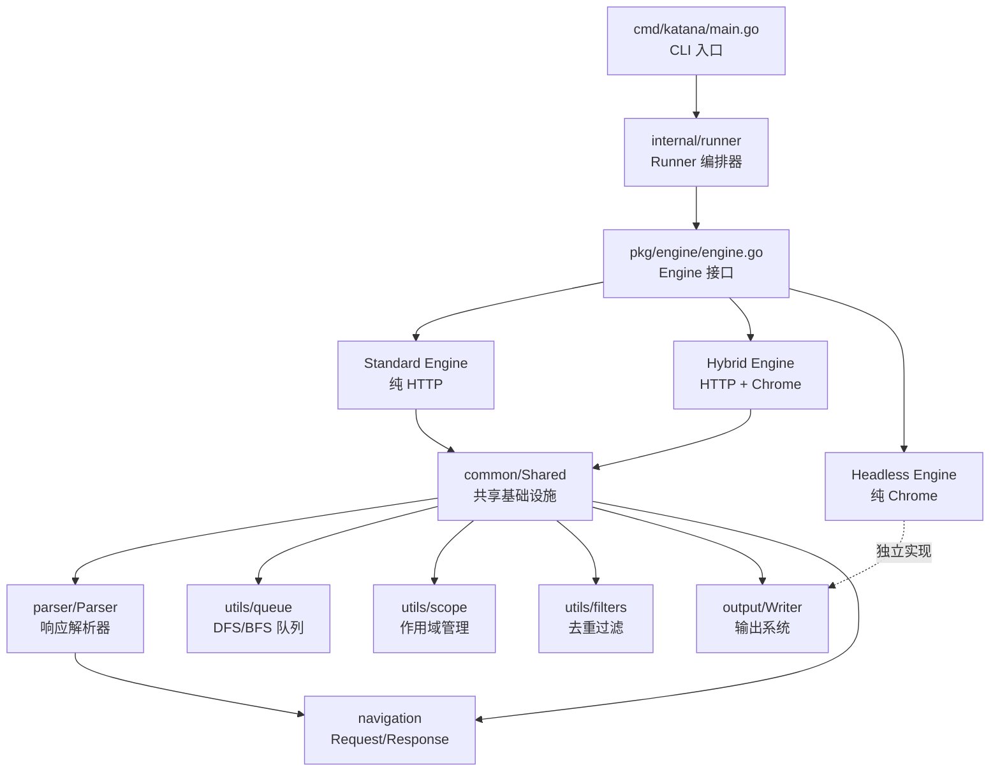
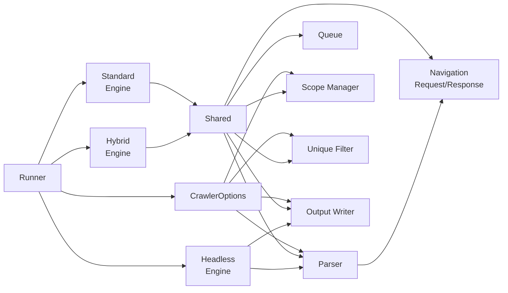
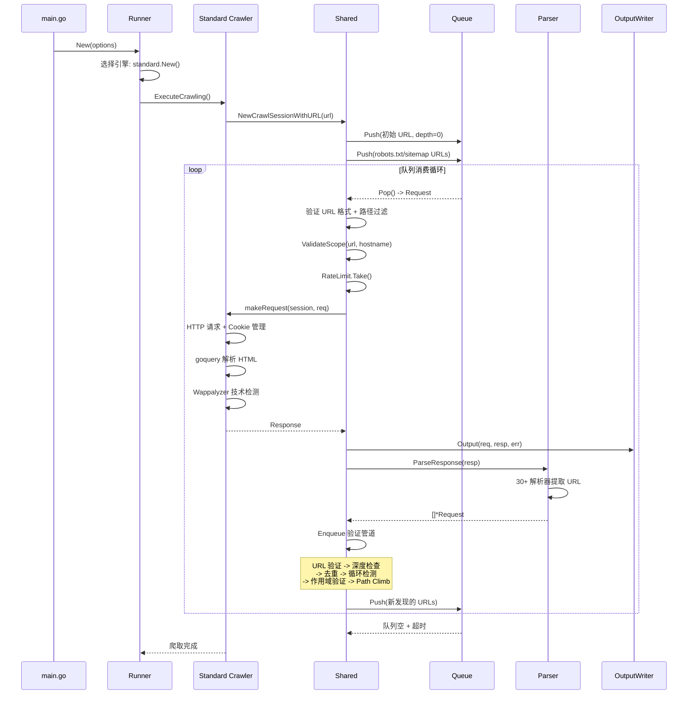
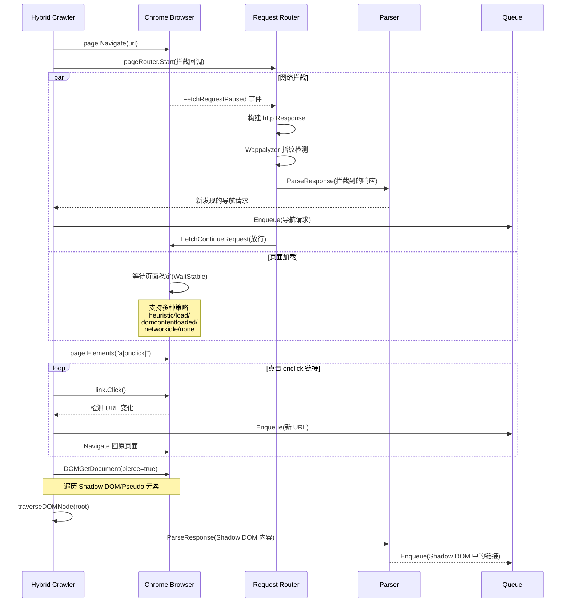

# katana 源码学习笔记

> 仓库地址：[katana](https://github.com/projectdiscovery/katana)
> 学习日期：2026-04-05

---

> **以下为 AI 源码分析**
>
> ### 一句话概括
>
> katana 是 ProjectDiscovery 开发的下一代 Web 爬虫框架，提供 Standard（HTTP）、Hybrid（HTTP + 无头浏览器）和 Headless（纯无头浏览器）三种爬取模式，专为安全自动化管道设计。
>
> ### 要点速览
>
> | 核心模块 | 职责 | 关键文件 |
> |---------|------|---------|
> | Engine 接口 | 定义爬虫引擎抽象 | `pkg/engine/engine.go` |
> | Standard Engine | 基于 HTTP 的标准爬虫 | `pkg/engine/standard/` |
> | Hybrid Engine | HTTP + Chrome 混合爬虫 | `pkg/engine/hybrid/` |
> | Headless Engine | 纯无头浏览器爬虫 | `pkg/engine/headless/` |
> | Parser | 从 HTML/JS 响应中提取新 URL | `pkg/engine/parser/` |
> | Output | 结果格式化与输出 | `pkg/output/` |
> | Scope | URL 作用域验证 | `pkg/utils/scope/` |
> | Queue | 支持 DFS/BFS 策略的优先队列 | `pkg/utils/queue/` |
> | Runner | 顶层编排，初始化引擎并驱动爬取 | `internal/runner/` |

---

## 项目简介

katana 是一个快速且高度可配置的 Web 爬虫/蜘蛛框架，专注于在安全自动化管道中执行。它支持标准 HTTP 爬取和基于 Chrome DevTools Protocol 的无头浏览器爬取，能够发现传统爬虫难以捕获的 JavaScript 渲染内容、Shadow DOM 元素和 XHR 请求。katana 提供灵活的作用域控制、输出过滤、自动表单填充、技术检测（Wappalyzer）和知识库分类（dit）等高级功能，是安全研究人员进行攻击面发现的核心工具。

## 技术栈

| 类别 | 技术 |
|------|------|
| 语言 | Go 1.25+ |
| 框架 | 自研爬虫框架，基于 go-rod（Chrome DevTools Protocol） |
| 构建工具 | Makefile, Dockerfile, GoReleaser |
| 依赖管理 | Go Modules |
| 测试框架 | Go 标准 testing + stretchr/testify |

## 目录结构

```
katana/
├── cmd/
│   ├── katana/main.go              # CLI 入口，命令行参数定义
│   ├── functional-test/            # 功能测试
│   ├── integration-test/           # 集成测试
│   └── tools/crawl-maze-score/     # 爬虫评分工具
├── internal/
│   └── runner/                     # 运行器，编排引擎初始化和爬取执行
│       ├── runner.go               # Runner 结构体与引擎选择逻辑
│       ├── executer.go             # ExecuteCrawling 主循环
│       └── options.go              # 参数验证与输入解析
├── pkg/
│   ├── engine/                     # 爬虫引擎核心
│   │   ├── engine.go               # Engine 接口定义 (Crawl + Close)
│   │   ├── common/                 # 引擎共享逻辑（会话、队列消费、输出）
│   │   │   └── base.go             # Shared 结构体、Enqueue/Do/Output
│   │   ├── standard/               # Standard 爬虫（纯 HTTP）
│   │   ├── hybrid/                 # Hybrid 爬虫（HTTP + Chrome）
│   │   ├── headless/               # Headless 爬虫（纯 Chrome，高级模式）
│   │   │   ├── browser/            # 浏览器管理与元素操作
│   │   │   ├── captcha/            # CAPTCHA 识别与自动求解
│   │   │   ├── crawler/            # 核心爬取状态机与 DOM 规范化
│   │   │   └── graph/              # 爬取图（页面关系追踪）
│   │   └── parser/                 # 响应解析器，提取导航请求
│   │       ├── parser.go           # 解析器注册与调度
│   │       ├── parser_generic.go   # 通用解析器（JS 内容、表单）
│   │       └── files/              # robots.txt / sitemap.xml 解析
│   ├── navigation/                 # 导航数据模型
│   │   ├── request.go              # Request 结构体
│   │   └── response.go             # Response 结构体
│   ├── output/                     # 输出系统
│   │   ├── output.go               # Writer 接口与 StandardWriter
│   │   ├── result.go               # Result 结构体
│   │   ├── format_json.go          # JSON 格式化
│   │   ├── format_screen.go        # 终端彩色输出
│   │   └── format_template.go      # 自定义模板输出
│   ├── types/                      # 配置类型
│   │   ├── options.go              # Options（命令行选项）
│   │   └── crawler_options.go      # CrawlerOptions（运行时依赖组装）
│   └── utils/                      # 工具集
│       ├── scope/                  # 作用域管理（DNS + URL 正则）
│       ├── filters/                # URL 去重（HybridMap + MD5）
│       ├── queue/                  # DFS/BFS 队列实现
│       ├── extensions/             # 文件扩展名过滤
│       ├── formfill.go             # 自动表单填充
│       └── urlfingerprint.go       # URL 相似度指纹（PathTrie）
└── .github/workflows/             # CI/CD 配置
```

## 架构设计

### 整体架构

katana 采用**策略模式**为核心的分层架构。顶层 `Runner` 根据用户选择的模式（Standard / Hybrid / Headless）实例化对应的 `Engine` 实现，所有引擎共享统一的 `Shared` 基础设施（队列消费、作用域验证、输出写入、去重过滤），仅在「如何发起请求」这一层实现差异化。

响应解析器（`Parser`）与引擎解耦，采用管道式设计 —— 注册多个 `ResponseParserFunc`，按 Header / Body / Content 分类依次提取新的导航请求，再通过 `Enqueue` 方法经过去重、深度检查、作用域验证后入队。



### 核心模块

#### 1. Engine 接口与三种实现

**Engine 接口**（`pkg/engine/engine.go`）极其简洁，仅定义两个方法：

```go
type Engine interface {
    Crawl(string) error
    Close() error
}
```

**Standard Engine**（`pkg/engine/standard/`）：
- 嵌入 `common.Shared`，复用所有共享逻辑
- `makeRequest` 通过 `retryablehttp` 发起 HTTP 请求
- 使用 `goquery` 解析 HTML DOM
- 支持 Cookie Jar 跨请求保持会话
- 支持 Wappalyzer 技术指纹识别和 dit 页面分类

**Hybrid Engine**（`pkg/engine/hybrid/`）：
- 同样嵌入 `common.Shared`
- 使用 `go-rod` 启动 Chrome 实例进行真实浏览器导航
- 通过 `FetchRequestPaused` 拦截所有网络请求，捕获 XHR/Fetch 请求
- 支持 Shadow DOM 遍历（`traverseDOMNode`），解析隐藏在 Shadow Root 中的链接
- 模拟点击 `onclick` 链接发现 JS 跳转
- 覆盖 `Do` 方法为串行处理（concurrency=1），避免 CDP 竞态

**Headless Engine**（`pkg/engine/headless/`）：
- 全新独立实现，不嵌入 `common.Shared`
- 基于状态机驱动的高级爬取逻辑（`crawler/crawler.go`）
- 内置 DOM 规范化器（`normalizer`），使用 SimHash 检测相似页面
- 内置 CAPTCHA 识别与自动求解（`captcha/`）
- 支持爬取图（`graph/CrawlGraph`）追踪页面关系
- 支持 Cookie Consent 自动绕过

#### 2. Parser 响应解析器

**文件**：`pkg/engine/parser/parser.go`

采用**注册式管道模式**，按解析器类型分为三类：

| 类型 | 触发条件 | 示例 |
|------|---------|------|
| `headerParser` | `resp.Resp != nil` | Content-Location, Link, Refresh |
| `bodyParser` | `resp.Reader != nil` | `<a>`, `<script>`, `<form>`, htmx 属性等 |
| `contentParser` | `len(resp.Body) > 0` | JS 正则提取端点 |

内置 30+ 个解析器函数，覆盖几乎所有 HTML 标签中可能出现 URL 的属性：`href`, `src`, `srcset`, `action`, `formaction`, `data`, `background`, `poster`, `ping`, `cite`, `manifest`, `hx-get/post/put/patch` 等。

通过 `parser.Options` 可动态启用：
- `AutomaticFormFill`：自动填写表单并提交
- `ScrapeJSResponses`：从 `<script>` 内容和 JS 文件中用正则提取端点
- `ScrapeJSLuiceResponses`：使用 jsluice 深度解析 JavaScript

#### 3. Shared 共享基础设施

**文件**：`pkg/engine/common/base.go`

`Shared` 是 Standard 和 Hybrid 引擎的核心基座，提供：

- **`Enqueue`**：入队前的完整验证管道 → URL 格式 → 查询参数处理 → 深度检查 → 去重 → 循环检测 → 作用域验证 → Path Climb 扩展
- **`Do`**：主爬取循环，从队列消费请求，并发执行（`sizedwaitgroup`），调用引擎特定的 `doRequest` 函数，解析响应后入队新发现
- **`Output`**：将 Request + Response 封装为 `Result` 写入输出
- **`NewCrawlSessionWithURL`**：初始化爬取会话（上下文、超时、队列策略、初始 URL、已知文件入队、HTTP 客户端）

#### 4. 队列系统

**文件**：`pkg/utils/queue/queue.go`

支持两种策略：
- **Depth-First（默认）**：LIFO 栈，优先深入探索
- **Breadth-First**：优先级队列，低深度的 URL 先处理

队列的 `Pop` 方法返回一个 channel，当队列为空时等待超时后自动关闭，实现优雅的爬取终止。

#### 5. Scope 管理

**文件**：`pkg/utils/scope/scope.go`

三层验证：
1. **DNS 作用域**（`fieldScope`）：支持 `dn`（域名包含匹配）、`rdn`（注册域名后缀匹配，默认）、`fqdn`（完全匹配）和自定义正则
2. **In-Scope 正则**：白名单 URL 模式
3. **Out-of-Scope 正则**：黑名单 URL 模式（优先于白名单）

#### 6. 输出系统

**文件**：`pkg/output/output.go`

`Writer` 接口的 `StandardWriter` 实现支持：
- 三种输出格式：Screen（彩色终端）、JSON、自定义 Template（`fasttemplate`）
- DSL 条件匹配/过滤（`dsl.EvalExpr`）
- 正则匹配/过滤
- 页面类型过滤（基于 dit 分类结果）
- 文件扩展名过滤
- 响应存储（原始 HTTP 请求/响应写入文件系统）
- 分字段存储（per-host 字段文件）
- 自定义字段提取（通过正则从 Header/Body 中提取）

### 模块依赖关系



## 核心流程

### 流程一：Standard 模式爬取流程

这是最典型的爬取路径，展示了从命令行输入到结果输出的完整链路。



**关键逻辑说明：**

1. **引擎选择**：`Runner.New` 根据 `--headless`/`--hybrid`/`--chrome-ws-url` 标志选择引擎实现
2. **会话初始化**：`NewCrawlSessionWithURL` 创建带超时的 context，初始化 DFS/BFS 队列，入队初始 URL 和已知文件（robots.txt/sitemap.xml）
3. **并发控制**：`sizedwaitgroup` 限制并发爬取 goroutine 数（`-c` 参数，默认 10）
4. **响应解析**：`ParseResponse` 遍历所有注册的解析器，按 header/body/content 分类执行，提取所有可能的导航目标
5. **入队验证**：`Enqueue` 是整个系统的质量关卡，确保只有合法、唯一、在作用域内的 URL 才会被爬取

### 流程二：Hybrid 模式页面导航

Hybrid 模式的核心差异在于通过 Chrome DevTools Protocol 拦截所有网络请求，并能发现 JavaScript 渲染的动态内容。



**关键逻辑说明：**

1. **网络拦截**：使用 `FetchRequestPaused` 事件拦截所有响应（类似 Burp 的 Proxy），每个拦截到的响应都独立进行解析和 URL 提取
2. **页面加载策略**：支持 5 种策略控制何时认为页面加载完成，`heuristic`（默认）等待 `FirstMeaningfulPaint`
3. **onclick 发现**：模拟点击带有 `onclick` 属性的链接，检测是否触发 JS 跳转
4. **Shadow DOM 穿透**：通过 `DOMGetDocument(pierce=true)` 获取完整 DOM 树（包括 Shadow Root），从中提取隐藏的链接
5. **串行执行**：Hybrid 覆盖了 `Do` 方法，强制 concurrency=1，避免 CDP 协议竞态

## 关键设计亮点

### 1. 策略模式 + 嵌入组合实现引擎多态

**问题**：需要支持三种差异巨大的爬取模式，但 80% 的逻辑（入队验证、去重、作用域、输出）是共享的。

**实现**：通过 `Engine` 接口定义统一契约，`common.Shared` 封装所有共享逻辑，Standard 和 Hybrid 通过 Go 的嵌入（embedding）复用 `Shared`，只需实现各自的 `makeRequest` / `navigateRequest`。Headless 则独立实现，因为它的爬取模型（状态机 + 图）与前两者差异太大。

**关键文件**：`pkg/engine/engine.go`, `pkg/engine/common/base.go`, `pkg/engine/standard/standard.go`

### 2. 管道式响应解析器

**问题**：Web 页面中 URL 可能出现在几十种不同的 HTML 标签和属性中，需要全面覆盖。

**实现**：`Parser` 是一个 `[]responseParser` 切片，每个解析器是一个带类型标签的函数。`ParseResponse` 遍历所有解析器，根据类型（header/body/content）和响应可用性决定是否执行。新增解析器只需在 `NewResponseParser` 中追加一行注册。

**关键文件**：`pkg/engine/parser/parser.go`

### 3. 多层入队验证管道

**问题**：爬虫容易陷入无限循环、重复爬取、超出作用域等问题。

**实现**：`Enqueue` 方法实现了 6 层验证管道：URL 格式 → 查询参数规范化 → 深度检查（超深 URL 仅输出不入队，保留去重空间） → 唯一性过滤 → 循环检测（`LongestRepeatingSequence` 检测 URL 中的重复模式） → 作用域验证。这种设计确保只有高质量的 URL 进入队列。

**关键文件**：`pkg/engine/common/base.go:Enqueue`, `pkg/utils/filters/simple.go`

### 4. Shadow DOM 穿透与 DOM 遍历

**问题**：现代 Web 应用大量使用 Shadow DOM 和 Web Components，传统 HTML 解析器无法触及这些内容。

**实现**：Hybrid 模式通过 CDP 的 `DOMGetDocument(depth=-1, pierce=true)` 获取包含 Shadow Root 的完整 DOM 树，然后用 `traverseDOMNode` 递归遍历所有子节点（包括 `TemplateContent`, `ContentDocument`, `ShadowRoots`, `PseudoElements`），构建伪 HTML 字符串供 goquery 解析。

**关键文件**：`pkg/engine/hybrid/crawl.go:traverseDOMNode`

### 5. URL 相似度去重（PathTrie + SimHash）

**问题**：动态网站可能生成大量结构相似但参数不同的 URL（如 `/users/123`, `/users/456`），导致爬虫浪费大量时间在相同模式的页面上。

**实现**：通过 `PathTrie` 追踪每个路径位置出现过的不同值，当某个位置的不同值超过阈值（默认 10），该位置被标记为「参数化」，后续相同模式的 URL 会被归一化为相同的指纹。Headless 模式还额外使用 `SimHash` 检测页面内容相似度，避免爬取内容几乎相同的页面。

**关键文件**：`pkg/utils/urlfingerprint.go`, `pkg/utils/pathtrie.go`, `pkg/engine/headless/crawler/normalizer/simhash/`
