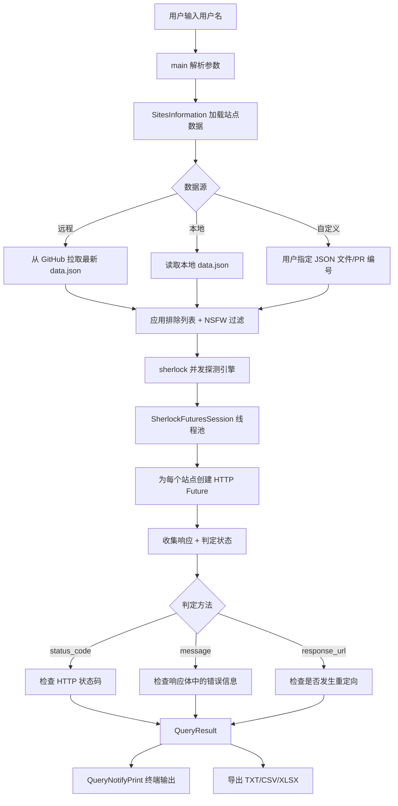
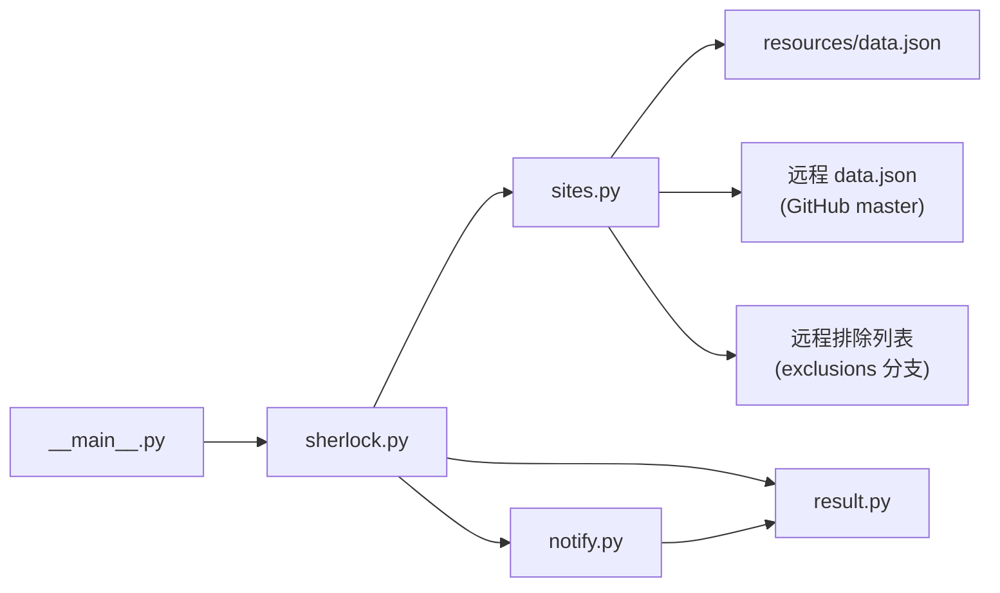
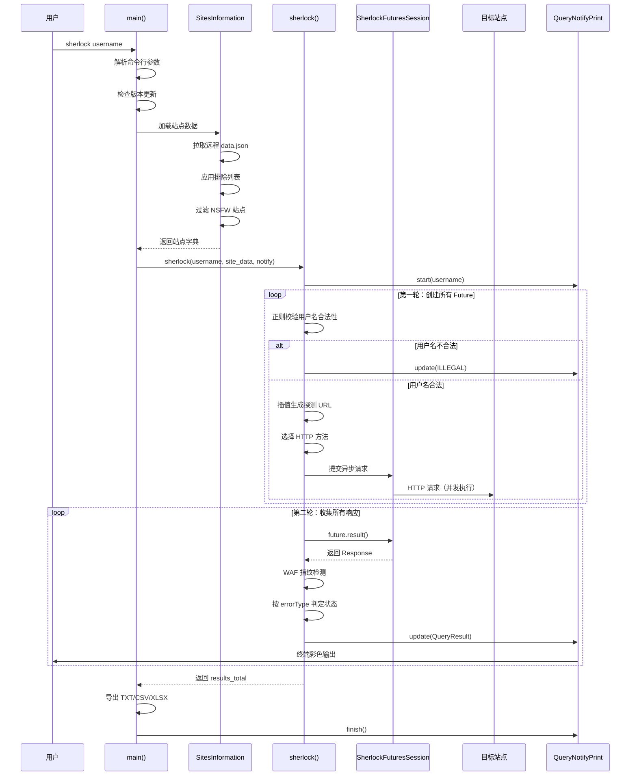
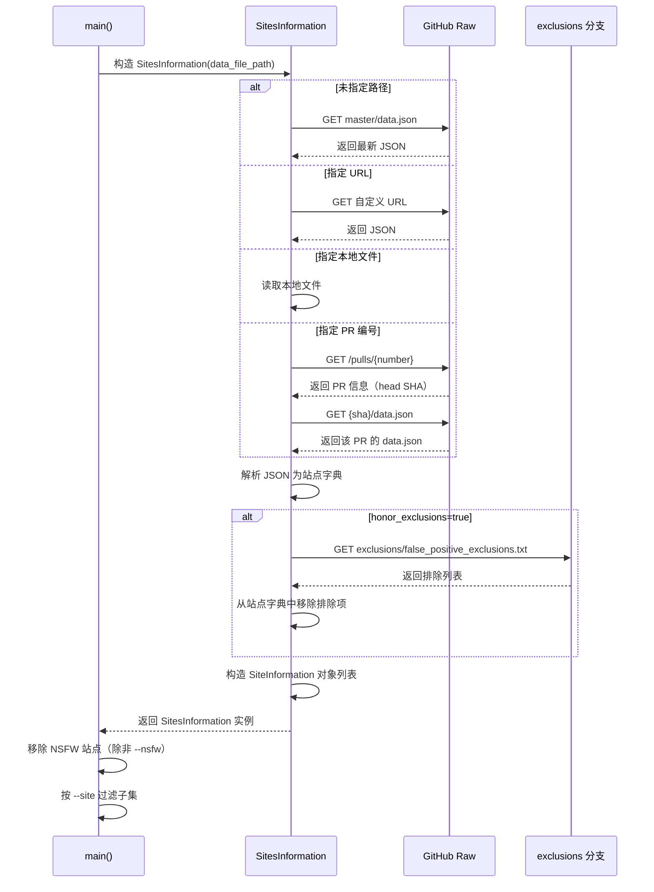

# sherlock 源码学习笔记

> 仓库地址：[sherlock](https://github.com/sherlock-project/sherlock)
> 学习日期：2026-04-05

---

> **以下为 AI 源码分析**
>
> ### 一句话概括
>
> Sherlock 是一个 Python 编写的 OSINT 工具，通过并发 HTTP 请求在 400+ 社交网络上搜索指定用户名是否存在。
>
> ### 要点速览
>
> | 核心模块 | 职责 | 关键文件 |
> |---------|------|---------|
> | 主逻辑引擎 | 解析参数、编排查询、输出结果 | `sherlock_project/sherlock.py` |
> | 站点数据层 | 加载/管理 400+ 站点的探测规则 | `sherlock_project/sites.py` + `resources/data.json` |
> | 结果模型 | 定义查询状态枚举和结果对象 | `sherlock_project/result.py` |
> | 通知系统 | 实时向终端输出彩色查询结果 | `sherlock_project/notify.py` |
> | 站点清单 | JSON 格式的社交网络探测规则 | `sherlock_project/resources/data.json` |

---

## 项目简介

Sherlock 是一个开源情报（OSINT）工具，用于在 400+ 社交网络上搜索指定用户名对应的账户是否存在。它的核心价值在于：给定一个用户名，自动、并发地探测各大社交平台，快速生成该用户名在互联网上的"数字足迹"报告。支持 TXT/CSV/XLSX 多种输出格式、Tor 代理、正则校验用户名合法性、WAF 指纹检测等功能。广泛用于安全研究、数字取证和隐私审计等合法场景。

## 技术栈

| 类别 | 技术 |
|------|------|
| 语言 | Python 3.9+ |
| 框架 | 无框架（纯 CLI 应用） |
| 构建工具 | Poetry / Docker |
| 依赖管理 | Poetry（pyproject.toml） |
| 测试框架 | pytest + tox + pytest-xdist |
| HTTP 客户端 | requests + requests-futures（线程池并发） |
| 输出格式 | colorama（终端彩色）、pandas + openpyxl（Excel） |

## 目录结构

```
sherlock/
├── sherlock_project/           # 核心源码包
│   ├── __init__.py             # 版本号管理，从 pyproject.toml 读取
│   ├── __main__.py             # python -m 入口，Python 版本检查
│   ├── sherlock.py             # 主逻辑：参数解析 + 并发探测引擎 + main()
│   ├── sites.py                # 站点数据加载与管理（SiteInformation / SitesInformation）
│   ├── result.py               # QueryStatus 枚举 + QueryResult 数据对象
│   ├── notify.py               # 查询结果通知系统（终端彩色输出）
│   └── resources/
│       ├── data.json           # 400+ 站点的探测规则清单（核心数据）
│       └── data.schema.json    # data.json 的 JSON Schema 校验规则
├── tests/                      # 测试套件
│   ├── conftest.py             # pytest 配置、fixture、参数化
│   ├── test_probes.py          # 在线探测测试（已知正例/反例）
│   ├── test_validate_targets.py # 全量站点误报/漏报验证
│   ├── test_manifest.py        # data.json Schema 校验测试
│   ├── test_version.py         # 版本号一致性测试
│   └── test_ux.py              # UX 相关测试
├── devel/                      # 开发辅助脚本
│   ├── site-list.py            # 生成站点列表文档（排序 data.json 并输出 .mdx）
│   └── summarize_site_validation.py  # 汇总站点验证测试结果
├── .actor/                     # Apify 云端运行集成
├── .github/workflows/          # CI/CD 流水线
│   ├── regression.yml          # 回归测试（lint + 多版本 tox + Docker 构建）
│   ├── validate_modified_targets.yml  # PR 中修改的站点自动验证
│   ├── exclusions.yml          # 每日自动更新误报排除列表
│   └── update-site-list.yml    # 推送时自动更新站点文档
├── pyproject.toml              # Poetry 项目配置（依赖、入口、元数据）
├── Dockerfile                  # Docker 镜像构建
├── tox.ini                     # tox 多环境测试配置
└── pytest.ini                  # pytest marker 配置
```

## 架构设计

### 整体架构

Sherlock 采用**数据驱动 + 并发探测**的架构。核心思想是将"如何探测一个站点"的知识全部抽象为 JSON 数据（`data.json`），代码本身只负责通用的探测逻辑。这种设计使得新增站点仅需编辑 JSON，无需修改代码。

整体流程分为三个阶段：
1. **初始化阶段**：解析命令行参数、加载站点数据、应用排除列表和过滤条件
2. **并发探测阶段**：为每个站点创建异步 HTTP 请求 future，然后逐一收集响应并判定结果
3. **输出阶段**：通过通知系统实时输出到终端，并按需导出 TXT/CSV/XLSX 文件



### 核心模块

#### 1. 主逻辑引擎（`sherlock_project/sherlock.py`）

**职责**：程序入口、命令行参数解析、并发探测编排、结果导出。

**关键类与函数**：
- `SherlockFuturesSession`：继承自 `FuturesSession`，在每个请求上注入计时 hook，自动记录响应耗时
- `sherlock(username, site_data, query_notify, ...)`：核心探测函数，接收用户名和站点数据，返回所有站点的查询结果字典
- `get_response(request_future, error_type, social_network)`：安全地提取 future 的响应结果，捕获各类网络异常
- `interpolate_string(input_object, username)`：递归地将站点配置中的 `{}` 占位符替换为实际用户名
- `main()`：CLI 入口，串联参数解析、数据加载、探测执行、结果导出全流程

**与其他模块的关系**：调用 `sites.py` 加载数据、使用 `result.py` 的状态枚举、通过 `notify.py` 输出结果。

#### 2. 站点数据层（`sherlock_project/sites.py`）

**职责**：加载、解析和管理 400+ 站点的探测规则。

**关键类**：
- `SiteInformation`：单个站点的数据模型（名称、主页 URL、用户名 URL 模板、已知用户名、NSFW 标记等）
- `SitesInformation`：站点集合管理器，支持从本地文件或远程 URL 加载 JSON 数据，支持排除列表过滤、NSFW 过滤

**数据源策略**：
- 默认从 GitHub master 分支远程拉取最新 `data.json`，确保用户始终使用最新数据
- 支持 `--local` 使用本地数据、`--json` 指定自定义文件或 PR 编号

#### 3. 结果模型（`sherlock_project/result.py`）

**职责**：定义查询状态和结果的数据结构。

**关键类**：
- `QueryStatus(Enum)`：查询状态枚举，包含 5 种状态：
  - `CLAIMED`：用户名已被占用
  - `AVAILABLE`：用户名可用
  - `UNKNOWN`：查询出错
  - `ILLEGAL`：用户名格式不合法
  - `WAF`：被 WAF 拦截
- `QueryResult`：查询结果数据对象，封装用户名、站点名、URL、状态、耗时和上下文信息

#### 4. 通知系统（`sherlock_project/notify.py`）

**职责**：基于观察者模式，实时通知调用方查询进展。

**关键类**：
- `QueryNotify`：基类，定义 `start()`、`update()`、`finish()` 三个生命周期方法
- `QueryNotifyPrint`：终端输出实现，使用 colorama 输出彩色结果，支持 verbose 模式显示响应耗时，支持自动在浏览器中打开找到的链接

#### 5. 站点清单（`sherlock_project/resources/data.json`）

**职责**：以 JSON 格式存储所有社交网络的探测规则。

**每个站点的必填字段**：
- `url`：用户主页 URL 模板（`{}` 为用户名占位符）
- `urlMain`：站点主页
- `errorType`：探测方法（`status_code` / `message` / `response_url`，或其组合数组）
- `username_claimed`：已知存在的用户名（用于测试）

**可选字段**：`urlProbe`（专用探测 URL）、`errorMsg`（错误信息关键词）、`errorCode`（错误状态码）、`regexCheck`（用户名合法性正则）、`headers`（自定义请求头）、`request_method`（自定义 HTTP 方法）、`request_payload`（请求体）、`isNSFW`（成人内容标记）、`tags`（分类标签）

### 模块依赖关系



## 核心流程

### 流程一：用户名探测流程

这是 Sherlock 的核心业务流程——给定一个用户名，在所有目标站点上并发探测其是否存在。



**关键细节**：

1. **两阶段执行**：先遍历所有站点创建 HTTP future（非阻塞），再遍历收集响应。这确保了所有请求并发执行，极大提升速度。
2. **线程池限制**：`max_workers` 上限为 20，避免过多并发导致被封禁。
3. **三种探测方法**：
   - `status_code`：默认使用 HEAD 请求，通过 HTTP 状态码判断（2xx = 存在）
   - `message`：使用 GET 请求，检查响应体是否包含特定错误信息
   - `response_url`：禁止重定向，通过状态码判断是否被跳转到错误页
4. **WAF 检测**：内置 Cloudflare、CloudFront、PerimeterX 等 WAF 指纹，避免将 WAF 拦截误判为"用户名存在"。

### 流程二：站点数据加载与排除列表机制



**关键细节**：

1. **默认远程数据**：默认从 GitHub master 分支拉取最新 `data.json`，确保用户无需更新 Sherlock 就能获得最新站点。
2. **PR 测试支持**：`--json 123` 可直接加载某个 PR 中的 `data.json`，方便社区贡献者测试。
3. **自动排除机制**：CI 每天运行全量误报检测，将持续产生误报的站点写入 `exclusions` 分支，运行时自动拉取并排除。
4. **NSFW 过滤**：默认不检查标记为 NSFW 的站点，除非显式传入 `--nsfw`。

## 关键设计亮点

### 1. 数据驱动的探测架构

**解决的问题**：400+ 站点各有不同的探测方式，硬编码不可维护。

**实现方式**：将所有站点的探测规则抽象为 `data.json`（`sherlock_project/resources/data.json`），每个站点配置包含 URL 模板、探测方法、错误信息等。代码侧只需实现通用的三种探测策略（`status_code`、`message`、`response_url`），新增站点仅需编辑 JSON。

**为什么这样设计**：将变化频繁的站点数据与稳定的探测逻辑分离，社区贡献者只需了解 JSON 格式即可贡献新站点，大幅降低了贡献门槛。

### 2. 两阶段并发模型

**解决的问题**：逐个探测 400+ 站点速度极慢。

**实现方式**：在 `sherlock()` 函数（`sherlock_project/sherlock.py:170-502`）中，第一个循环创建所有站点的 HTTP future 并行发出请求，第二个循环逐一收集响应。底层使用 `requests-futures` 的 `FuturesSession`（线程池并发），并通过 `SherlockFuturesSession` 子类注入计时 hook。

**为什么这样设计**：网络 I/O 是瓶颈，线程池并发可将总耗时从 O(n) 降低到接近 O(1)（受限于最慢的站点和线程池大小），同时 20 线程的上限避免触发反爬。

### 3. WAF 指纹检测

**解决的问题**：Cloudflare 等 WAF 拦截请求返回的页面可能被误判为"用户名存在"。

**实现方式**：在 `sherlock.py:385-390` 中维护了一组 WAF 响应指纹字符串（Cloudflare、CloudFront/AWS、PerimeterX），在判定探测结果前先检查响应体是否命中 WAF 指纹，命中则标记为 `QueryStatus.WAF` 而非误判。

**为什么这样设计**：随着 WAF 的普及，不检测 WAF 会导致大量误报。将 WAF 指纹作为独立的检测层，在正常探测逻辑之前拦截，既避免误报又保持代码清晰。

### 4. 自动化排除列表维护

**解决的问题**：某些站点可能在特定时期持续产生误报，需要临时排除。

**实现方式**：通过 `.github/workflows/exclusions.yml` 配置每日定时任务，使用 `pytest-xdist` 并行运行全量站点的误报测试，将持续误报的站点名写入 `exclusions` 分支的 `false_positive_exclusions.txt`。运行时 `SitesInformation` 自动拉取该列表并排除对应站点。

**为什么这样设计**：站点状态变化频繁，人工维护排除列表不可持续。自动化检测 + 独立分支存储的方式实现了"自愈"能力，无需修改代码或合并 PR 就能动态调整探测范围。

### 5. PR 级别的站点验证

**解决的问题**：社区贡献新站点或修改站点配置时，需要验证变更不会引入误报/漏报。

**实现方式**：`.github/workflows/validate_modified_targets.yml` 在 PR 触发时自动 diff `data.json`，仅对被修改的站点运行 `validate_targets` 测试（包含误报和漏报检测），并将测试结果作为 PR 评论自动发布。

**为什么这样设计**：全量测试耗时长且不稳定（网络因素），仅测试变更的站点既高效又精确。自动评论机制让 PR 审查者无需手动运行测试即可看到验证结果。
