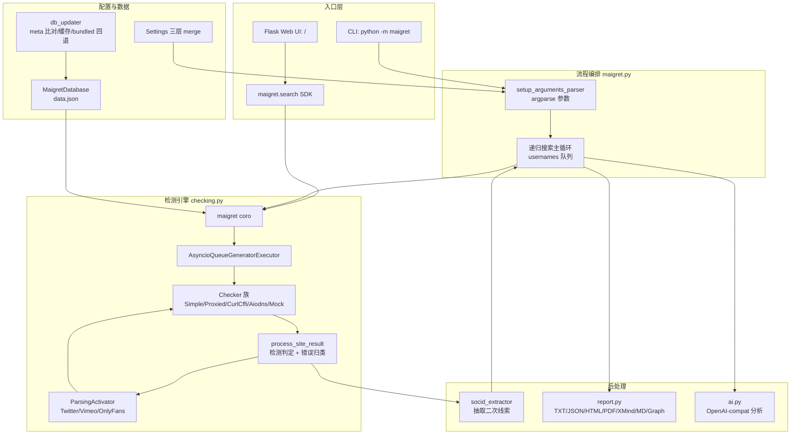
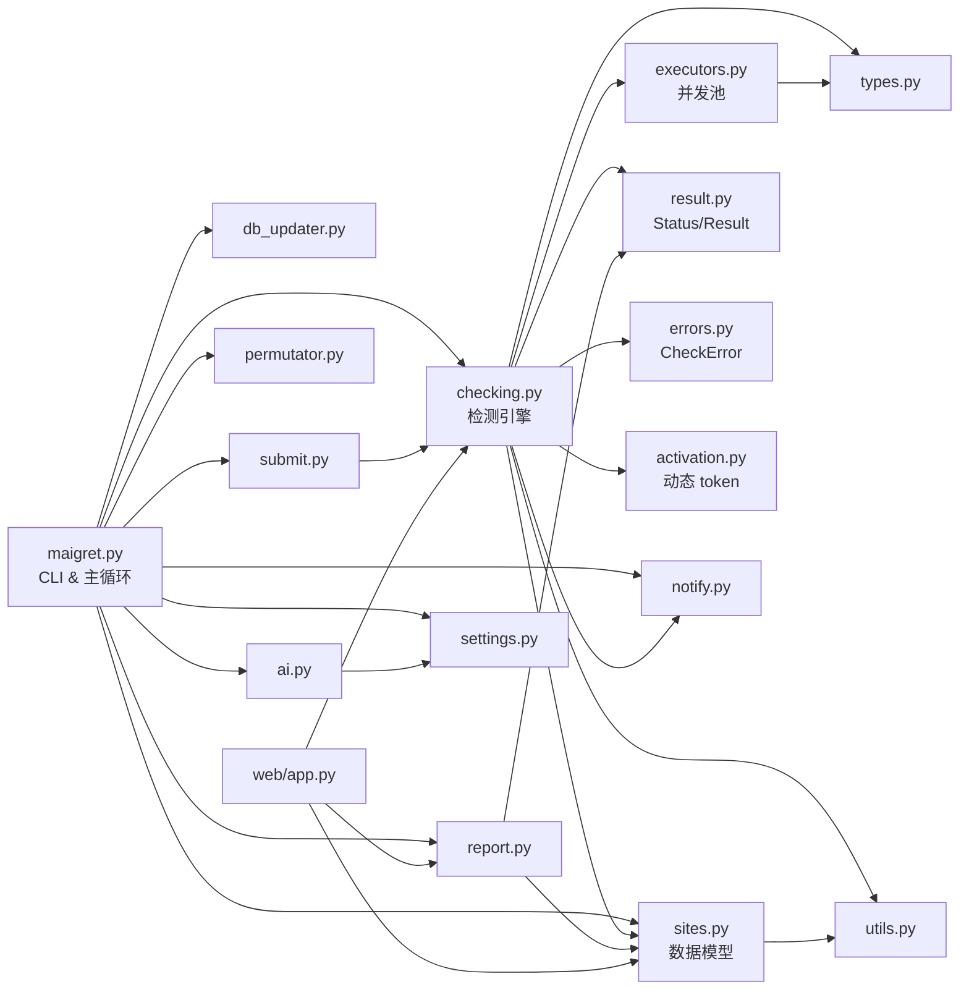
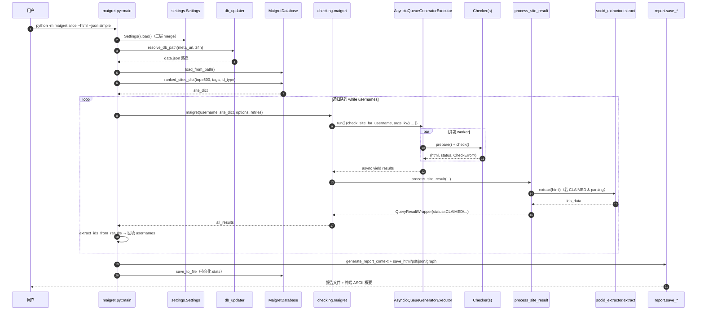
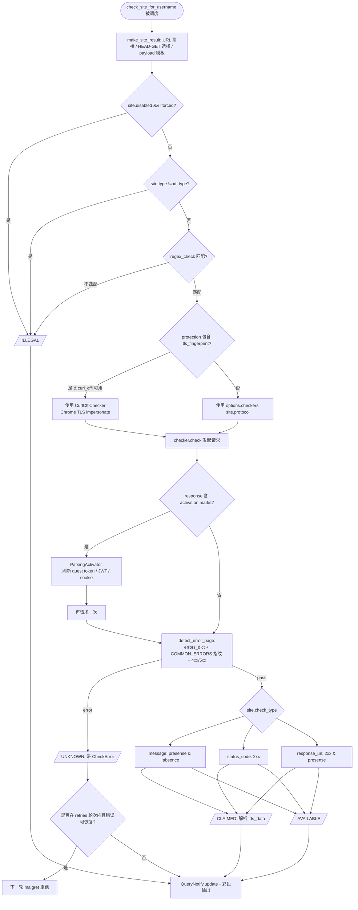

# maigret 源码学习笔记

> 仓库地址：[soxoj/maigret](https://github.com/soxoj/maigret)
> 学习日期：2026/05/08

---

> **以下为 AI 源码分析**
>
> ### 一句话概括
>
> maigret 是一个完全由 username 驱动的 OSINT 画像工具——通过对 3000+ 站点的并发探测、结果解析与递归挖掘，自动化地收集一个人在互联网上的账号分布与附带信息，最终产出多格式侦查报告。
>
> ### 要点速览
>
> | 模块 | 职责 | 关键文件 |
> |------|------|---------|
> | CLI 入口 / 流程编排 | 参数解析、数据库装载、多轮递归搜索调度、报告分发 | `maigret/maigret.py` |
> | 核心检测引擎 | 异步 HTTP 请求、反爬 bypass、响应匹配、错误分类 | `maigret/checking.py` |
> | 站点数据模型 | `MaigretSite` / `MaigretEngine` / `MaigretDatabase` JSON 结构与过滤排序 | `maigret/sites.py` |
> | 并发执行器 | 基于 `asyncio.Queue` 的限流 worker 池，支持超时回退 | `maigret/executors.py` |
> | 站点数据库 | 3000+ 站点配置与指纹 | `maigret/resources/data.json` |
> | 报告渲染 | TXT / JSON / HTML / PDF / XMind / Markdown / Graph 多格式生成 | `maigret/report.py` |
> | AI 分析 | 调 OpenAI-compat API 生成侦查结论 | `maigret/ai.py` |
> | Web UI | Flask 异步应用，提供浏览器界面 | `maigret/web/app.py` |
> | 数据库自动更新 | 远端 meta + 本地缓存 + bundled 回退 | `maigret/db_updater.py` |
> | 新站点提交向导 | 半自动推断指纹、自检并写库 | `maigret/submit.py` |

---

## 项目简介

maigret 是 Sherlock 项目的深度演化版本：只需给出一个 username（或受支持的平台内部 ID，如 gaia_id、vk_id、yandex_public_id 等），它就并发地向数千家网站发起请求，判定用户名在各站点上是否被注册，并利用 `socid_extractor` 从命中页面中抽取简介、关联账号、真实姓名等二次线索；这些线索进一步被送回搜索队列，形成递归侦查。整个过程无需任何 API Key，自带一份 1.2 MB 的 `data.json` 指纹库，启动时会尝试从 GitHub 拉取最新版本。产物可以是终端彩色报告，也可以是 HTML/PDF/XMind/Markdown/图谱等结构化文件，或者通过 Flask Web UI 与 Jupyter / Telegram Bot 使用。典型使用场景是 OSINT 调查、红队信息搜集、失踪人口寻踪与合规尽调。

## 技术栈

| 类别 | 技术 |
|------|------|
| 语言 | Python 3.10+（`^3.10`，类型注解随处可见，渐进式 mypy） |
| 框架 | `aiohttp`（主要 HTTP 客户端）、`curl_cffi`（TLS 指纹 impersonation）、`cloudscraper`（Cloudflare bypass）、`Flask + asgiref`（Web UI 支持 async 路由）、`socid_extractor`（站点数据抽取） |
| 构建工具 | `poetry-core`（PEP 517 后端）、`Makefile`、`pyinstaller`（打包 EXE）、`snapcraft`（Snap 包）、`Dockerfile` |
| 依赖管理 | Poetry（`pyproject.toml` + `poetry.lock`，`--with dev` 区分开发依赖） |
| 测试框架 | `pytest` + `pytest-asyncio` + `pytest-httpserver` + `pytest-cov` + `pytest-rerunfailures` |
| 报告渲染 | `Jinja2`（HTML/PDF 模板）、`xhtml2pdf` + `reportlab`（PDF）、`XMind`（思维导图）、`networkx` + `pyvis`（关系图） |

## 目录结构

```
maigret/
├── maigret/                    # Python 包主体
│   ├── __main__.py            #   `python -m maigret` 入口，调 asyncio.run(main())
│   ├── maigret.py             #   CLI 主流程：参数解析、DB 装载、递归循环、报告分发
│   ├── checking.py            #   核心检测：多种 Checker + process_site_result + maigret()
│   ├── sites.py               #   MaigretSite / MaigretEngine / MaigretDatabase 数据模型
│   ├── executors.py           #   基于 asyncio.Queue 的 worker 池执行器族
│   ├── report.py              #   各类报告生成（CSV/TXT/JSON/HTML/PDF/Markdown/XMind/Graph）
│   ├── notify.py              #   QueryNotifyPrint：彩色终端通知器（观察者模式）
│   ├── result.py              #   MaigretCheckResult + MaigretCheckStatus 枚举
│   ├── errors.py              #   CheckError 与反爬/censorship 常见错误指纹表
│   ├── activation.py          #   站点特定激活逻辑（Twitter/Vimeo/OnlyFans 动态 token）
│   ├── db_updater.py          #   站点数据库自动更新：meta 对比 + 本地缓存 + bundled 回退
│   ├── submit.py              #   新站点提交向导（Submitter）：半自动推断指纹
│   ├── ai.py                  #   OpenAI-compat 流式分析：resolve_api_key + get_ai_analysis
│   ├── permutator.py          #   多个姓名词的排列组合搜索
│   ├── settings.py            #   三层配置加载（resources/settings.json → ~/.maigret → CWD）
│   ├── types.py               #   QueryDraft / QueryOptions / QueryResultWrapper 类型别名
│   ├── utils.py               #   CaseConverter、URLMatcher、ascii 树、随机 UA 等工具
│   ├── resources/             #   静态资源
│   │   ├── data.json          #     3000+ 站点指纹（1.2 MB）
│   │   ├── db_meta.json       #     版本元数据，供 db_updater 比对
│   │   ├── settings.json      #     默认运行参数
│   │   ├── ai_prompt.txt      #     AI 分析系统提示词
│   │   └── simple_report*.tpl #     Jinja2 报告模板
│   └── web/                   #   Flask Web UI
│       ├── app.py             #     路由、后台任务追踪、异步搜索桥接
│       ├── templates/         #     前端页面模板
│       └── static/            #     静态资源
├── tests/                     # pytest 测试套件（含 pytest-httpserver 桩）
├── utils/                     # 辅助脚本（如 update_site_data.py 生成 sites.md）
├── docs/                      # Sphinx 文档源（readthedocs 发布）
├── static/                    # 仓库静态资源（演示报告、Logo）
├── wizard.py                  # 交互式引导脚本
├── pyproject.toml             # Poetry 项目声明
└── Dockerfile / Makefile      # 构建与容器化
```

## 架构设计

### 整体架构

maigret 是一个分层的 OSINT 侦查管线：
**CLI / Web UI / SDK → 参数与配置层 → 站点数据库层 → 并发检测引擎 → 结果处理与递归驱动 → 多格式报告层 / 可选 AI 分析**。

- 所有入口（`python -m maigret`、Flask UI、`maigret.search` 库调用）最终都汇聚到 `checking.maigret()` 这个核心协程。
- 核心协程不与具体传输协议耦合：通过 `options["checkers"]` 字典注入 clearweb / Tor / I2P / DNS 四种 Checker，站点对象上的 `protocol` 字段决定选哪一个。
- 是否需要 `curl_cffi` 的 TLS impersonation、是否需要 `ParsingActivator` 激活、是否需要重试，都在 `make_site_result` / `check_site_for_username` 内部按站点元数据动态判断，典型的"策略模式驱动的数据编码"风格。
- 递归搜索由 `maigret.py` 的主循环驱动：命中页面里抽到的新 ID 会被回填到 `usernames` 字典，下一轮继续执行同一套检测流程，直到队列为空。



### 核心模块

#### 1. CLI 流程编排（`maigret/maigret.py`，970 行）
- **职责**：参数解析、配置加载、数据库装载与回退、notifier / submitter / permutator 初始化、递归搜索主循环、按 `--xmind/--csv/--html/...` 等旗标分发报告。
- **关键函数**：`main()`（从 ~540 行起）、`run()`（asyncio.run 包装 + KeyboardInterrupt 兜底）、`extract_ids_from_page/results()`（对外部 URL 与历史结果再抽取 ID）、`setup_arguments_parser()`（集中声明 50+ CLI 参数）。
- **与其他模块的关系**：向下调用 `checking.maigret()`、`report.save_*` 系列与 `ai.get_ai_analysis()`；向上消费 `settings.Settings`、`sites.MaigretDatabase`、`notify.QueryNotifyPrint`、`submit.Submitter`、`permutator.Permute`、`db_updater.resolve_db_path`。

#### 2. 核心检测引擎（`maigret/checking.py`，1255 行）
- **职责**：
  - 定义 Checker 抽象 & 多种实现（`SimpleAiohttpChecker`、`ProxiedAiohttpChecker`、`CurlCffiChecker`、`AiodnsDomainResolver`、`CheckerMock`），各自封装协议与反爬策略。
  - `make_site_result()`：按站点配置构造请求上下文（URL 填充、HEAD/GET/POST 选择、payload 模板化、TLS 指纹判定）。
  - `check_site_for_username()`：执行一次 Checker.check()，遇到 `activation.marks` 则触发动态 token 刷新后重试一次。
  - `process_site_result()`：根据 `check_type ∈ {message, status_code, response_url}` 和 `presense_strs / absence_strs` 判定 CLAIMED / AVAILABLE / UNKNOWN / ILLEGAL；命中后调用 `extract_ids_data` 递归抽取新 ID。
  - `maigret()` 主协程：实例化 4 类 Checker、构造 `QueryOptions`、按 `retries` 轮次重跑失败站点（`get_failed_sites()` 过滤掉永久性错误）。
  - `self_check / site_self_check`：用 claimed / unclaimed 两个锚点用户名回归验证站点配置是否仍有效，`auto_disable` 时自动下线失效站点。
- **关键类型**：`SUPPORTED_IDS`（9 种身份）、`BAD_CHARS = "#"`、`QueryOptions`。
- **与其他模块的关系**：是所有入口的收敛点，消费 `sites.MaigretSite`、`result.MaigretCheckResult/Status`、`errors.CheckError`、`activation.ParsingActivator`、`executors.AsyncioQueueGeneratorExecutor`，向 `notify.QueryNotify` 广播进度。

#### 3. 站点数据模型（`maigret/sites.py`，716 行）
- **职责**：
  - `MaigretEngine`：一组同类站点的共享配置（如 XenForo、UIKit）。
  - `MaigretSite`：站点的全部指纹（正则、User-Agent、presense/absence 标志、activation 配置、mirrors、tag、alexa_rank、protection 列表 ...），并通过 `CaseConverter.camel_to_snake` 自动把 JSON 的 camelCase 映射到 snake_case 属性。
  - `MaigretDatabase`：加载 / 保存 JSON，`ranked_sites_dict()` 是最复杂的方法——支持按 tag、engine、protocol、名称、disabled、id_type 多维过滤，按 `alexa_rank` 排序取 top N，并且在截断后还会把被剔除的"热门父站点镜像"（如 Picuki 之于 Instagram）重新拼回来。
- **关键接口**：`load_from_path/str/http/file`、`save_to_file`、`ranked_sites_dict`、`extract_ids_from_url`、`update_from_engine`、`detect_username`。
- **与其他模块的关系**：被 `maigret.py` / `checking.py` / `submit.py` / `web/app.py` 直接消费；`db_updater.py` 只负责"选哪一份 data.json"，不触碰解析。

#### 4. 并发执行器（`maigret/executors.py`，245 行）
- **职责**：把异步任务串成一条可控的流水线。项目内共存 5 种实现（其中 4 种标注 "Deprecated"）：
  - `AsyncioSimpleExecutor`：`Semaphore + gather`。
  - `AsyncioProgressbarExecutor`：加进度条。
  - `AsyncioProgressbarSemaphoreExecutor`：`as_completed` + 进度条。
  - `AsyncioProgressbarQueueExecutor`：固定 worker 数 + Queue + 进度条，每个 worker 带 `asyncio.wait_for(timeout)`，超时走 `kwargs["default"]`。
  - `AsyncioQueueGeneratorExecutor`（实际使用）：同上，但以 async generator 形式逐个 yield 结果，让调用方可以边收边推进进度条。
- **关键机制**：`QueryDraft = (callable, args, kwargs)`，worker 从 queue 取任务并 `asyncio.wait_for` 执行，超时时取 `kwargs["default"]` 当结果——与上层 `checking.maigret()` 预填的 `default_result` 形成端到端的兜底约定。

#### 5. 报告与可视化（`maigret/report.py`，718 行）
- 统一入口：`generate_report_context(general_results)` → 各格式的 `save_*` / `generate_*`。
- 除纯文本外，HTML/PDF 复用同一套 Jinja2 模板（`simple_report.tpl` / `simple_report_pdf.tpl`），Graph 报告基于 `networkx + pyvis` 画关系图，XMind 用 `xmind` 包写思维导图。

#### 6. 反爬 / bypass 子系统
- `errors.py`：硬编码一张"响应体指纹 → CheckError"映射表（Cloudflare / DDoS-Guard / Incapsula / 俄罗斯运营商 censorship...），让检测器可以"在看起来是 200 的页面里"识别出其实是被拦了。
- `activation.py`：定义 `ParsingActivator`，为少数站点编排动态 token 流程（Twitter guest token、Vimeo JWT、OnlyFans SHA1 sign...）。站点 JSON 中通过 `"activation": {"method": "onlyfans", ...}` 引用方法名，reflective 调用。
- `CurlCffiChecker`：用 `curl_cffi.AsyncSession` 以 Chrome 指纹发起 TLS 握手，绕过 "Chrome UA + 老 TLS 指纹" 的复合打分。
- `submit.py::CloudflareSession`：`cloudscraper` 包装成 `aiohttp` 风格接口供新站点提交时使用。

#### 7. 数据库自动更新（`maigret/db_updater.py`）
- `~/.maigret/data.json` 为运行时缓存、`maigret/resources/data.json` 为 bundled 回退。
- `resolve_db_path()`：优先走 CLI `--db` → 缓存 → 拉 meta 比对 → 下载并原子替换 → 失败时回 bundled。

#### 8. Web / AI / SDK 旁路
- `maigret/web/app.py`：Flask（`extras=["async"]`）路由表，`/search` 开后台线程跑 `asyncio.run(maigret_search(...))`，`background_jobs` dict 存任务状态。
- `maigret/ai.py`：`resolve_api_key` 按 `settings.openai_api_key → OPENAI_API_KEY` 取；`get_ai_analysis` 调 OpenAI-compat `/chat/completions` 并用自定义 `_Spinner` + `print_streaming` 模拟流式体验。
- `maigret/__init__.py` 暴露 `search = checking.maigret`、`cli = maigret.maigret.main`，外部可 `import maigret; maigret.search(...)`。

### 模块依赖关系



## 核心流程

### 流程一：一次 `maigret <username>` 的完整调用链



关键点：
- 第 4-6 步：优先远端 → 本地缓存 → bundled 三级回退，保证离线也能跑。
- 第 8-11 步：`AsyncioQueueGeneratorExecutor.run()` 是 async generator，每完成一个站点就 yield 一次，让 `alive_bar` 进度条即时推进。
- 第 13 步：`extract()` 来自外部库 `socid_extractor`，这是 maigret 区别于 Sherlock 的核心——不止"账号存在/不存在"，还把页面抽成结构化字段。
- 第 15-17 步：抽到的新 username / vk_id / gaia_id 等被塞回 `usernames` dict（`maigret.py:837`），并通过 `already_checked` 去重，形成递归闭环。

### 流程二：单站点检测与反爬降级



要点：
- `errors_dict`（站点私有）优先匹配，匹配不到再走 `COMMON_ERRORS`（全局反爬指纹表），最后才是状态码启发式。
- `activation` 机制让配置驱动的 JSON 站点库也能处理 Twitter 这类 "需要先刷 guest token" 的场景；活体代码存在 `activation.py::ParsingActivator`，JSON 里只写方法名——典型的"配置 + 反射"拆耦。
- 当站点的 `protection` 标签包含 `tls_fingerprint` 时自动切换到 `curl_cffi` 的 Chrome impersonation，这是 2024 年后为应对 Cloudflare TLS 指纹打分新增的分支。

## 关键设计亮点

### 1. 指纹库 JSON 驱动 + 反射式"激活方法"：Python 最少、JSON 最多

- **解决的问题**：3000+ 站点的检测逻辑如果每个都写 Python，既膨胀也难贡献。
- **实现**：`MaigretSite.__init__` 直接把 JSON 字段通过 `CaseConverter.camel_to_snake` 挂到实例属性上（`sites.py:106`），检测器只读配置里的 `checkType / presenseStrs / absenceStrs / headers / regexCheck / urlProbe / requestPayload`。遇到真正需要代码的站点，JSON 里只写 `"activation": {"method": "twitter"}`，运行时 `getattr(ParsingActivator(), method)`（`checking.py:396`）取回函数对象再调用。
- **为何这样设计**：贡献者只需改 `data.json` 就能加站点；`ParsingActivator` 的方法名是显式白名单，反射的攻击面可控；同时站点库还能远端下发（`db_updater.py`），不发版也能更新能力。

### 2. "Executor 预留 default" 的超时兜底协议

- **解决的问题**：3000+ 站点必然有慢站、死站；单一超时不能拖垮整个流水线。
- **实现**：`checking.maigret()` 在入队任务时构造好一份 `default_result = QueryResultWrapper(...MaigretCheckStatus.UNKNOWN, error=CheckError('Request failed'))`，放进 `kwargs["default"]`（`checking.py:874-892`）；`AsyncioQueueGeneratorExecutor.worker` 用 `asyncio.wait_for(query_task, timeout=self.timeout)`，捕到 `TimeoutError` 就 `result = kwargs.get('default')`（`executors.py:208-210`）。
- **为何这样设计**：把"默认值"放进任务参数里，worker 不必关心任何业务语义，就能产出跟成功任务同构的结果，上层 `get_failed_sites()` 再按 `error.type` 分类决定是否重试（`checking.py:735`）。这比常见的 try/except + None 检查健壮得多。

### 3. 三级站点库回退 + 自检自愈

- **解决的问题**：站点指纹会失效；离线场景仍要能跑。
- **实现**：`db_updater.resolve_db_path`（`maigret/db_updater.py`）串起 "CLI 指定 → `~/.maigret/data.json` 缓存 → 下载远端 meta 比对 → 更新缓存 → 最终回落 bundled"。`checking.self_check / site_self_check` 则用 `username_claimed / username_unclaimed` 两个锚点周期性回归每个站点的配置，`--auto-disable` 时自动把失效站点的 `disabled` 置 True 并写回本地库。
- **为何这样设计**：OSINT 工具最大的负维护是"指纹腐烂"；把热更新 + 自愈 + 离线兜底做成第一优先级，用户体验差异巨大。

### 4. 递归搜索：用"站点 → 站点外信息"放大输入

- **解决的问题**：给一个 username，大多数工具只能做等宽检测；maigret 想收敛出"这个人"。
- **实现**：命中 CLAIMED 后，`process_site_result` 把 `extract_ids_data` 的结果挂到 `results_info`（`checking.py:495`）；主循环里 `extract_ids_from_results(results, db)` 把新 ids 合并进 `usernames` 字典（`maigret.py:834-837`），`already_checked` 做去重，天然形成 BFS 式递归。对单独输入一个 URL 的场景（`--parse-url`），`extract_ids_from_page` 会先用 `socid_extractor.parse + extract` 抽一轮再入队。
- **为何这样设计**：把第三方库 `socid_extractor` 当成数据增益器，避免 maigret 自己维护抓取规则；同时把"站点匹配"和"信息抽取"解耦，后者失效不会拖垮前者。

### 5. Checker 族 + 策略注入：一套主流程覆盖 clearweb / Tor / I2P / DNS / TLS-impersonation

- **解决的问题**：不同站点可能在 Tor 上、是 DNS-only 域名探测、或需要 TLS 指纹伪装；又不希望主循环里堆满 if。
- **实现**：五种 Checker 都实现同样的 `prepare(url, headers, ...)` + `async check() -> (text, status, CheckError?)` + `close()` 合同（`checking.py:55-302`）。主协程按 `protocol ∈ {'', 'tor', 'i2p', 'dns'}` 从 `options["checkers"]` 字典选用（`checking.py:852-857`），而 `tls_fingerprint` 这类细粒度特征则在 `make_site_result` 里单独切到 `CurlCffiChecker`（`checking.py:551-561`）。`CheckerMock` 负责未启用特性时的 no-op，保持接口对齐。
- **为何这样设计**：策略模式的教科书式用法——策略对象不光替换行为，还统一了失败模型，让上层用同一套超时/错误处理即可。新增协议（例如未来加一个 `curl_cffi` 的 Firefox impersonation）只需增加一个 Checker 类和字典键，核心循环零改动。
