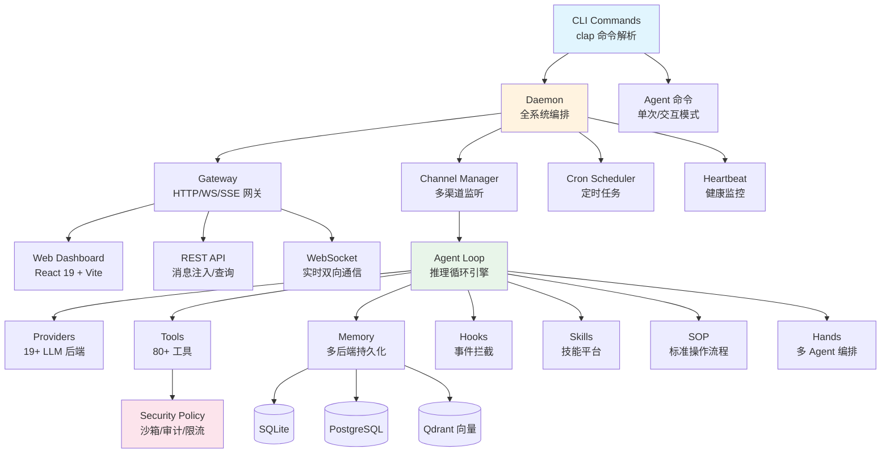
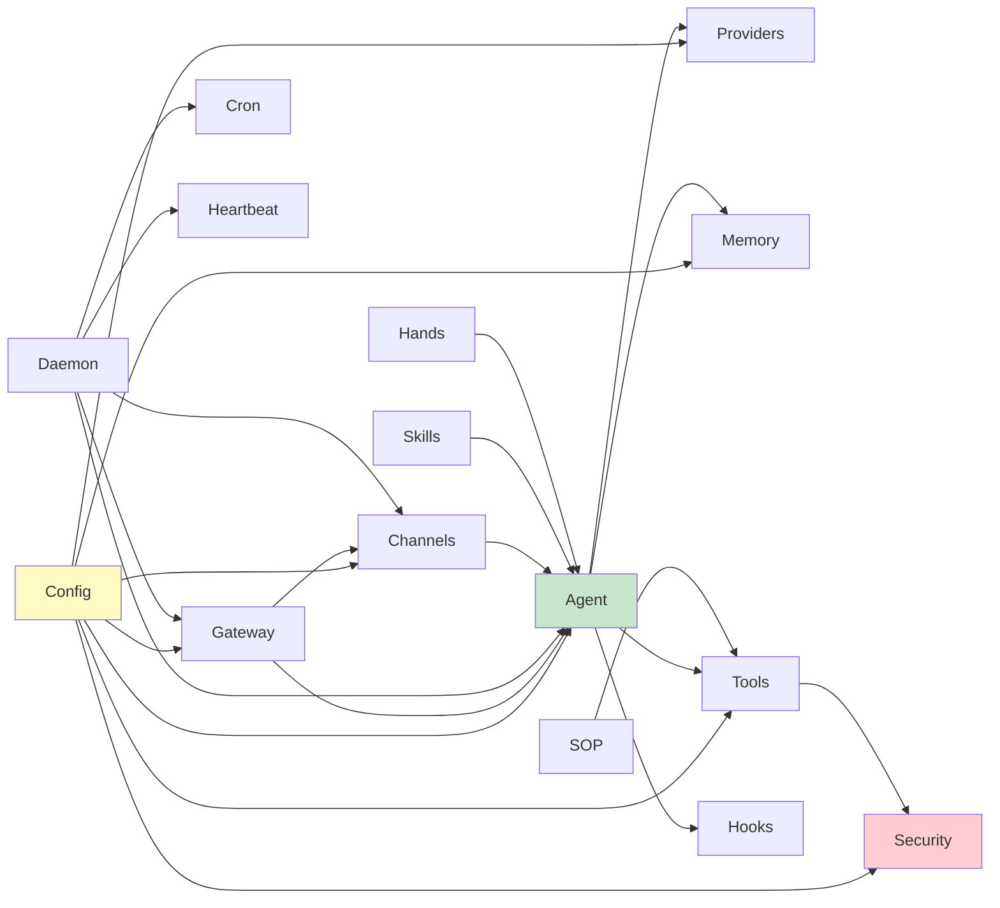
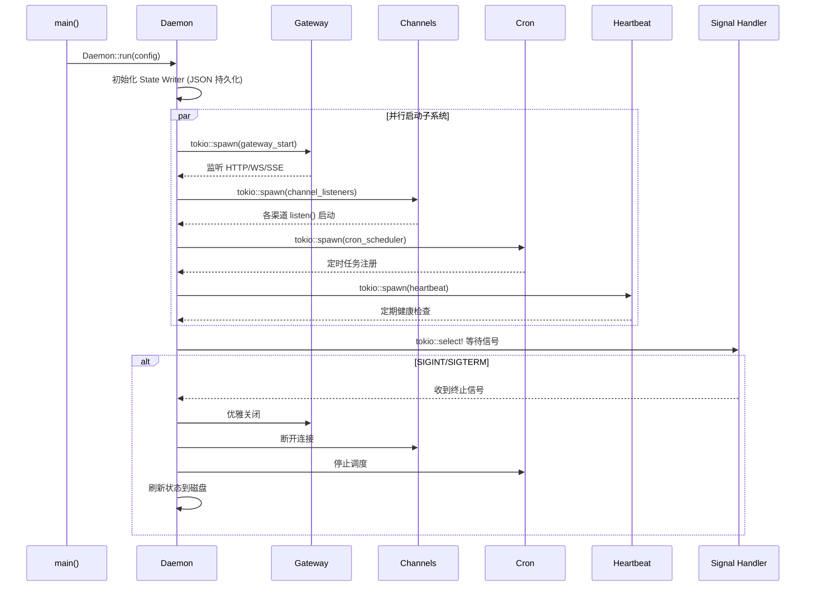

# ZeroClaw 源码学习笔记

> 仓库地址：[zeroclaw](https://github.com/zeroclaw-labs/zeroclaw)
> 学习日期：2026-03-22

---

> **以下为 AI 源码分析**
>
> ### 一句话概括
>
> ZeroClaw 是一个用纯 Rust 编写的个人 AI 助手，支持 41+ 消息渠道、19+ LLM Provider、80+ 工具，可运行在 $10 硬件上，内存占用 <5MB。
>
> ### 要点速览
>
> | 核心模块 | 职责 | 关键文件 |
> |---------|------|---------|
> | Agent | LLM 推理循环、工具调度、多轮对话 | `src/agent/agent.rs`, `loop_.rs`, `dispatcher.rs` |
> | Providers | 抽象 19+ LLM 后端（OpenAI/Anthropic/Gemini 等） | `src/providers/traits.rs`, `router.rs` |
> | Channels | 统一 41+ 消息平台（Telegram/Discord/Slack 等） | `src/channels/traits.rs` |
> | Gateway | HTTP/WS/SSE 控制面板 | `src/gateway/mod.rs`, `api.rs` |
> | Tools | 80+ agent 可调用的工具 | `src/tools/traits.rs` |
> | Memory | 多后端持久化记忆（SQLite/Postgres/Qdrant） | `src/memory/traits.rs`, `sqlite.rs` |
> | Security | 沙箱隔离、审计、紧急停止 | `src/security/policy.rs`, `estop.rs` |
> | Daemon | 全部子系统编排和生命周期管理 | `src/daemon/mod.rs` |

---

## 项目简介

ZeroClaw 是一个运行在个人设备上的 AI 助手框架。它解决的核心问题是：让用户通过已有的消息渠道（WhatsApp、Telegram、Slack、Discord、Signal、iMessage、Email 等 41+ 平台）与 AI 助手交互，同时保持本地化、隐私优先、资源占用极低。项目的核心价值在于「零开销、零妥协」——单个 Rust 二进制文件，<5MB RAM，支持从 $10 嵌入式设备到云服务器的全场景部署。Gateway 是控制面板，真正的产品是整个 AI 助手体验。

## 技术栈

| 类别 | 技术 |
|------|------|
| 语言 | Rust 1.87+（2021 edition） |
| Web 框架 | Axum（HTTP/WS/SSE） |
| 异步运行时 | Tokio（多线程） |
| 构建工具 | Cargo（workspace） |
| 依赖管理 | Cargo.toml + Cargo.lock |
| 测试框架 | Rust 内置 `#[test]` + 集成测试 (`tests/`) |
| HTTP 客户端 | reqwest（rustls-tls） |
| 序列化 | serde + serde_json + TOML |
| 数据库 | SQLite（rusqlite, 默认）/ PostgreSQL（可选）/ Qdrant（向量） |
| 前端 | React 19 + Vite 6 + Tailwind CSS 4 |
| 监控 | Prometheus（可选）/ OpenTelemetry（可选） |
| 日志 | tracing + tracing-subscriber |

## 目录结构

```
zeroclaw/
├── src/                        # 主程序源码（240,000+ 行 Rust）
│   ├── main.rs                 # 程序入口，CLI 解析
│   ├── lib.rs                  # 库入口，子命令枚举定义
│   ├── agent/                  # Agent 推理循环引擎
│   ├── providers/              # 19+ LLM Provider 抽象层
│   ├── channels/               # 41+ 消息渠道适配
│   ├── gateway/                # HTTP/WS/SSE 网关服务
│   ├── tools/                  # 80+ Agent 工具
│   ├── memory/                 # 多后端持久化记忆系统
│   ├── security/               # 安全策略、沙箱、审计
│   ├── daemon/                 # 全系统编排和 supervisor
│   ├── config/                 # TOML 配置 schema 和加载
│   ├── hooks/                  # 事件驱动的 Hook 系统
│   ├── skills/                 # 技能平台（加载/创建/审计）
│   ├── sop/                    # Standard Operating Procedures
│   ├── hands/                  # 多 Agent 编排（autonomous swarm）
│   ├── cron/                   # 定时任务调度
│   ├── onboard/                # 用户引导和初始化
│   ├── doctor/                 # 诊断和健康检查
│   ├── tunnel/                 # 隧道支持（Cloudflare/ngrok 等）
│   ├── peripherals/            # 硬件外设抽象（ESP32/STM32/RPi）
│   ├── hardware/               # USB 硬件发现
│   ├── auth/                   # OAuth 和凭证管理
│   ├── cost/                   # Token 使用和费用追踪
│   ├── observability/          # Prometheus/OpenTelemetry 指标
│   └── integrations/           # 第三方集成（Jira/Notion 等）
├── crates/                     # 子 crate
│   ├── robot-kit/              # 机器人工具包
│   └── aardvark-sys/           # Aardvark I2C/SPI/GPIO 适配
├── web/                        # React Web Dashboard
│   └── src/                    # 前端源码（React 19 + Vite 6）
├── firmware/                   # 嵌入式固件
│   ├── esp32/                  # ESP32 无线外设 Agent
│   ├── nucleo/                 # STM32 Nucleo 工业外设
│   ├── arduino/                # Arduino 传感器桥接
│   └── esp32-ui/               # ESP32 带显示屏版本
├── tests/                      # 集成测试 + 安全测试
├── docs/                       # 文档
├── scripts/                    # 构建和运维脚本
├── python/                     # Python 工具集成
├── Cargo.toml                  # Workspace 和依赖配置
├── Dockerfile                  # 容器化部署
└── Justfile                    # 任务运行器
```

## 架构设计

### 整体架构

ZeroClaw 采用 **分层架构 + Trait 多态** 设计。最上层是 CLI 命令入口，中间层是 Daemon 编排器和 Agent 推理引擎，底层是可插拔的 Provider、Channel、Tool、Memory 等组件。所有核心组件都定义为 Rust trait，通过 trait object 实现运行时多态，便于扩展和测试。



### 核心模块

#### 1. Agent 模块 (`src/agent/`)

**职责：** LLM 推理循环引擎，负责多轮对话、工具调度和上下文管理。

**核心文件：**
- `agent.rs` — Agent 主体结构和 `AgentBuilder`（Builder 模式）
- `loop_.rs` — 推理循环主逻辑（接收消息→调 LLM→解析工具→执行→返回）
- `dispatcher.rs` — Tool Dispatcher（支持 Native/XML/PromptGuided 三种调用模式）
- `classifier.rs` — 查询分类器（模型路由）
- `prompt.rs` — 系统提示词构建
- `memory_loader.rs` — 上下文记忆注入策略

**关键接口：**
```rust
pub struct Agent {
    provider: Box<dyn Provider>,
    tools: Vec<Box<dyn Tool>>,
    memory: Arc<dyn Memory>,
    tool_dispatcher: Box<dyn ToolDispatcher>,
}

pub struct AgentBuilder { /* fluent builder pattern */ }
```

**与其他模块的关系：** 依赖 Providers（调用 LLM）、Tools（工具执行）、Memory（上下文检索）、Hooks（事件通知）。被 CLI、Gateway、Daemon 调用。

---

#### 2. Providers 模块 (`src/providers/`)

**职责：** 抽象 19+ LLM API 差异，提供统一的 chat 接口，支持故障转移和模型路由。

**核心文件：**
- `traits.rs` — `Provider` trait 定义
- `router.rs` — Provider 路由和故障转移
- `anthropic.rs`, `openai.rs`, `gemini.rs`, `ollama.rs` — 各提供商实现
- `reliable.rs` — 可靠性包装器（retry + failover）
- `compatible.rs` — OpenAI-compatible 通用适配器

**关键接口：**
```rust
pub trait Provider: Send + Sync {
    fn capabilities(&self) -> ProviderCapabilities;
    async fn chat_with_history(...) -> Result<String>;
    async fn chat_with_tools(...) -> Result<ChatResponse>;
    async fn stream_chat_with_system(...) -> BoxStream<StreamChunk>;
}

pub struct ProviderCapabilities {
    native_tool_calling: bool,
    vision: bool,
    prompt_caching: bool,
}
```

**支持的提供商：** Anthropic Claude、OpenAI、Azure OpenAI、Gemini、GLM（智谱）、Ollama、OpenRouter、Copilot、Bedrock、Telnyx、Compatible（通用 OpenAI 兼容）等 19+。

---

#### 3. Channels 模块 (`src/channels/`)

**职责：** 统一 41+ 消息平台的收发接口，支持平台特定功能（threaded replies、typing indicators、草稿模式）。

**核心文件：**
- `traits.rs` — `Channel` trait 定义
- `session_store.rs`, `session_sqlite.rs` — 会话管理
- 各平台实现：`telegram.rs`, `discord.rs`, `slack.rs`, `matrix.rs`, `whatsapp.rs` 等

**关键接口：**
```rust
pub trait Channel: Send + Sync {
    async fn send(&self, message: &SendMessage) -> Result<()>;
    async fn listen(&self, tx: mpsc::Sender<ChannelMessage>) -> Result<()>;
    async fn health_check(&self) -> bool;
    async fn start_typing(&self, recipient: &str) -> Result<()>;
    async fn send_draft(&self) -> Result<Option<String>>;
    async fn update_draft(...) -> Result<()>;
}
```

---

#### 4. Gateway 模块 (`src/gateway/`)

**职责：** HTTP/WS/SSE 控制面板，暴露 REST API，服务 Web Dashboard，处理设备配对。

**核心文件：**
- `mod.rs` — Axum 路由注册和服务启动
- `api.rs` — RESTful API 路由
- `api_pairing.rs` — 设备配对认证
- `ws.rs` — WebSocket 连接管理
- `sse.rs` — Server-Sent Events 推送
- `static_files.rs` — Web Dashboard 静态文件服务

---

#### 5. Tools 模块 (`src/tools/`)

**职责：** 提供 80+ agent 可调用的工具，涵盖文件操作、系统命令、Web、浏览器、集成等。

**关键接口：**
```rust
pub trait Tool: Send + Sync {
    fn name(&self) -> &str;
    fn description(&self) -> &str;
    fn parameters_schema(&self) -> Value;
    async fn execute(&self, args: Value) -> Result<ToolResult>;
}
```

**工具分类：**
- **文件操作：** read/write/edit、glob search、content search
- **系统命令：** shell、git、cron
- **Web：** web search、web fetch、HTTP request
- **浏览器：** browser control、screenshot、Computer Use
- **记忆：** recall、store、forget、knowledge
- **多代理：** delegate（agent-to-agent）、swarm
- **集成：** MCP、Jira、Notion、Google Workspace、Composio

---

#### 6. Memory 模块 (`src/memory/`)

**职责：** 多后端持久化记忆系统，支持关键字检索和向量检索。

**关键接口：**
```rust
pub trait Memory: Send + Sync {
    async fn store(&self, key, content, category, session_id) -> Result<()>;
    async fn recall(&self, query, limit, session_id, since, until) -> Result<Vec<MemoryEntry>>;
    async fn get(&self, key) -> Result<Option<MemoryEntry>>;
    async fn forget(&self, key) -> Result<bool>;
    async fn store_procedural(...) -> Result<()>;
}
```

**支持后端：** SQLite（默认）、Markdown（纯文本）、Lucid（SQLite + 向量混合）、Qdrant（向量数据库）、PostgreSQL（可选 feature）。

---

#### 7. Security 模块 (`src/security/`)

**职责：** 安全策略执行——自主级别控制、沙箱隔离、工作区边界、审计日志、紧急停止。

**关键接口：**
```rust
pub struct SecurityPolicy {
    autonomy: AutonomyLevel,  // Supervised | Autonomous | Manual
    workspace_boundary: Option<PathBuf>,
    allowed_domains: Vec<String>,
}

pub trait Sandbox: Send + Sync {
    async fn run(...) -> Result<CommandOutput>;
}
```

**沙箱后端：** Docker、Firejail、Bubblewrap、Landlock（Linux LSM）、NoopSandbox。

### 模块依赖关系



## 核心流程

### 流程一：Agent 推理循环（消息处理全流程）

这是 ZeroClaw 最核心的流程——从用户发送消息到 AI 回复的完整调用链。

```mermaid
sequenceDiagram
    participant U as 用户
    participant Ch as Channel<br/>(Telegram/Discord等)
    participant D as Daemon
    participant A as Agent Loop
    participant ML as Memory Loader
    participant P as Provider<br/>(LLM)
    participant TD as Tool Dispatcher
    participant T as Tool
    participant M as Memory

    U->>Ch: 发送消息
    Ch->>D: ChannelMessage (mpsc)
    D->>A: 注入推理循环
    A->>ML: 加载上下文记忆
    ML->>M: recall(query, session_id)
    M-->>ML: Vec&lt;MemoryEntry&gt;
    ML-->>A: 构建 system prompt + context

    loop 多轮推理 (max_turns)
        A->>P: chat_with_tools(messages, tools)
        P-->>A: ChatResponse (text + tool_calls)

        alt 有 tool_calls
            A->>TD: dispatch(tool_calls)
            TD->>T: execute(args)
            T-->>TD: ToolResult
            TD-->>A: 工具结果注入消息历史
        else 纯文本回复
            A-->>A: 推理完成，退出循环
        end
    end

    A->>M: store(response, session_id)
    A->>Ch: send(response)
    Ch->>U: 显示回复
```

**关键逻辑说明：**
1. Channel 通过 `listen()` 长轮询收到消息，转为 `ChannelMessage` 发送到 Daemon
2. Daemon 构建 session_id（channel + sender + thread），注入 Agent 推理循环
3. Memory Loader 加载相关上下文记忆和会话历史
4. Agent 调用 LLM Provider，解析返回的 tool_calls
5. Tool Dispatcher 根据策略（Native/XML/PromptGuided）执行工具
6. 工具执行结果注入消息历史，继续推理直到 LLM 返回纯文本或达到 max_turns
7. 最终回复存入 Memory 并通过 Channel 发送给用户

### 流程二：Daemon 全系统启动与编排



**关键逻辑说明：**
1. `main()` 解析 CLI 参数后调用 `Daemon::run()`
2. Daemon 作为 supervisor 并行启动 Gateway、Channels、Cron、Heartbeat
3. 使用 `tokio::select!` 等待 SIGINT/SIGTERM 信号
4. 收到信号后优雅关闭所有子系统，刷新状态到磁盘

## 关键设计亮点

### 1. Trait-Based 全组件可插拔

**解决的问题：** 需要支持 19+ LLM、41+ 消息平台、80+ 工具，同时保持核心代码简洁。

**实现方式：** 所有核心组件定义为 Rust trait（`Provider`, `Channel`, `Tool`, `Memory`, `Sandbox`, `HookHandler`），通过 `Box<dyn Trait>` 实现运行时多态。新增一个 Provider 或 Channel 只需实现对应 trait。

**关键文件：** `src/providers/traits.rs`, `src/channels/traits.rs`, `src/tools/traits.rs`, `src/memory/traits.rs`

**设计原因：** Rust 的 trait 系统提供零成本抽象（编译期已知的实现可以内联），同时 trait object 在需要时提供动态分发。这让 ZeroClaw 可以在不修改核心代码的情况下扩展任意数量的实现。

### 2. Feature Gates 按需编译

**解决的问题：** 项目依赖众多（Matrix SDK、Nostr SDK、probe-rs 等），全量编译耗时且增大二进制体积。

**实现方式：** 通过 Cargo feature flags 将重量级依赖设为可选：
- `channel-matrix` — Matrix SDK（E2EE）
- `channel-nostr` — Nostr 协议
- `hardware` — USB 设备枚举
- `sandbox-landlock` — Linux Landlock LSM
- `whatsapp-web` — WhatsApp Web 客户端
- `plugins-wasm` — WASM 插件运行时

**关键文件：** `Cargo.toml`（features 部分, L226-L279）

**设计原因：** 目标硬件是 $10 嵌入式设备，二进制体积和编译时间直接影响可用性。Feature gates 让用户只编译需要的功能。

### 3. 多策略 Tool Dispatcher

**解决的问题：** 不同 LLM Provider 对 tool calling 的支持程度不同——有些原生支持，有些只能通过文本引导。

**实现方式：** `src/agent/dispatcher.rs` 实现三种调度策略：
- **Native** — 使用 Provider 原生的 tool calling API（如 Anthropic/OpenAI）
- **XML** — 将工具定义编码为 XML 格式嵌入 prompt，解析 LLM 输出中的 XML 标签
- **Native Fallback** — 优先尝试 Native，失败时自动降级为 XML

**设计原因：** 保证所有 Provider 都能使用工具，同时在支持原生调用的 Provider 上获得最佳性能和准确性。

### 4. Channel 草稿模式（Draft Pattern）

**解决的问题：** LLM 生成回复需要时间，用户等待时看到的是"正在输入"而不是渐进式内容。

**实现方式：** Channel trait 定义了 `send_draft()` 和 `update_draft()` 方法。支持的渠道（Telegram、Discord 等）先发一条"占位消息"，然后通过编辑消息 API 实时更新内容，实现流式输出效果。

**关键文件：** `src/channels/traits.rs`（`send_draft`, `update_draft`）

**设计原因：** 用户体验优先。在聊天平台上，流式输出比等待完整回复更自然，减少感知延迟。

### 5. 多层安全纵深防御

**解决的问题：** AI 助手连接真实消息平台，需要防范恶意输入、越权操作、资源滥用。

**实现方式：**
- **自主级别（AutonomyLevel）：** Supervised（默认）/Autonomous/Manual 三级控制
- **沙箱执行：** Docker/Firejail/Bubblewrap/Landlock 四种后端
- **工作区边界：** `workspace_boundary` 强制路径约束
- **DM 配对：** 未知发送者需配对验证
- **速率限制：** 每小时最大操作数、每日费用上限
- **Prompt Guard：** 注入检测和泄露防护
- **E-Stop：** 紧急停止机制（kill-all / network-kill / domain-block / tool-freeze）

**关键文件：** `src/security/policy.rs`, `src/security/estop.rs`, `src/security/prompt_guard.rs`, `src/security/workspace_boundary.rs`

**设计原因：** 安全是产品的基础。作为连接真实社交平台的自主代理，任何安全漏洞都可能导致严重后果。多层防御确保即使单层被突破，整体安全性仍然可控。
